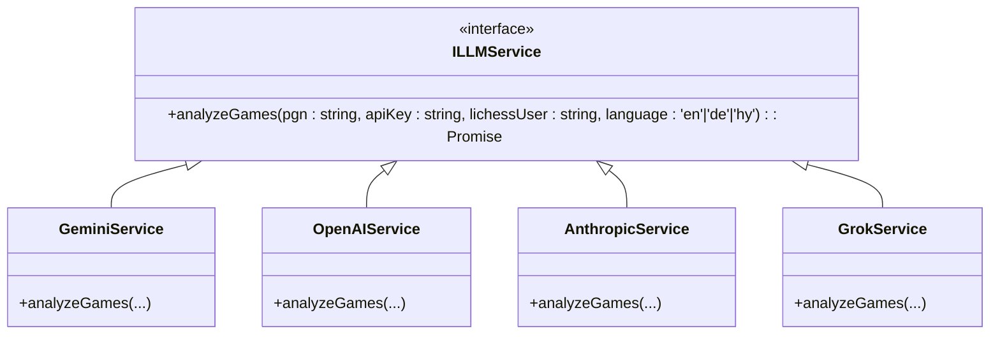
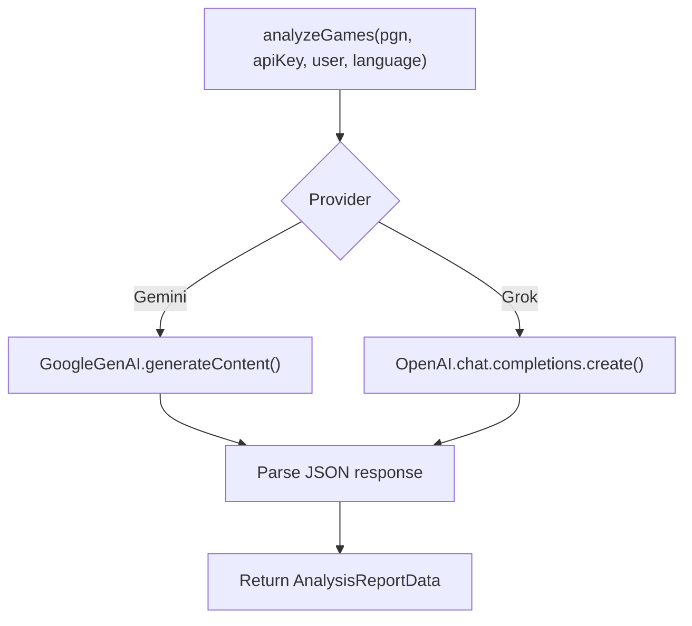
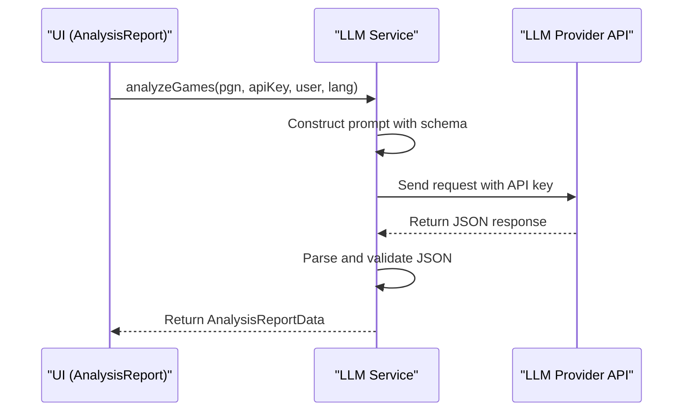

# AI Analysis System

<cite>
**Referenced Files in This Document**  
- [llmService.ts](file://services/llmService.ts)
- [geminiService.ts](file://services/geminiService.ts)
- [openAIService.ts](file://services/openAIService.ts)
- [anthropicService.ts](file://services/anthropicService.ts)
- [grokService.ts](file://services/grokService.ts)
- [llmProviders.ts](file://llmProviders.ts)
- [Settings.tsx](file://components/Settings.tsx)
- [useSettings.ts](file://hooks/useSettings.ts)
- [AnalysisReport.tsx](file://components/AnalysisReport.tsx)
- [types.ts](file://types.ts)
</cite>

## Table of Contents
1. [Introduction](#introduction)
2. [Core Architecture](#core-architecture)
3. [LLM Service Interface and Strategy Pattern](#llm-service-interface-and-strategy-pattern)
4. [Provider-Specific Implementations](#provider-specific-implementations)
5. [Runtime Provider Selection and Dependency Injection](#runtime-provider-selection-and-dependency-injection)
6. [Analysis Request Flow](#analysis-request-flow)
7. [Response Processing and Error Handling](#response-processing-and-error-handling)
8. [Integration with Settings and UI](#integration-with-settings-and-ui)
9. [Common Issues and Best Practices](#common-issues-and-best-practices)
10. [Conclusion](#conclusion)

## Introduction

ChessTrax leverages large language models (LLMs) to provide personalized chess training recommendations by analyzing a user's lost games. The system ingests PGN (Portable Game Notation) data from Lichess, processes it through an LLM, and returns structured insights on opening performance, tactical blind spots, strategic weaknesses, and endgame training opportunities. This document details the architecture of the AI analysis system, focusing on its modular design, pluggable provider model, and robust error handling.

## Core Architecture

The AI analysis system in ChessTrax is built around a service-oriented architecture where LLM interactions are abstracted behind a common interface. This design enables flexibility in integrating multiple LLM providers while maintaining a consistent internal API. The core components include:
- **Service Layer**: Contains provider-specific implementations that communicate with external LLM APIs.
- **Settings System**: Manages user preferences and API keys via browser localStorage.
- **UI Components**: Display analysis results and allow user interaction with the AI system.

The architecture follows the Strategy pattern, allowing seamless switching between different LLM providers at runtime based on user configuration.

**Section sources**
- [llmService.ts](file://services/llmService.ts#L1-L5)
- [llmProviders.ts](file://llmProviders.ts#L1-L29)
- [useSettings.ts](file://hooks/useSettings.ts#L1-L39)

## LLM Service Interface and Strategy Pattern

The foundation of the AI analysis system is the `ILLMService` interface defined in `llmService.ts`. This interface standardizes the contract for all LLM providers, ensuring consistent method signatures and return types across implementations.

**Diagram sources**
- [llmService.ts](file://services/llmService.ts#L1-L5)
- [geminiService.ts](file://services/geminiService.ts#L1-L165)
- [openAIService.ts](file://services/openAIService.ts#L1-L28)
- [anthropicService.ts](file://services/anthropicService.ts#L1-L18)
- [grokService.ts](file://services/grokService.ts#L1-L157)

**Section sources**
- [llmService.ts](file://services/llmService.ts#L1-L5)
- [types.ts](file://types.ts#L1-L29)

## Provider-Specific Implementations

Each LLM provider is implemented as a separate service class that adheres to the `ILLMService` interface. Currently, ChessTrax supports four providers:

1. **GeminiService**: Uses Google's Generative AI SDK with structured JSON output via schema validation.
2. **GrokService**: Leverages the OpenAI-compatible API from xAI, using the official OpenAI client library.
3. **OpenAIService** and **AnthropicService**: Placeholder implementations indicating future integration plans.

The `GeminiService` and `GrokService` are fully implemented with robust error handling, retry logic, and multi-language support. Both services define a strict JSON schema (`analysisSchema`) to ensure consistent response formatting from the LLM.

**Diagram sources**
- [geminiService.ts](file://services/geminiService.ts#L1-L165)
- [grokService.ts](file://services/grokService.ts#L1-L157)

**Section sources**
- [geminiService.ts](file://services/geminiService.ts#L1-L165)
- [grokService.ts](file://services/grokService.ts#L1-L157)
- [openAIService.ts](file://services/openAIService.ts#L1-L28)
- [anthropicService.ts](file://services/anthropicService.ts#L1-L18)

## Runtime Provider Selection and Dependency Injection

ChessTrax uses a dependency injection mechanism to select the appropriate LLM provider at runtime based on user settings. The selection process involves:

1. Reading user preferences from localStorage via the `useSettings` hook.
2. Identifying the currently selected provider (`selectedProviderId`).
3. Injecting the corresponding service instance when initiating an analysis request.

The `llmProviders.ts` file defines metadata for each provider, including display name, API key requirements, and documentation links. This configuration drives the settings UI and ensures users can properly configure their chosen provider.

**Section sources**
- [llmProviders.ts](file://llmProviders.ts#L1-L29)
- [useSettings.ts](file://hooks/useSettings.ts#L1-L39)
- [Settings.tsx](file://components/Settings.tsx#L1-L105)

## Analysis Request Flow

The analysis request flow follows a standardized sequence:

1. User uploads PGN data or connects their Lichess account.
2. Application retrieves the selected provider and corresponding API key from settings.
3. Constructs a provider-specific prompt containing:
   - User's Lichess username
   - PGN of lost games
   - Desired output language
   - Structured JSON schema requirements
4. Sends request to the LLM API with retry logic for transient failures.
5. Processes and validates the JSON response.
6. Returns structured analysis data to the UI.

**Diagram sources**
- [geminiService.ts](file://services/geminiService.ts#L1-L165)
- [grokService.ts](file://services/grokService.ts#L1-L157)
- [AnalysisReport.tsx](file://components/AnalysisReport.tsx#L1-L197)

## Response Processing and Error Handling

Both implemented services (`GeminiService` and `GrokService`) include comprehensive error handling mechanisms:

- **API Key Validation**: Checks for keys in multiple locations (user input, localStorage, environment variables).
- **Retry Logic**: Implements exponential backoff for rate limiting (429) and service overload (503) errors.
- **Response Parsing**: Handles malformed JSON and empty responses gracefully.
- **Error Propagation**: Wraps provider-specific errors in consistent application-level exceptions.

The retry mechanism uses a randomized exponential backoff strategy, with up to three attempts and increasing delays between requests to avoid overwhelming the LLM service.

**Section sources**
- [geminiService.ts](file://services/geminiService.ts#L1-L165)
- [grokService.ts](file://services/grokService.ts#L1-L157)

## Integration with Settings and UI

The AI analysis system is tightly integrated with the application's settings and user interface:

- **Settings Component**: Allows users to select their preferred LLM provider and enter API keys securely.
- **Analysis Report UI**: Displays structured results in an accessible format with export options (PDF, clipboard).
- **Language Support**: Respects user language preferences while maintaining consistent analysis quality.

The `AnalysisReport.tsx` component renders the structured `AnalysisReportData` into an intuitive interface with categorized insights and actionable training links to Lichess resources.

**Section sources**
- [Settings.tsx](file://components/Settings.tsx#L1-L105)
- [useSettings.ts](file://hooks/useSettings.ts#L1-L39)
- [AnalysisReport.tsx](file://components/AnalysisReport.tsx#L1-L197)

## Common Issues and Best Practices

### API Key Errors
- **Cause**: Missing or invalid API keys
- **Solution**: Ensure keys are correctly entered in settings; fallback to environment variables during development
- **Best Practice**: Store keys in environment variables for development, use secure input for production

### Rate Limiting
- **Cause**: Excessive API requests within a time window
- **Solution**: Implemented automatic retries with exponential backoff
- **Best Practice**: Cache results when possible; respect provider rate limits

### Response Parsing Failures
- **Cause**: Malformed JSON or unexpected response format
- **Solution**: Validate JSON structure; implement error boundaries
- **Best Practice**: Use strict response schemas; include fallback content

### Provider Availability
- **Note**: OpenAI and Anthropic providers are currently placeholders
- **Recommendation**: Use Gemini or Grok for production analysis

## Conclusion

ChessTrax's AI analysis system demonstrates a well-architected approach to integrating large language models into a chess training application. By leveraging the Strategy pattern and dependency injection, the system achieves flexibility in LLM provider selection while maintaining a clean, maintainable codebase. The robust error handling, structured response parsing, and seamless UI integration provide users with reliable, personalized chess improvement recommendations. Future work should focus on completing additional provider integrations and enhancing the analysis schema for even deeper insights.