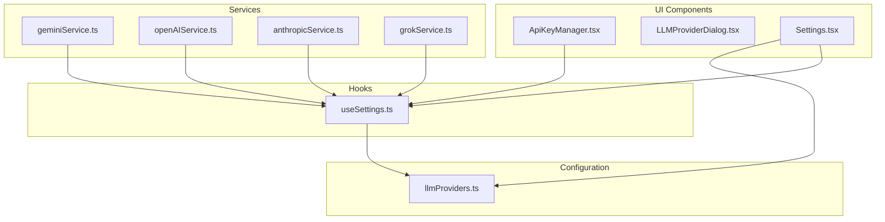
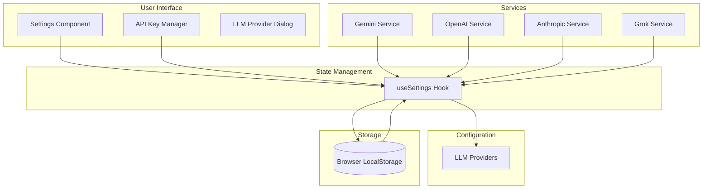
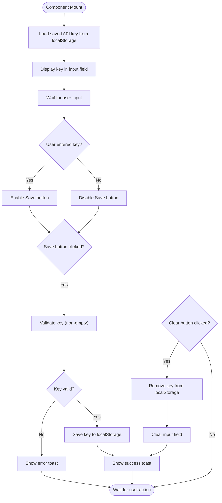
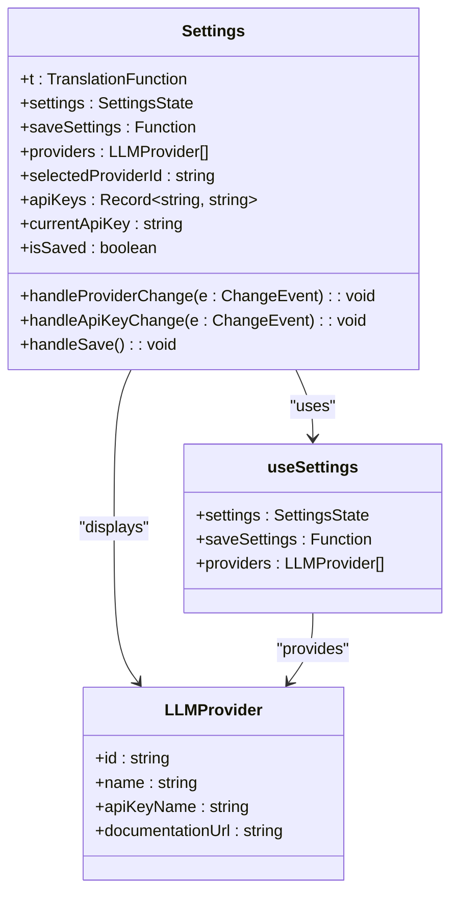
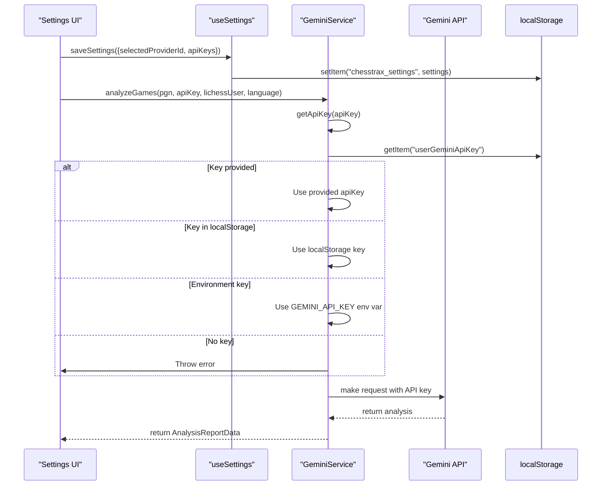
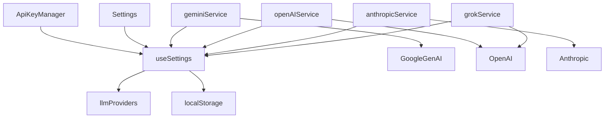

# API Key Management

<cite>
**Referenced Files in This Document**   
- [ApiKeyManager.tsx](file://ApiKeyManager.tsx)
- [LLMProviderDialog.tsx](file://components/LLMProviderDialog.tsx)
- [useSettings.ts](file://hooks/useSettings.ts)
- [llmProviders.ts](file://llmProviders.ts)
- [geminiService.ts](file://services/geminiService.ts)
- [openAIService.ts](file://services/openAIService.ts)
- [anthropicService.ts](file://services/anthropicService.ts)
- [grokService.ts](file://services/grokService.ts)
- [Settings.tsx](file://components/Settings.tsx)
</cite>

## Table of Contents
1. [Introduction](#introduction)
2. [Project Structure and Key Components](#project-structure-and-key-components)
3. [Core Components](#core-components)
4. [Architecture Overview](#architecture-overview)
5. [Detailed Component Analysis](#detailed-component-analysis)
6. [Dependency Analysis](#dependency-analysis)
7. [Performance Considerations](#performance-considerations)
8. [Troubleshooting Guide](#troubleshooting-guide)
9. [Conclusion](#conclusion)

## Introduction
This document provides a comprehensive overview of the API key management system in ChessTrax, a chess analysis application that leverages large language models (LLMs) for game evaluation. The system enables users to securely input, store, and manage API keys for various LLM providers such as Google Gemini, OpenAI, Anthropic, and xAI Grok. It emphasizes secure persistence using browser localStorage, validation workflows, and integration with LLM services. The documentation is designed to be accessible to beginners learning about API authentication while offering experienced developers insights into security implementation and error resilience.

## Project Structure and Key Components

The ChessTrax project is organized into a modular structure with distinct directories for components, hooks, services, and configuration files. The API key management functionality is distributed across several key files:

- **ApiKeyManager.tsx**: A standalone component for managing the Gemini API key.
- **components/LLMProviderDialog.tsx**: A modal dialog for confirming LLM provider selection.
- **hooks/useSettings.ts**: A custom React hook for managing user settings and API keys.
- **llmProviders.ts**: Configuration file defining supported LLM providers.
- **services/\*.ts**: Service implementations for each LLM provider.
- **components/Settings.tsx**: UI component for selecting providers and entering API keys.

**Diagram sources**  
- [ApiKeyManager.tsx](file://ApiKeyManager.tsx)
- [components/LLMProviderDialog.tsx](file://components/LLMProviderDialog.tsx)
- [hooks/useSettings.ts](file://hooks/useSettings.ts)
- [llmProviders.ts](file://llmProviders.ts)
- [components/Settings.tsx](file://components/Settings.tsx)

**Section sources**  
- [ApiKeyManager.tsx](file://ApiKeyManager.tsx)
- [components/LLMProviderDialog.tsx](file://components/LLMProviderDialog.tsx)
- [hooks/useSettings.ts](file://hooks/useSettings.ts)
- [llmProviders.ts](file://llmProviders.ts)
- [components/Settings.tsx](file://components/Settings.tsx)

## Core Components

The API key management system in ChessTrax consists of several core components that work together to provide a secure and user-friendly experience. The system allows users to input and store API keys for different LLM providers, which are then used to authenticate requests to the respective services. The keys are stored locally in the browser's localStorage, ensuring that they are not transmitted to any server. The system also includes validation workflows to test key validity before saving and handles invalid keys during analysis requests.

**Section sources**  
- [ApiKeyManager.tsx](file://ApiKeyManager.tsx)
- [hooks/useSettings.ts](file://hooks/useSettings.ts)
- [llmProviders.ts](file://llmProviders.ts)

## Architecture Overview

The API key management architecture in ChessTrax follows a modular and extensible design. The system is built around a central configuration file (llmProviders.ts) that defines the supported LLM providers and their properties. A custom React hook (useSettings.ts) encapsulates the logic for reading and writing user settings, including API keys, to localStorage. The UI components (ApiKeyManager.tsx, Settings.tsx) provide interfaces for users to input and manage their API keys. The LLM services (geminiService.ts, openAIService.ts, etc.) retrieve the appropriate API key based on the active provider and use it to authenticate requests.

**Diagram sources**  
- [hooks/useSettings.ts](file://hooks/useSettings.ts)
- [llmProviders.ts](file://llmProviders.ts)
- [ApiKeyManager.tsx](file://ApiKeyManager.tsx)
- [components/Settings.tsx](file://components/Settings.tsx)

## Detailed Component Analysis

### ApiKeyManager Component Analysis

The ApiKeyManager component provides a dedicated interface for users to input and manage their Gemini API key. It uses a password input field to mask the key as it is typed, enhancing security by preventing shoulder surfing. The component loads the saved API key from localStorage when it mounts and provides buttons to save or clear the key. It uses react-hot-toast to display success or error messages to the user.

**Diagram sources**  
- [ApiKeyManager.tsx](file://ApiKeyManager.tsx#L1-L73)

**Section sources**  
- [ApiKeyManager.tsx](file://ApiKeyManager.tsx#L1-L73)

### Settings Component Analysis

The Settings component provides a more comprehensive interface for managing API keys and selecting the active LLM provider. It uses the useSettings hook to read and write settings, including the selected provider ID and API keys for all providers. The component displays a dropdown menu for selecting the provider and an input field for entering the API key for the selected provider. It also shows a checkmark icon when the settings are successfully saved.

**Diagram sources**  
- [components/Settings.tsx](file://components/Settings.tsx#L1-L38)
- [hooks/useSettings.ts](file://hooks/useSettings.ts#L1-L38)
- [llmProviders.ts](file://llmProviders.ts#L1-L28)

**Section sources**  
- [components/Settings.tsx](file://components/Settings.tsx#L1-L38)
- [hooks/useSettings.ts](file://hooks/useSettings.ts#L1-L38)
- [llmProviders.ts](file://llmProviders.ts#L1-L28)

### LLM Service Analysis

The LLM services (geminiService.ts, openAIService.ts, etc.) are responsible for making requests to the respective LLM APIs. They implement the ILLMService interface, which defines a common method for analyzing games. The services retrieve the appropriate API key from the useSettings hook or localStorage and use it to authenticate requests. The geminiService.ts implementation includes a fallback mechanism that tries the user-provided key, then a key from localStorage, and finally an environment variable.

**Diagram sources**  
- [services/geminiService.ts](file://services/geminiService.ts#L1-L165)
- [hooks/useSettings.ts](file://hooks/useSettings.ts#L1-L38)
- [components/Settings.tsx](file://components/Settings.tsx#L1-L38)

**Section sources**  
- [services/geminiService.ts](file://services/geminiService.ts#L1-L165)
- [hooks/useSettings.ts](file://hooks/useSettings.ts#L1-L38)
- [components/Settings.tsx](file://components/Settings.tsx#L1-L38)

## Dependency Analysis

The API key management system in ChessTrax has a well-defined dependency structure. The UI components depend on the useSettings hook for state management, which in turn depends on the llmProviders configuration. The LLM services depend on the useSettings hook to retrieve API keys and the ILLMService interface for type safety. There are no circular dependencies in the system, and the modular design allows for easy addition of new LLM providers.

**Diagram sources**  
- [ApiKeyManager.tsx](file://ApiKeyManager.tsx)
- [components/Settings.tsx](file://components/Settings.tsx)
- [hooks/useSettings.ts](file://hooks/useSettings.ts)
- [llmProviders.ts](file://llmProviders.ts)
- [services/geminiService.ts](file://services/geminiService.ts)
- [services/openAIService.ts](file://services/openAIService.ts)
- [services/anthropicService.ts](file://services/anthropicService.ts)
- [services/grokService.ts](file://services/grokService.ts)

**Section sources**  
- [ApiKeyManager.tsx](file://ApiKeyManager.tsx)
- [components/Settings.tsx](file://components/Settings.tsx)
- [hooks/useSettings.ts](file://hooks/useSettings.ts)
- [llmProviders.ts](file://llmProviders.ts)
- [services/geminiService.ts](file://services/geminiService.ts)
- [services/openAIService.ts](file://services/openAIService.ts)
- [services/anthropicService.ts](file://services/anthropicService.ts)
- [services/grokService.ts](file://services/grokService.ts)

## Performance Considerations

The API key management system in ChessTrax is designed with performance in mind. The use of localStorage ensures that settings are persisted locally and can be accessed quickly without network requests. The modular design of the LLM services allows for lazy loading of service implementations, reducing the initial bundle size. The retry logic in the geminiService.ts and grokService.ts implementations helps to handle transient errors and improve reliability.

## Troubleshooting Guide

Common issues with the API key management system include malformed keys, unauthorized access errors, and expired credentials. Users should ensure that they are entering the correct API key for the selected provider and that the key has the necessary permissions. If a key is invalid, the system will display an error message and prevent the key from being saved. During analysis requests, if the API key is rejected by the LLM service, the system will throw an error that is displayed to the user. Users should check the provider's documentation for instructions on generating a valid API key.

**Section sources**  
- [ApiKeyManager.tsx](file://ApiKeyManager.tsx#L1-L73)
- [services/geminiService.ts](file://services/geminiService.ts#L1-L165)
- [services/openAIService.ts](file://services/openAIService.ts#L1-L27)
- [services/anthropicService.ts](file://services/anthropicService.ts#L1-L17)
- [services/grokService.ts](file://services/grokService.ts#L1-L157)

## Conclusion

The API key management system in ChessTrax provides a secure and user-friendly way for users to input and store API keys for various LLM providers. The system uses browser localStorage for persistence, ensuring that keys are not transmitted to any server. The modular design allows for easy addition of new LLM providers, and the use of a custom React hook encapsulates the state management logic. The system includes validation workflows to test key validity and handles errors gracefully. Overall, the system strikes a balance between security, usability, and extensibility.