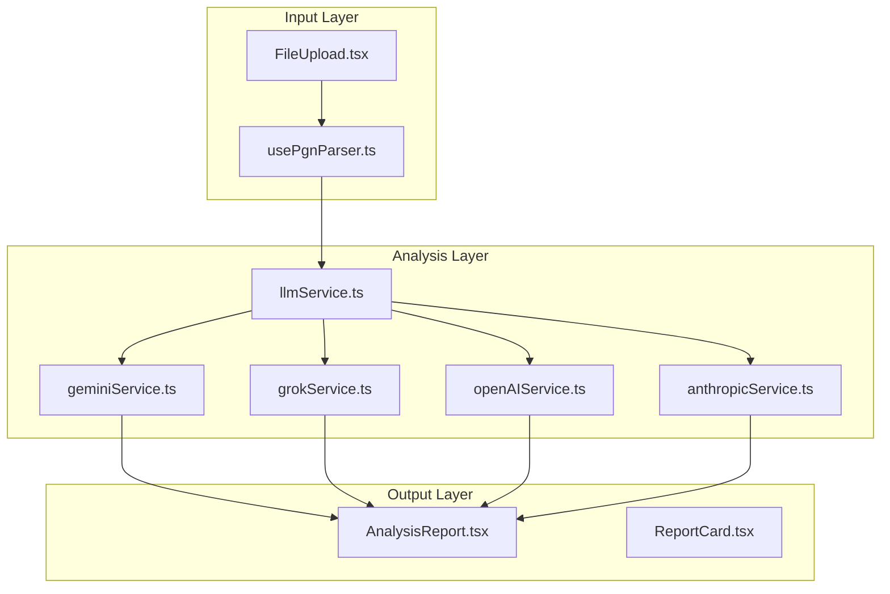
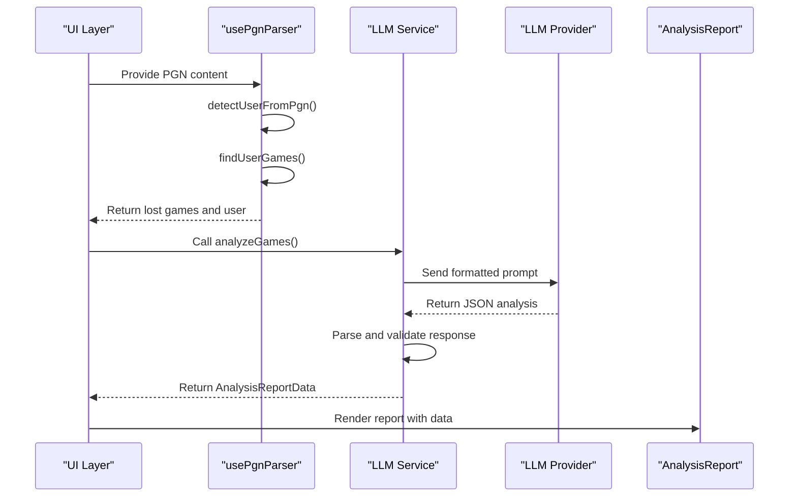
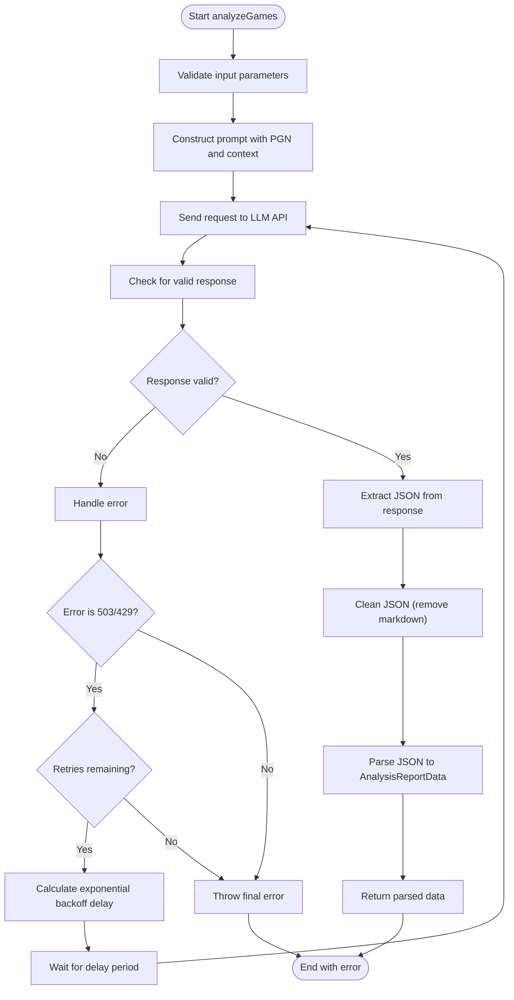
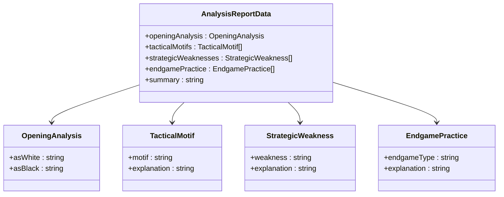
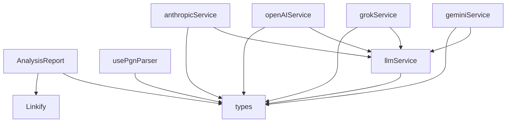

# Analysis Process

<cite>
**Referenced Files in This Document**   
- [usePgnParser.ts](file://hooks/usePgnParser.ts)
- [AnalysisReport.tsx](file://components/AnalysisReport.tsx)
- [types.ts](file://types.ts)
- [llmService.ts](file://services/llmService.ts)
- [geminiService.ts](file://services/geminiService.ts)
- [grokService.ts](file://services/grokService.ts)
- [openAIService.ts](file://services/openAIService.ts)
- [anthropicService.ts](file://services/anthropicService.ts)
</cite>

## Table of Contents
1. [Introduction](#introduction)
2. [Project Structure](#project-structure)
3. [Core Components](#core-components)
4. [Architecture Overview](#architecture-overview)
5. [Detailed Component Analysis](#detailed-component-analysis)
6. [Dependency Analysis](#dependency-analysis)
7. [Performance Considerations](#performance-considerations)
8. [Troubleshooting Guide](#troubleshooting-guide)
9. [Conclusion](#conclusion)

## Introduction
ChessTrax is an AI-powered chess training application that analyzes a player's lost games to generate personalized improvement plans. This document details the end-to-end analysis workflow, from parsing PGN (Portable Game Notation) data to displaying structured training recommendations. The system leverages large language models (LLMs) to identify patterns in gameplay, focusing on recurring tactical, strategic, and opening mistakes. The architecture supports multiple LLM providers through a unified interface, ensuring flexibility and extensibility. The analysis process is designed to be robust, with error handling, retry mechanisms, and structured output parsing to ensure reliable recommendations.

## Project Structure
The ChessTrax application follows a modular structure with clear separation of concerns. The core functionality is organized into distinct directories: `hooks` for reusable logic, `components` for UI elements, `services` for external integrations, and root-level files for types and configuration. The analysis pipeline begins in the `hooks` directory with PGN parsing, proceeds through LLM services in the `services` directory, and culminates in the `components` directory with report rendering. This organization enables maintainability and allows for independent development of parsing, analysis, and presentation layers.

**Diagram sources**
- [usePgnParser.ts](file://hooks/usePgnParser.ts#L0-L104)
- [llmService.ts](file://services/llmService.ts#L0-L4)
- [geminiService.ts](file://services/geminiService.ts#L0-L165)
- [grokService.ts](file://services/grokService.ts#L0-L157)
- [AnalysisReport.tsx](file://components/AnalysisReport.tsx#L0-L197)

**Section sources**
- [usePgnParser.ts](file://hooks/usePgnParser.ts#L0-L104)
- [llmService.ts](file://services/llmService.ts#L0-L4)
- [geminiService.ts](file://services/geminiService.ts#L0-L165)
- [grokService.ts](file://services/grokService.ts#L0-L157)
- [AnalysisReport.tsx](file://components/AnalysisReport.tsx#L0-L197)

## Core Components
The ChessTrax analysis process relies on several core components that work together to transform raw PGN data into actionable insights. The `usePgnParser.ts` hook extracts relevant game data, identifying the user and their lost games. The `llmService.ts` interface defines a contract for LLM integration, enabling multiple provider implementations. Each provider service (e.g., `geminiService.ts`, `grokService.ts`) implements this interface to communicate with specific AI models. The `AnalysisReport.tsx` component renders the structured analysis data in a user-friendly format. The `types.ts` file defines the `AnalysisReportData` interface, ensuring consistency between LLM outputs and UI rendering.

**Section sources**
- [usePgnParser.ts](file://hooks/usePgnParser.ts#L0-L104)
- [types.ts](file://types.ts#L0-L28)
- [llmService.ts](file://services/llmService.ts#L0-L4)
- [AnalysisReport.tsx](file://components/AnalysisReport.tsx#L0-L197)

## Architecture Overview
The ChessTrax analysis architecture follows a clean, layered approach with well-defined interfaces between components. The system begins with PGN data input, either from file upload or Lichess API. The `usePgnParser` hook processes this data to identify the user and extract their lost games. This filtered PGN data is then passed to an LLM service implementation through the `ILLMService` interface. The selected provider (e.g., Gemini, Grok) formats a prompt with game context and analytical directives, sends it to the AI model, and handles the response. After parsing and validation, the structured `AnalysisReportData` is returned to the UI layer for rendering in the `AnalysisReport` component. This architecture enables provider-agnostic analysis while maintaining a consistent output format.

**Diagram sources**
- [usePgnParser.ts](file://hooks/usePgnParser.ts#L0-L104)
- [llmService.ts](file://services/llmService.ts#L0-L4)
- [geminiService.ts](file://services/geminiService.ts#L0-L165)
- [AnalysisReport.tsx](file://components/AnalysisReport.tsx#L0-L197)

## Detailed Component Analysis

### PGN Parsing and Data Extraction
The PGN parsing process begins with the `usePgnParser` hook, which serves as the entry point for analysis. This hook uses two pure functions: `detectUserFromPgn` to identify the most frequently occurring player in the PGN data, and `findUserGames` to extract games where this player was involved and lost. The parsing logic splits the PGN content into individual games using a regular expression that matches the start of each game (indicated by `[Event "`). For each game, it extracts the player names, determines if the detected user was playing as White or Black, and checks the game result to identify losses. The function also collects all game dates for display in the report. This preprocessing step ensures that only relevant game data is sent to the LLM, reducing input size and focusing the analysis on the user's performance.

**Section sources**
- [usePgnParser.ts](file://hooks/usePgnParser.ts#L0-L104)

### LLM Service Interface and Provider Implementation
The `llmService.ts` file defines the `ILLMService` interface, which establishes a contract for all LLM providers. This interface specifies the `analyzeGames` method that accepts PGN data, an API key, the Lichess username, and a language preference, returning a Promise of `AnalysisReportData`. This abstraction allows the application to support multiple AI providers without changing the calling code. The concrete implementations in `geminiService.ts`, `grokService.ts`, and others adhere to this interface while handling provider-specific API requirements. The placeholder implementations for OpenAI and Anthropic demonstrate the extensibility of this pattern, allowing new providers to be added with minimal changes to the core architecture.

#### For API/Service Components:

```mermaid
classDiagram
class ILLMService {
<<interface>>
+analyzeGames(pgn : string, apiKey : string, lichessUser : string, language : 'en'|'de'|'hy') : Promise~AnalysisReportData~
}
class GeminiService {
-getApiKey(apiKey? : string) : string
+analyzeGames(pgn : string, apiKey : string, lichessUser : string, language : 'en'|'de'|'hy') : Promise~AnalysisReportData~
}
class GrokService {
+analyzeGames(pgn : string, apiKey : string, lichessUser : string, language : 'en'|'de'|'hy') : Promise~AnalysisReportData~
}
class OpenAIService {
+analyzeGames(pgn : string, apiKey : string, lichessUser : string, language : 'en'|'de'|'hy') : Promise~AnalysisReportData~
}
class AnthropicService {
+analyzeGames(pgn : string, apiKey : string, lichessUser : string, language : 'en'|'de'|'hy') : Promise~AnalysisReportData~
}
ILLMService <|-- GeminiService
ILLMService <|-- GrokService
ILLMService <|-- OpenAIService
ILLMService <|-- AnthropicService
```

**Diagram sources**
- [llmService.ts](file://services/llmService.ts#L0-L4)
- [geminiService.ts](file://services/geminiService.ts#L0-L165)
- [grokService.ts](file://services/grokService.ts#L0-L157)
- [openAIService.ts](file://services/openAIService.ts#L0-L27)
- [anthropicService.ts](file://services/anthropicService.ts#L0-L17)

**Section sources**
- [llmService.ts](file://services/llmService.ts#L0-L4)
- [geminiService.ts](file://services/geminiService.ts#L0-L165)
- [grokService.ts](file://services/grokService.ts#L0-L157)
- [openAIService.ts](file://services/openAIService.ts#L0-L27)
- [anthropicService.ts](file://services/anthropicService.ts#L0-L17)

### Prompt Construction and API Communication
The LLM provider services construct prompts that include game context, move sequences, and analytical directives to guide the AI's response. In `geminiService.ts`, the prompt is structured to request a personalized training plan based on the user's lost games, with specific instructions to focus on recurring patterns rather than individual blunders. The prompt also includes tone and formatting rules, such as addressing the user informally in German ("Du") and using the keyword "GameId" when referencing example games. The service implements a retry mechanism with exponential backoff to handle transient API errors, particularly 503 "overloaded" responses. The prompt is sent with a response schema that enforces the structure of the `AnalysisReportData` interface, ensuring consistent output regardless of the underlying model's tendencies.

#### For Complex Logic Components:

**Diagram sources**
- [geminiService.ts](file://services/geminiService.ts#L0-L165)
- [grokService.ts](file://services/grokService.ts#L0-L157)

**Section sources**
- [geminiService.ts](file://services/geminiService.ts#L0-L165)
- [grokService.ts](file://services/grokService.ts#L0-L157)

### Response Parsing and Data Transformation
The raw JSON output from LLMs is transformed into the structured `AnalysisReportData` format defined in `types.ts`. This interface specifies five key properties: `openingAnalysis` (with `asWhite` and `asBlack` fields), `tacticalMotifs`, `strategicWeaknesses`, `endgamePractice`, and `summary`. Each of these properties contains arrays of objects with `motif`/`weakness`/`endgameType` and `explanation` fields, ensuring a consistent structure for UI rendering. The provider services parse the JSON response and validate that it conforms to this schema before returning it. This transformation step is critical for maintaining a reliable data flow, as it normalizes outputs from different LLMs that may have varying response styles or formats. The structured data enables the `AnalysisReport` component to render recommendations consistently, regardless of which AI model generated the analysis.

#### For Object-Oriented Components:

**Diagram sources**
- [types.ts](file://types.ts#L0-L28)

**Section sources**
- [types.ts](file://types.ts#L0-L28)

### Report Rendering and User Interaction
The `AnalysisReport.tsx` component renders the structured analysis data in a visually appealing format. It displays the user's Lichess username, analysis date, game period, and AI model used at the top of the report. The main content is organized into cards for primary focus, opening analysis, tactical blind spots, strategic weaknesses, and endgame training. Each card presents the relevant data with appropriate styling and icons. The component also provides export functionality, allowing users to download the report as a PDF or copy it to the clipboard in plain text format. The `Linkify` utility processes the text to make URLs clickable, enhancing usability. This component serves as the final stage of the analysis pipeline, transforming structured data into actionable insights for the user.

**Section sources**
- [AnalysisReport.tsx](file://components/AnalysisReport.tsx#L0-L197)

## Dependency Analysis
The ChessTrax analysis process has a clear dependency hierarchy that ensures loose coupling between components. The `AnalysisReport` component depends on the `AnalysisReportData` interface from `types.ts` but has no direct dependency on the LLM services. The LLM services depend on the same interface to define their output format but are otherwise independent of each other. All provider implementations depend on the `ILLMService` interface, which defines their contract with the rest of the application. The `usePgnParser` hook is independent of the LLM services, communicating only through the PGN data it provides. This architecture allows for easy replacement or addition of LLM providers without affecting the parsing or rendering layers. The only external dependencies are the LLM provider SDKs (e.g., `@google/genai` for Gemini, `openai` for Grok), which are encapsulated within their respective service implementations.

**Diagram sources**
- [types.ts](file://types.ts#L0-L28)
- [llmService.ts](file://services/llmService.ts#L0-L4)
- [geminiService.ts](file://services/geminiService.ts#L0-L165)
- [grokService.ts](file://services/grokService.ts#L0-L157)
- [openAIService.ts](file://services/openAIService.ts#L0-L27)
- [anthropicService.ts](file://services/anthropicService.ts#L0-L17)
- [AnalysisReport.tsx](file://components/AnalysisReport.tsx#L0-L197)
- [usePgnParser.ts](file://hooks/usePgnParser.ts#L0-L104)

**Section sources**
- [types.ts](file://types.ts#L0-L28)
- [llmService.ts](file://services/llmService.ts#L0-L4)
- [geminiService.ts](file://services/geminiService.ts#L0-L165)
- [grokService.ts](file://services/grokService.ts#L0-L157)
- [openAIService.ts](file://services/openAIService.ts#L0-L27)
- [anthropicService.ts](file://services/anthropicService.ts#L0-L17)
- [AnalysisReport.tsx](file://components/AnalysisReport.tsx#L0-L197)
- [usePgnParser.ts](file://hooks/usePgnParser.ts#L0-L104)

## Performance Considerations
The ChessTrax analysis process incorporates several performance optimizations to ensure a responsive user experience. The `usePgnParser` hook uses React's `useMemo` to cache parsing results, preventing unnecessary reprocessing of PGN data when the component re-renders. The LLM services implement request throttling through exponential backoff retry mechanisms, which helps prevent overwhelming the AI providers' APIs during periods of high load. The system is designed to handle large PGN files efficiently by processing games in batches and extracting only the necessary information (lost games for the detected user). However, the primary performance bottleneck is the LLM API call itself, which can take several seconds to complete. To mitigate this, the UI provides feedback during analysis (e.g., loading states) and allows users to export the report once it's generated, reducing the need for repeated analysis of the same data.

## Troubleshooting Guide
Common issues in the ChessTrax analysis process typically fall into three categories: empty responses, parsing failures, and inconsistent recommendations. Empty responses are often caused by missing or invalid API keys; the system checks for keys in user settings, localStorage, and environment variables, falling back to the developer's key if available. Parsing failures can occur when the LLM returns malformed JSON or when the response doesn't conform to the expected schema; the system includes error handling and retry logic to address transient issues. Inconsistent recommendations may arise from differences in LLM behavior or prompt interpretation; the structured response schema and consistent prompt formatting help normalize outputs across providers. Users experiencing issues should verify their API key configuration, ensure their PGN file is properly formatted, and check the browser console for error messages. The retry mechanism with exponential backoff helps recover from temporary API overloads, particularly with the Gemini service.

**Section sources**
- [geminiService.ts](file://services/geminiService.ts#L0-L165)
- [grokService.ts](file://services/grokService.ts#L0-L157)
- [usePgnParser.ts](file://hooks/usePgnParser.ts#L0-L104)

## Conclusion
The ChessTrax analysis process demonstrates a well-architected approach to AI-powered chess training. By separating concerns into distinct layers—data parsing, LLM integration, and report rendering—the system achieves flexibility, maintainability, and reliability. The use of a common interface for LLM providers enables easy extension to new AI models, while the structured data format ensures consistent output regardless of the underlying technology. The implementation includes robust error handling, retry mechanisms, and performance optimizations to provide a smooth user experience. Future enhancements could include caching of analysis results, support for additional LLM providers, and more sophisticated pattern recognition in the PGN parsing stage. The current architecture provides a solid foundation for these improvements while delivering valuable, personalized training recommendations to chess players.