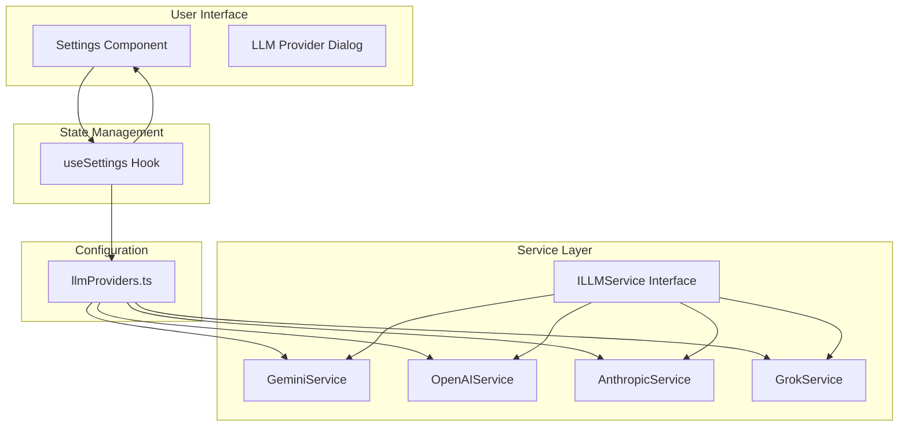
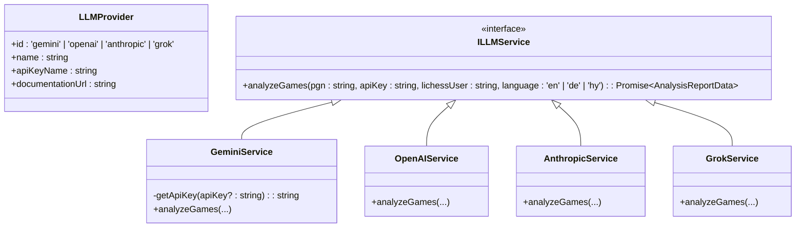
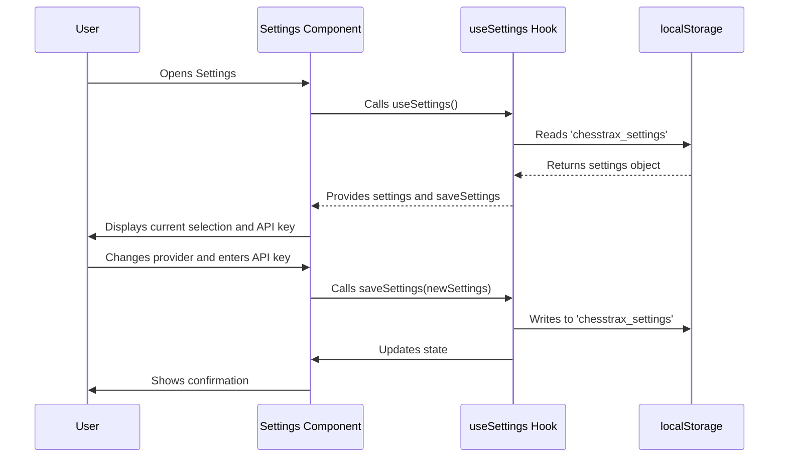
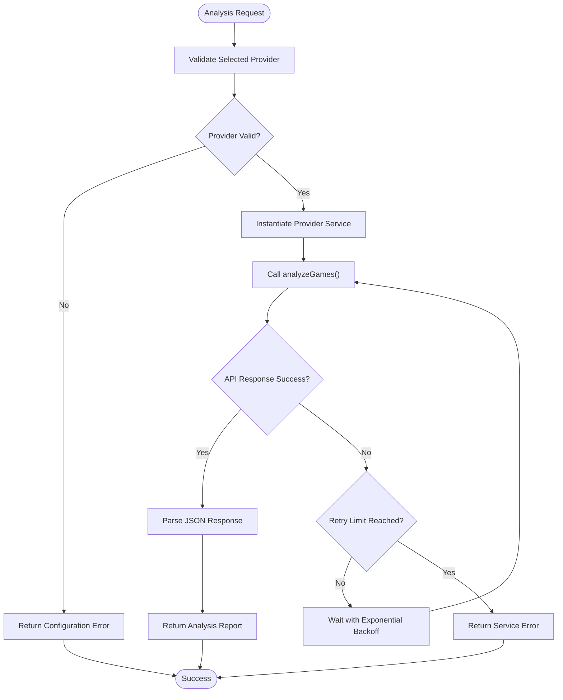

# LLM Provider Selection

<cite>
**Referenced Files in This Document**   
- [llmService.ts](file://services/llmService.ts)
- [geminiService.ts](file://services/geminiService.ts)
- [openAIService.ts](file://services/openAIService.ts)
- [anthropicService.ts](file://services/anthropicService.ts)
- [grokService.ts](file://services/grokService.ts)
- [llmProviders.ts](file://llmProviders.ts)
- [useSettings.ts](file://hooks/useSettings.ts)
- [Settings.tsx](file://components/Settings.tsx)
</cite>

## Table of Contents
1. [Introduction](#introduction)
2. [Architecture Overview](#architecture-overview)
3. [Core Components](#core-components)
4. [Provider Configuration and Metadata](#provider-configuration-and-metadata)
5. [User Preferences and Runtime Selection](#user-preferences-and-runtime-selection)
6. [Service Resolution and Initialization](#service-resolution-and-initialization)
7. [Error Handling and Resilience](#error-handling-and-resilience)
8. [Extending with New Providers](#extending-with-new-providers)
9. [Conclusion](#conclusion)

## Introduction
ChessTrax supports multiple large language model (LLM) providers through a flexible, pluggable architecture based on the Strategy Pattern. This design enables seamless integration of different AI services while maintaining a consistent interface for game analysis. The system allows users to select their preferred provider, store API keys securely, and switch between models without code changes. This document explains how the LLM provider selection mechanism works, from configuration and user preferences to service initialization and error handling.

## Architecture Overview
The LLM provider system in ChessTrax follows a clean separation of concerns, leveraging the Strategy Pattern to decouple the analysis logic from specific provider implementations. At the core is an abstract interface that all concrete services must implement, ensuring uniform behavior across different models. Provider metadata is centrally managed, and user preferences are persisted locally to maintain state across sessions. This modular approach makes the application extensible and maintainable.

**Diagram sources**
- [llmService.ts](file://services/llmService.ts#L1-L5)
- [llmProviders.ts](file://llmProviders.ts#L1-L28)
- [useSettings.ts](file://hooks/useSettings.ts#L1-L37)

## Core Components
The LLM provider system consists of several key components that work together to deliver a flexible and user-configurable AI analysis experience. The foundation is the `ILLMService` interface defined in `llmService.ts`, which specifies the contract that all provider implementations must adhere to. This interface declares a single method, `analyzeGames`, which takes PGN data, an API key, a Lichess username, and a language preference, returning a structured analysis report.

Concrete implementations such as `GeminiService`, `OpenAIService`, `AnthropicService`, and `GrokService` provide provider-specific logic while conforming to this shared interface. Each service handles authentication, API communication, response parsing, and error recovery according to the requirements of its respective platform. The use of TypeScript ensures type safety and helps maintain consistency across implementations.

**Section sources**
- [llmService.ts](file://services/llmService.ts#L1-L5)
- [geminiService.ts](file://services/geminiService.ts#L1-L165)
- [openAIService.ts](file://services/openAIService.ts#L1-L27)
- [anthropicService.ts](file://services/anthropicService.ts#L1-L17)
- [grokService.ts](file://services/grokService.ts#L1-L157)

## Provider Configuration and Metadata
The `llmProviders.ts` file serves as the central registry for all available LLM providers. It defines the `LLMProvider` interface, which includes essential metadata such as the provider's unique ID, display name, API key label, and documentation URL. This configuration enables the UI to dynamically render provider options and guide users through the API key setup process.

Currently, the application supports OpenAI, xAI Grok, and Anthropic Claude 3, with Google Gemini support available in the implementation but not yet listed in the public provider array. This discrepancy suggests an ongoing development or configuration phase. Each provider entry provides the necessary information for the settings interface to present a consistent user experience, regardless of the underlying service.

**Diagram sources**
- [llmProviders.ts](file://llmProviders.ts#L1-L28)
- [llmService.ts](file://services/llmService.ts#L1-L5)
- [geminiService.ts](file://services/geminiService.ts#L1-L165)
- [openAIService.ts](file://services/openAIService.ts#L1-L27)
- [anthropicService.ts](file://services/anthropicService.ts#L1-L17)
- [grokService.ts](file://services/grokService.ts#L1-L157)

## User Preferences and Runtime Selection
User preferences for LLM providers are managed through the `useSettings` custom hook, which encapsulates all logic related to reading from and writing to `localStorage`. The hook maintains a state object containing the selected provider ID and a record of API keys for each provider. This state is initialized from the `chesstrax_settings` localStorage key, with sensible defaults if no saved settings exist.

The `Settings` component provides a user interface for selecting a provider and entering API keys. When a user selects a provider, the current API key field updates to reflect the stored value for that provider. Changes are not persisted until the user clicks save, at which point the `saveSettings` function updates both the in-memory state and localStorage. This approach ensures that user choices are preserved across sessions while providing immediate feedback within the current session.

**Diagram sources**
- [useSettings.ts](file://hooks/useSettings.ts#L1-L37)
- [Settings.tsx](file://components/Settings.tsx#L1-L38)

## Service Resolution and Initialization
While the exact service resolution logic is not visible in the provided code, the architecture implies a dynamic instantiation mechanism based on the selected provider ID. When a user initiates a game analysis, the application likely retrieves the current settings, identifies the active provider, and instantiates the corresponding service class. This process leverages the Strategy Pattern by allowing the runtime selection of algorithms (in this case, AI providers) without changing the client code.

Each service implementation is responsible for obtaining the correct API key through a prioritized lookup: first from the user-provided key in settings, then from localStorage (for legacy or temporary keys), and finally from environment variables (for developer defaults). This layered approach maximizes flexibility and usability while maintaining security best practices.

**Section sources**
- [useSettings.ts](file://hooks/useSettings.ts#L1-L37)
- [geminiService.ts](file://services/geminiService.ts#L1-L165)
- [llmProviders.ts](file://llmProviders.ts#L1-L28)

## Error Handling and Resilience
The LLM provider system incorporates robust error handling to ensure a reliable user experience. Each service implementation includes retry logic with exponential backoff to handle transient failures such as rate limiting or service overload. For example, both `GeminiService` and `GrokService` implement a maximum of three retry attempts with increasing delays between requests.

When a provider fails to initialize or respond, the system throws descriptive errors that are likely caught and presented to the user through the application's error handling mechanism. The placeholder implementations for `OpenAIService` and `AnthropicService` explicitly throw "not yet implemented" errors, indicating that these providers are in development and will provide meaningful feedback when activated. This approach prevents silent failures and helps users understand the status of their selected provider.

**Diagram sources**
- [geminiService.ts](file://services/geminiService.ts#L1-L165)
- [grokService.ts](file://services/grokService.ts#L1-L157)
- [openAIService.ts](file://services/openAIService.ts#L1-L27)
- [anthropicService.ts](file://services/anthropicService.ts#L1-L17)

## Extending with New Providers
Adding new LLM providers to ChessTrax follows a straightforward process that promotes backward compatibility and maintainability. Developers must implement three main steps: define the provider metadata, create a service class, and update the configuration. First, a new entry should be added to the `providers` array in `llmProviders.ts` with the appropriate metadata. Second, a new service file should be created that implements the `ILLMService` interface, following the patterns established by existing providers.

The use of a shared interface ensures that any new provider will integrate seamlessly with the existing codebase. The service resolution mechanism, though not fully visible, appears designed to work with any provider ID defined in the configuration, making the system inherently extensible. When implementing a new provider, developers should follow the error handling and retry patterns of existing services to maintain consistency in user experience.

**Section sources**
- [llmProviders.ts](file://llmProviders.ts#L1-L28)
- [llmService.ts](file://services/llmService.ts#L1-L5)
- [geminiService.ts](file://services/geminiService.ts#L1-L165)

## Conclusion
The LLM provider selection mechanism in ChessTrax demonstrates a well-architected approach to integrating multiple AI services through a pluggable, strategy-based design. By defining a clear interface, centralizing provider metadata, and managing user preferences through a dedicated hook, the application achieves both flexibility and maintainability. The system allows users to choose their preferred AI model while providing developers with a clear path for adding new providers. This architecture not only supports the current set of LLMs but is also poised to accommodate future models as they become available, ensuring the longevity and adaptability of the ChessTrax platform.