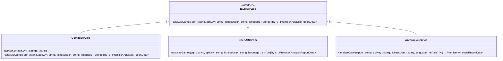
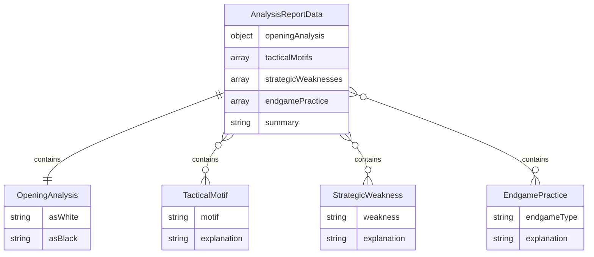
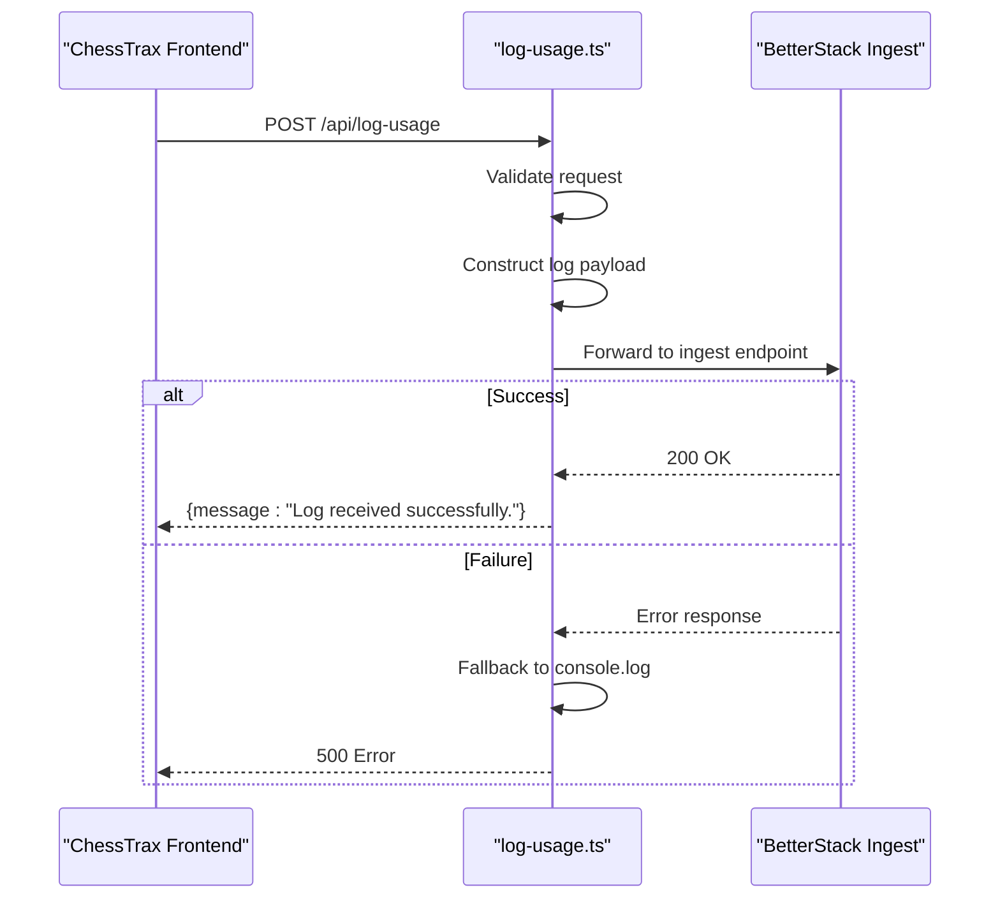
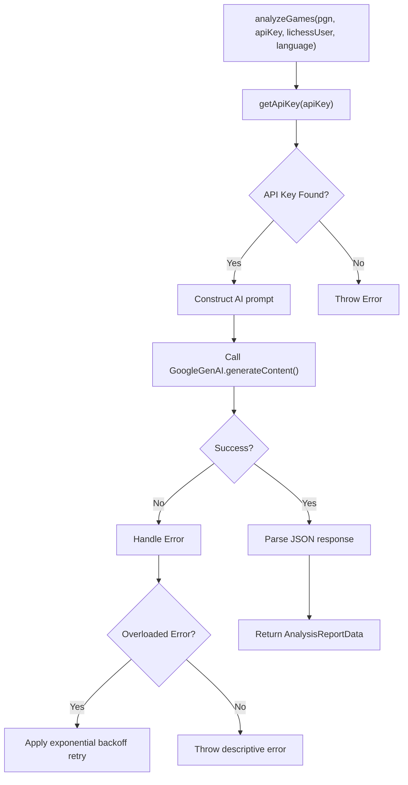
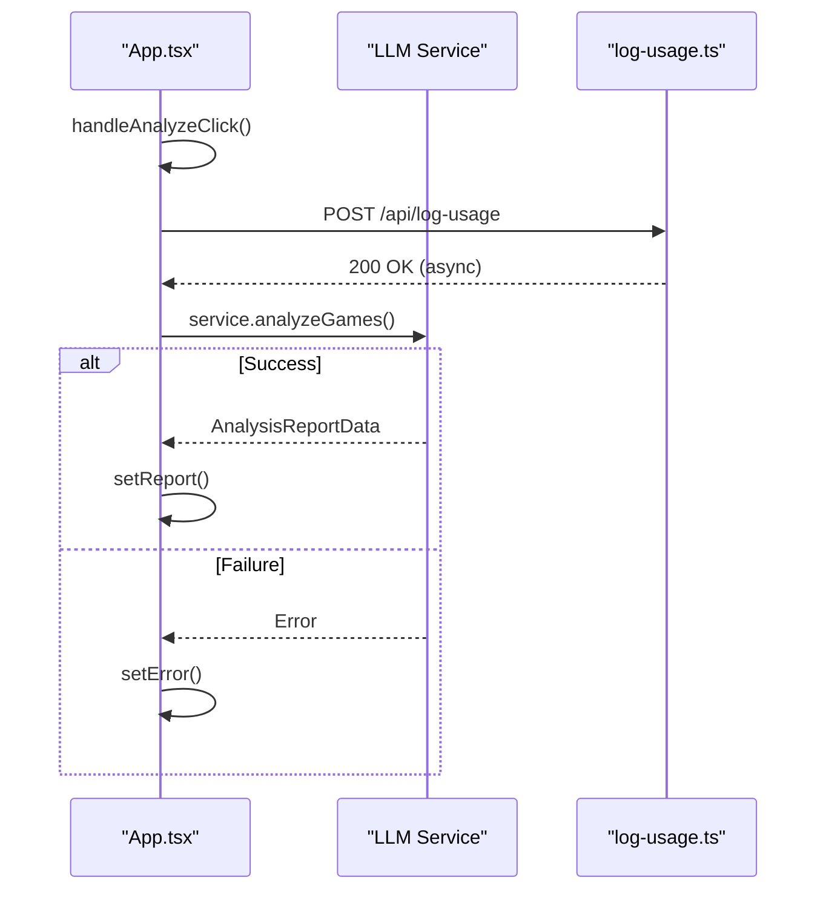
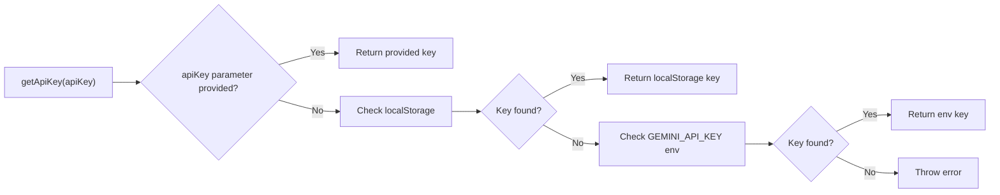
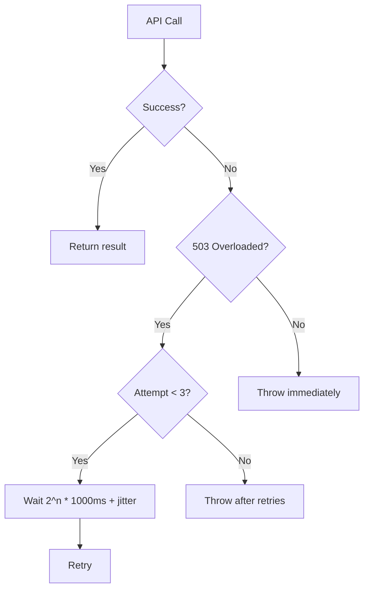

# API Reference

<cite>
**Referenced Files in This Document**   
- [llmService.ts](file://services/llmService.ts)
- [geminiService.ts](file://services/geminiService.ts)
- [anthropicService.ts](file://services/anthropicService.ts)
- [openAIService.ts](file://services/openAIService.ts)
- [log-usage.ts](file://api/log-usage.ts)
- [App.tsx](file://App.tsx)
- [types.ts](file://types.ts)
</cite>

## Table of Contents
1. [Introduction](#introduction)
2. [LLM Service Interface](#llm-service-interface)
3. [External Usage Logging API](#external-usage-logging-api)
4. [Implementation Examples](#implementation-examples)
5. [Authentication and Security](#authentication-and-security)
6. [Error Handling and Retry Logic](#error-handling-and-retry-logic)
7. [Client Implementation Guidelines](#client-implementation-guidelines)
8. [Migration Considerations](#migration-considerations)

## Introduction
This document provides comprehensive API documentation for both internal and external interfaces in ChessTrax. It covers the LLM service abstraction layer that enables pluggable AI providers and the external usage logging endpoint used for analytics. The system is designed with modularity, security, and extensibility in mind, allowing seamless integration of new LLM providers while maintaining consistent data structures and error handling.

## LLM Service Interface

The `ILLMService` interface defines a standardized contract that all LLM provider implementations must follow, enabling interchangeable AI backends. This abstraction ensures the core application logic remains decoupled from specific provider APIs.



**Diagram sources**
- [llmService.ts](file://services/llmService.ts#L3-L4)
- [geminiService.ts](file://services/geminiService.ts#L118-L165)
- [openAIService.ts](file://services/openAIService.ts#L6-L24)
- [anthropicService.ts](file://services/anthropicService.ts#L6-L14)

**Section sources**
- [llmService.ts](file://services/llmService.ts#L3-L4)
- [types.ts](file://types.ts#L1-L27)

### Abstract Methods and Parameters
The `ILLMService` interface requires implementation of a single method:

- **analyzeGames**(pgn: string, apiKey: string, lichessUser: string, language: 'en' | 'de' | 'hy'): Promise<AnalysisReportData>
  - **pgn**: String containing PGN-formatted chess games to analyze
  - **apiKey**: Provider-specific API key (may be empty if stored locally)
  - **lichessUser**: Username of the player whose games are being analyzed
  - **language**: Language preference for response ('en', 'de', or 'hy')
  - Returns: Promise resolving to `AnalysisReportData` structure

### Return Type Structure
The `AnalysisReportData` interface (defined in `types.ts`) standardizes the response format across all providers:



**Diagram sources**
- [types.ts](file://types.ts#L1-L27)

## External Usage Logging API

The usage logging API captures analysis requests for monitoring and analytics purposes. Deployed as a Vercel serverless function, it provides a simple HTTP endpoint for client-side logging.



**Diagram sources**
- [log-usage.ts](file://api/log-usage.ts#L1-L94)

**Section sources**
- [log-usage.ts](file://api/log-usage.ts#L1-L94)

### Endpoint Details
- **URL**: `/api/log-usage`
- **Method**: POST
- **CORS**: Enabled for all origins with support for preflight (OPTIONS)

### Request Schema
```json
{
  "username": "string (required)"
}
```

### Response Codes
- **200 OK**: Log successfully received and forwarded
- **400 Bad Request**: Missing or invalid username
- **405 Method Not Allowed**: Non-POST request
- **500 Internal Server Error**: Processing failure or logging service misconfiguration

### Error Responses
```json
{ "error": "Method Not Allowed" }
{ "error": "Username is required and must be a non-empty string." }
{ "error": "Logging service is not configured." }
{ "error": "Failed to send log." }
```

## Implementation Examples

### LLM Service Implementation
The `GeminiService` class demonstrates a complete implementation of the `ILLMService` interface, including API key resolution and structured JSON response handling.



**Diagram sources**
- [geminiService.ts](file://services/geminiService.ts#L45-L165)

**Section sources**
- [geminiService.ts](file://services/geminiService.ts#L45-L165)

### Usage Logging Invocation
The application invokes the logging API whenever an analysis is initiated, providing visibility into user activity patterns.



**Diagram sources**
- [App.tsx](file://App.tsx#L125-L158)
- [log-usage.ts](file://api/log-usage.ts#L1-L94)

**Section sources**
- [App.tsx](file://App.tsx#L125-L158)

## Authentication and Security

### API Key Management
Authentication for LLM providers is handled through API keys with a three-tier resolution strategy:

1. **User-provided key**: Passed directly from settings
2. **LocalStorage key**: User's personal key stored client-side
3. **Environment variable**: Fallback developer key

This approach prioritizes user privacy by ensuring API keys never leave the client environment when possible.



**Diagram sources**
- [geminiService.ts](file://services/geminiService.ts#L45-L65)

**Section sources**
- [geminiService.ts](file://services/geminiService.ts#L45-L65)

### Security Considerations
- API keys are never transmitted to backend services
- LocalStorage keys are isolated to the client browser
- Environment variables are only used as fallback
- CORS headers allow broad client access while maintaining security boundaries

## Error Handling and Retry Logic

### LLM Service Error Strategy
The system implements robust error handling with exponential backoff retry logic for transient failures:

- **Maximum retries**: 3 attempts
- **Backoff strategy**: 2^n * 1000ms + random jitter
- **Retry trigger**: 503 "Model overloaded" errors
- **Error wrapping**: Descriptive messages preserving original error context



**Diagram sources**
- [geminiService.ts](file://services/geminiService.ts#L133-L162)
- [grokService.ts](file://services/grokService.ts#L138-L157)

**Section sources**
- [geminiService.ts](file://services/geminiService.ts#L133-L162)

### Logging API Error Handling
The logging endpoint implements graceful degradation:

- **Primary**: Forward to BetterStack ingest endpoint
- **Fallback**: Write to console if service is misconfigured
- **Client impact**: Non-blocking; failures do not affect core functionality

## Client Implementation Guidelines

### Implementing New LLM Providers
To add a new LLM provider:

1. Create a service class in `/services/`
2. Implement the `ILLMService` interface
3. Import and register in `App.tsx` services map
4. Add provider configuration in `llmProviders.ts`

```typescript
// Example skeleton
import { ILLMService } from './llmService';
import type { AnalysisReportData } from '../types';

class NewProviderService implements ILLMService {
  public async analyzeGames(
    pgn: string,
    apiKey: string,
    lichessUser: string,
    language: 'en' | 'de' | 'hy'
  ): Promise<AnalysisReportData> {
    // Implementation using provider's API
    // Must return standardized AnalysisReportData
  }
}

export default new NewProviderService();
```

**Section sources**
- [openAIService.ts](file://services/openAIService.ts#L1-L26)
- [anthropicService.ts](file://services/anthropicService.ts#L1-L16)

### Protocol-Specific Debugging
- **LLM Services**: Check API key resolution flow and response parsing
- **Usage Logging**: Verify environment variables and network connectivity
- **General**: Monitor console logs for error details and retry patterns

## Migration Considerations

### Interface Evolution
When modifying the `ILLMService` interface:

1. **Backward compatibility**: Maintain existing method signatures
2. **Optional parameters**: Add new parameters with default values
3. **Response structure**: Extend `AnalysisReportData` rather than modifying existing fields
4. **Deprecation**: Mark old methods with JSDoc @deprecated before removal

### Versioning Strategy
- **Major changes**: Require coordinated updates to all provider implementations
- **Minor changes**: Add optional methods or parameters
- **Patch changes**: Fix bugs without interface modifications

The current architecture supports seamless provider additions without requiring changes to the core application logic, making it resilient to individual provider API changes.