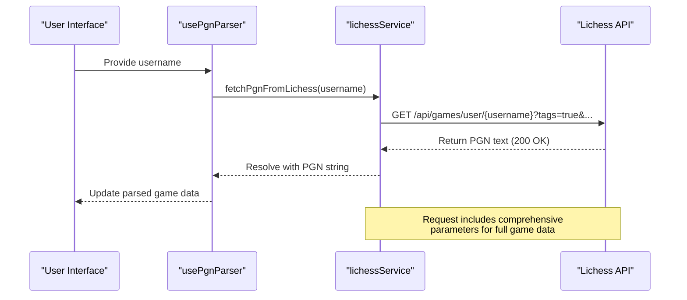
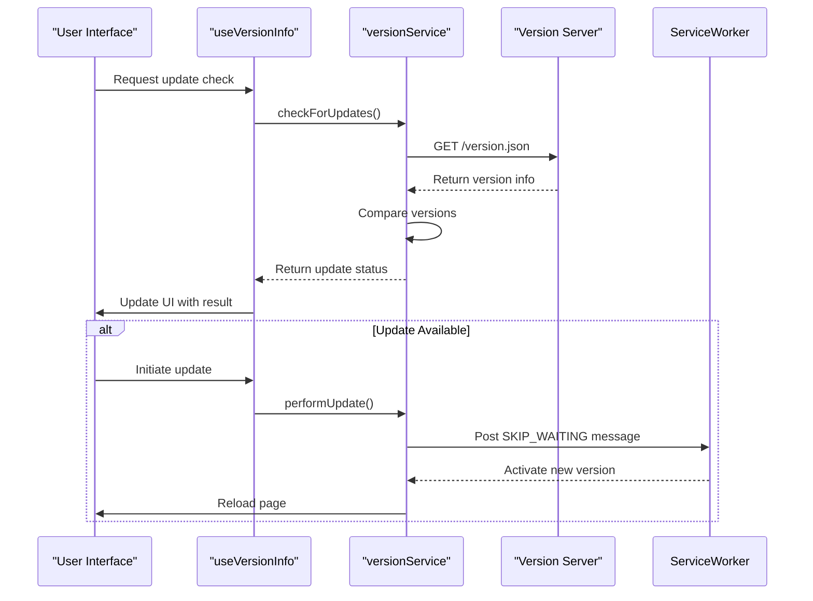
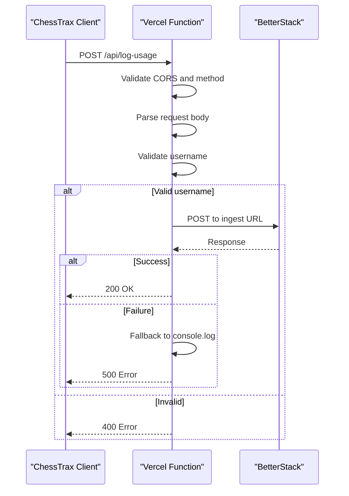

# External API Integrations

<cite>
**Referenced Files in This Document**   
- [lichessService.ts](file://services/lichessService.ts)
- [versionService.ts](file://services/versionService.ts)
- [log-usage.ts](file://api/log-usage.ts)
- [usePgnParser.ts](file://hooks/usePgnParser.ts)
- [useVersionInfo.ts](file://hooks/useVersionInfo.ts)
</cite>

## Table of Contents
1. [Introduction](#introduction)
2. [Lichess API Integration](#lichess-api-integration)
3. [Version Check API Integration](#version-check-api-integration)
4. [Usage Logging API Integration](#usage-logging-api-integration)
5. [Real-World Usage Examples](#real-world-usage-examples)
6. [Common Integration Features](#common-integration-features)
7. [Troubleshooting Guide](#troubleshooting-guide)
8. [Conclusion](#conclusion)

## Introduction
This document provides comprehensive documentation for all external API integrations used by ChessTrax. It details the implementation, usage, and behavior of three core external services: the Lichess API for retrieving user game data, the version check service for detecting application updates, and the usage logging API for collecting anonymous telemetry. The documentation includes endpoint specifications, request/response formats, error handling, and integration patterns used throughout the application.

## Lichess API Integration

The Lichess API integration enables ChessTrax to fetch a user's complete game history in PGN format for analysis. This is the primary data source for the application's chess analysis functionality.

### Endpoint and Parameters
- **HTTP Method**: GET
- **Base URL**: `https://lichess.org/api/games/user/{username}`
- **Authentication**: None required
- **Rate Limiting**: 40 requests per minute per IP address

### Query Parameters
The request includes several fixed parameters to ensure comprehensive game data is retrieved:

| Parameter | Value | Description |
|---------|-------|-------------|
| `tags` | `true` | Include PGN tags (Event, Site, Date, etc.) |
| `clocks` | `true` | Include clock times for each move |
| `evals` | `true` | Include engine evaluation data |
| `opening` | `true` | Include opening classification |
| `literate` | `true` | Include natural language comments |
| `max` | `2000` | Maximum number of games to retrieve |
| `perfType` | `blitz,rapid,classical,correspondence,standard` | Game types to include |

### Response Schema
The API returns a plain text response in PGN (Portable Game Notation) format, with multiple games concatenated. Each game includes:

- Standard PGN headers (Event, Site, Date, Round, White, Black, Result, etc.)
- Opening information (ECO code, opening name)
- Move list with clock times and engine evaluations
- Game termination details

### Error Handling
The integration handles the following error conditions:

| HTTP Status | Error Description |
|------------|-------------------|
| 404 | User not found on Lichess |
| 429 | Rate limit exceeded |
| 5xx | Server error on Lichess side |
| Network errors | Connection timeout or failure |

When an error occurs, the service throws a descriptive error message that is propagated to the UI.

### Caching and Timeout
- **Caching**: No client-side caching is implemented; fresh data is fetched on each request
- **Timeout**: Uses default fetch API timeout (no explicit timeout set)
- **Fallback**: No fallback behavior; user must retry the request



**Diagram sources**
- [lichessService.ts](file://services/lichessService.ts#L15-L27)
- [usePgnParser.ts](file://hooks/usePgnParser.ts#L65-L104)

**Section sources**
- [lichessService.ts](file://services/lichessService.ts#L1-L27)

## Version Check API Integration

The version check integration allows ChessTrax to detect when a new version of the application is available and guide users through the update process.

### Polling Mechanism
The application checks for updates:
- On initial load
- When the user explicitly requests a check
- No periodic background polling is implemented

The check is performed by fetching `version.json` from the same origin as the application (`window.location.origin/version.json`).

### Request Configuration
- **HTTP Method**: GET
- **URL**: `{origin}/version.json`
- **Headers**: 
  - `Accept: application/json`
  - `Cache-Control: no-cache`
- **Timeout**: 10 seconds
- **Authentication**: None required

### Response Structure
The server returns a JSON object with the following structure:

```json
{
  "version": "string",
  "buildDate": "string",
  "buildTime": "string",
  "changelog": "string"
}
```

The client maps this to the `UpdateCheckResponse` interface:

| Field | Type | Description |
|------|------|-------------|
| `available` | boolean | Whether a newer version is available |
| `latestVersion` | string | Version string of the latest release |
| `downloadUrl` | string | URL to the updated application (same as origin) |
| `changelog` | string | Release notes for the new version |

### Update Notification Logic
1. Compare current version (injected at build time) with server version
2. Use semantic versioning comparison to determine if update is available
3. Update UI state to reflect update status
4. When user initiates update, use service worker to install and activate new version
5. Reload the application to load the updated version

### Fallback Behaviors
- If service worker is not available: Perform simple page reload
- If network error occurs: Show descriptive error message based on error type
- If version endpoint returns 404: Inform user that update information is unavailable



**Diagram sources**
- [versionService.ts](file://services/versionService.ts#L50-L159)
- [useVersionInfo.ts](file://hooks/useVersionInfo.ts#L31-L97)

**Section sources**
- [versionService.ts](file://services/versionService.ts#L0-L214)
- [useVersionInfo.ts](file://hooks/useVersionInfo.ts#L0-L97)

## Usage Logging API Integration

The usage logging API collects anonymous telemetry data to help understand how ChessTrax is being used and to guide future development.

### Endpoint and Method
- **HTTP Method**: POST
- **URL**: `/api/log-usage` (Vercel serverless function)
- **Authentication**: Anonymous (no user authentication)

### Request Payload Schema
The client sends a JSON payload with the following structure:

| Field | Type | Description | Required |
|------|------|-------------|----------|
| `username` | string | Lichess username being analyzed | Yes |

### Success Response
- **Status**: 200 OK
- **Content-Type**: application/json
- **Body**: `{ "message": "Log received successfully." }`

### Failure Responses
| Status | Error Body | Description |
|-------|-----------|-------------|
| 400 | `{ "error": "Username is required..." }` | Missing or invalid username |
| 405 | `{ "error": "Method Not Allowed" }` | Non-POST request method |
| 500 | `{ "error": "Logging service not configured" }` | Server-side configuration issue |
| 500 | `{ "error": "Failed to send log" }` | Error sending to BetterStack |

### Privacy Considerations
- Only the Lichess username is collected (no personal information)
- No user identifiers or sensitive data are transmitted
- Data is used solely for product improvement
- Users are not explicitly notified of logging (consider adding disclosure)

### Implementation Details
The serverless function:
- Accepts CORS requests from any origin
- Handles preflight OPTIONS requests
- Uses BetterStack for log ingestion
- Falls back to console logging if BetterStack is not configured
- Validates input data before processing



**Diagram sources**
- [log-usage.ts](file://api/log-usage.ts#L20-L94)

**Section sources**
- [log-usage.ts](file://api/log-usage.ts#L0-L94)

## Real-World Usage Examples

### PGN Parsing in usePgnParser.ts
The `usePgnParser` hook demonstrates real-world integration with the Lichess API data:

1. Receives raw PGN content from the Lichess API
2. Detects the primary user by analyzing White/Black tags
3. Extracts games where the user lost
4. Collects all game dates for timeline visualization
5. Returns structured data for UI components

The hook uses memoization to avoid reprocessing the PGN on every render, improving performance when dealing with large game histories.

**Section sources**
- [usePgnParser.ts](file://hooks/usePgnParser.ts#L65-L104)

### Version Information in useVersionInfo.ts
The `useVersionInfo` hook provides a React-friendly interface to the version checking functionality:

1. Retrieves current version from build-time constants
2. Manages update status in React state
3. Provides callback functions for checking and applying updates
4. Handles error states and provides user-friendly messages
5. Exposes a clean API to components that need version information

This pattern separates the business logic of version checking from the UI concerns, promoting reusability across components.

**Section sources**
- [useVersionInfo.ts](file://hooks/useVersionInfo.ts#L0-L97)

## Common Integration Features

### Authentication
- **Lichess API**: No authentication required (public data)
- **Version Check**: No authentication required
- **Usage Logging**: Anonymous telemetry (no user authentication)

### Caching Strategies
- **Lichess API**: No caching implemented; fresh data on each request
- **Version Check**: No caching (Cache-Control: no-cache header used)
- **Usage Logging**: Not applicable (event-based)

### Timeout Configurations
- **Lichess API**: No explicit timeout (uses browser default)
- **Version Check**: 10 second timeout for version check
- **Usage Logging**: No explicit timeout (serverless function timeout applies)

### Fallback Behaviors
- **Lichess API**: Show error message; user can retry
- **Version Check**: Show descriptive error based on failure type
- **Usage Logging**: Fallback to console.log if BetterStack fails

## Troubleshooting Guide

### Common Issues and Solutions

#### CORS Errors
**Symptoms**: "Cross-Origin Request Blocked" in browser console
**Causes**: 
- Browser security restrictions
- Misconfigured server CORS headers
**Solutions**:
- Verify the Lichess API allows cross-origin requests (it does)
- Ensure no proxy or extension is interfering
- Test in incognito mode to rule out extension conflicts

#### Network Timeouts
**Symptoms**: "Failed to fetch" or "Network request failed"
**Causes**:
- Poor internet connection
- Server unavailability
- Firewall restrictions
**Solutions**:
- Check internet connection
- Verify Lichess status (https://status.lichess.org)
- Try again later
- For version check, ensure the server is reachable

#### Unexpected Response Formats
**Symptoms**: "Invalid version information" or parsing errors
**Causes**:
- Server returning unexpected data format
- Network corruption
- API changes
**Solutions**:
- Verify the expected response structure
- Check network tab for actual response
- Implement more robust error handling and validation
- Add response schema validation

#### Rate Limiting (Lichess)
**Symptoms**: 429 status code, "Too Many Requests"
**Causes**: Exceeding 40 requests per minute
**Solutions**:
- Implement client-side request throttling
- Add exponential backoff for retries
- Cache responses when possible
- Inform user to wait before retrying

#### Service Worker Update Issues
**Symptoms**: Update fails to apply, page doesn't refresh
**Causes**:
- Service worker registration issues
- Browser compatibility
- Network interruptions during update
**Solutions**:
- Verify service worker is supported and registered
- Implement fallback to manual refresh
- Add progress indicators for update process
- Clear service worker cache if stuck

## Conclusion
ChessTrax integrates with three external services to provide a complete chess analysis experience. The Lichess API integration forms the foundation by retrieving user game data for analysis. The version check service ensures users have access to the latest features and bug fixes. The usage logging API provides valuable insights for product development while respecting user privacy. These integrations follow consistent patterns of error handling, user feedback, and fallback behaviors to create a reliable user experience even when external services are unavailable.