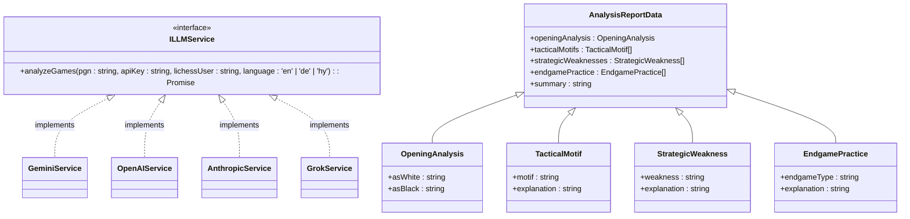
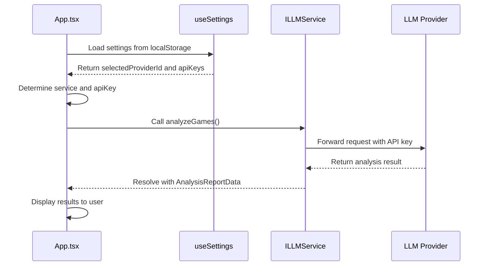
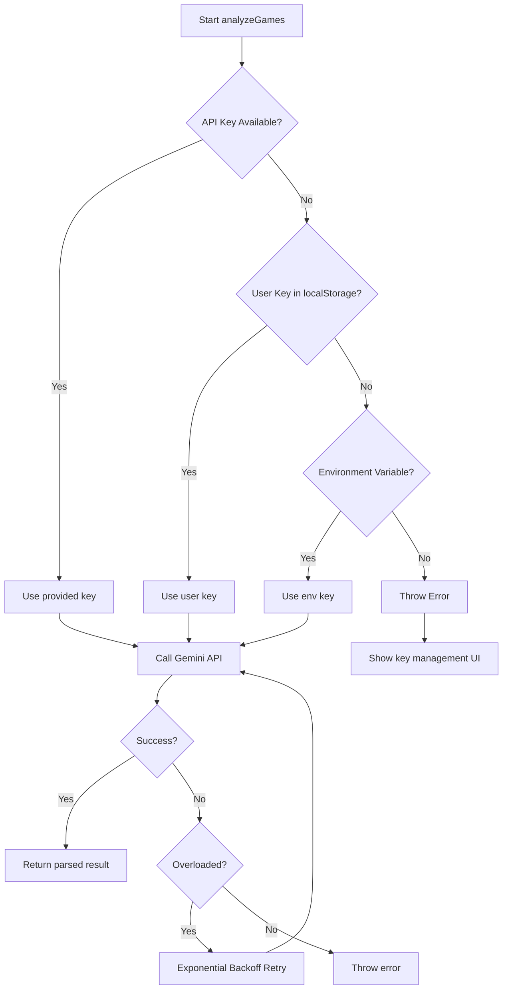
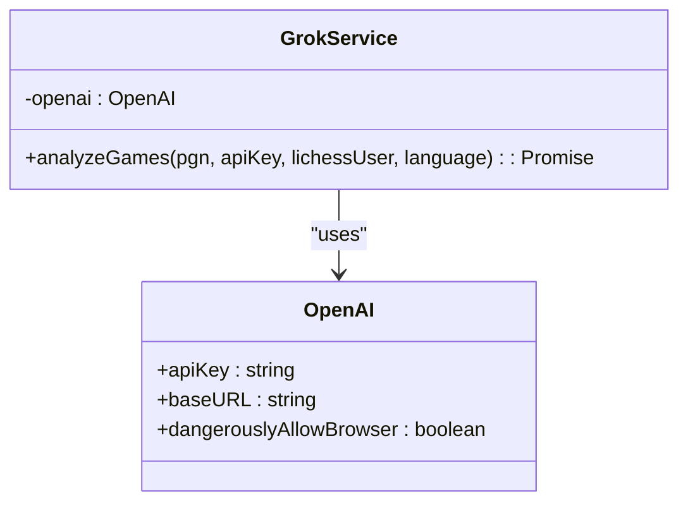
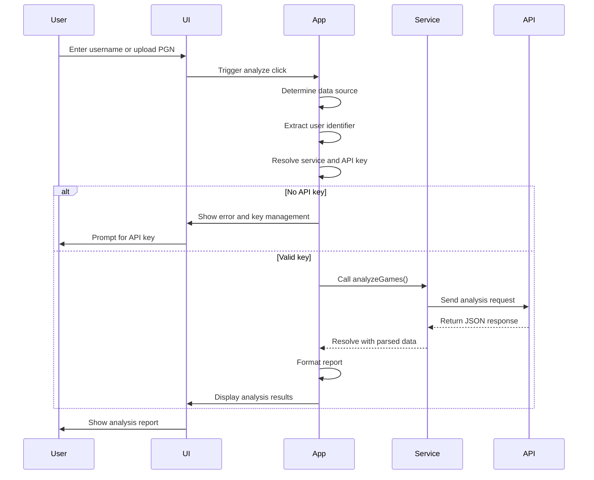
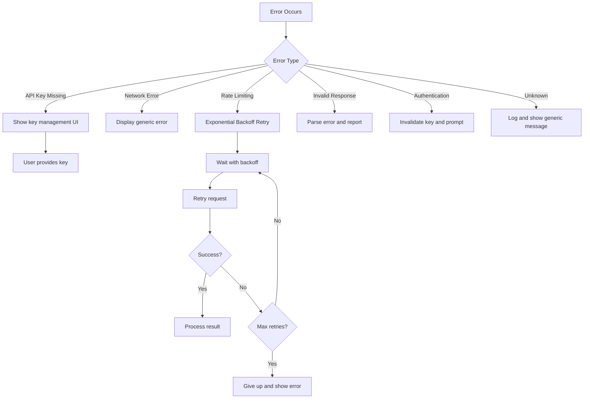
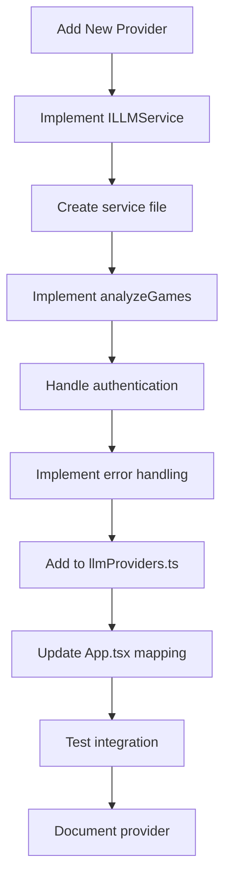

# LLM Service Interface

<cite>
**Referenced Files in This Document**   
- [llmService.ts](file://services/llmService.ts)
- [geminiService.ts](file://services/geminiService.ts)
- [openAIService.ts](file://services/openAIService.ts)
- [anthropicService.ts](file://services/anthropicService.ts)
- [grokService.ts](file://services/grokService.ts)
- [App.tsx](file://App.tsx)
- [llmProviders.ts](file://llmProviders.ts)
- [types.ts](file://types.ts)
</cite>

## Table of Contents
1. [Introduction](#introduction)
2. [Core Interface Definition](#core-interface-definition)
3. [Strategy Pattern Implementation](#strategy-pattern-implementation)
4. [Provider-Specific Implementations](#provider-specific-implementations)
5. [API Invocation Flow](#api-invocation-flow)
6. [Error Handling and Retry Logic](#error-handling-and-retry-logic)
7. [Extending with New Providers](#extending-with-new-providers)
8. [Debugging Integration Issues](#debugging-integration-issues)
9. [Conclusion](#conclusion)

## Introduction
This document provides comprehensive API documentation for the LLM service interface in the ChessTrax application. The system enables pluggable LLM providers through a well-defined interface and configuration system. The documentation covers the core interface, implementation details for each provider, invocation patterns, error handling, and extension guidelines.

## Core Interface Definition

The `ILLMService` interface defines the contract for all LLM providers in the system. It specifies a single abstract method `analyzeGames` that must be implemented by all concrete services.



**Diagram sources**
- [llmService.ts](file://services/llmService.ts#L2-L4)
- [types.ts](file://types.ts#L1-L28)

**Section sources**
- [llmService.ts](file://services/llmService.ts#L2-L4)
- [types.ts](file://types.ts#L1-L28)

### Method Signature
The `analyzeGames` method has the following signature:
- **pgn**: A string containing the PGN (Portable Game Notation) of chess games to analyze
- **apiKey**: A string containing the API key for authentication with the LLM provider
- **lichessUser**: A string representing the Lichess username of the player whose games are being analyzed
- **language**: A union type ('en' | 'de' | 'hy') specifying the language for the analysis output
- **Return Type**: A Promise that resolves to an `AnalysisReportData` object containing structured analysis results

### Expected Behavior
The method should analyze the provided PGN games and return a structured training plan that includes:
- Opening performance analysis for both White and Black
- Recurring tactical motifs the player misses
- Common strategic weaknesses in gameplay
- Recommended endgame types for practice
- A concise summary with actionable improvement suggestions

## Strategy Pattern Implementation

The system implements the Strategy Pattern to enable pluggable LLM providers. This design allows the application to dynamically select and use different LLM services without changing the core analysis logic.



**Diagram sources**
- [App.tsx](file://App.tsx#L150-L250)
- [llmProviders.ts](file://llmProviders.ts#L1-L28)

**Section sources**
- [App.tsx](file://App.tsx#L150-L250)
- [llmProviders.ts](file://llmProviders.ts#L1-L28)

### Key Components
The Strategy Pattern is implemented through three main components:
1. **Interface**: The `ILLMService` interface defines the common contract
2. **Concrete Strategies**: Each provider (Gemini, OpenAI, etc.) implements the interface
3. **Context**: The `App.tsx` component selects and uses the appropriate strategy

### Configuration System
The `llmProviders.ts` file defines the available providers with their metadata:
- **id**: Unique identifier for the provider
- **name**: Display name shown in the UI
- **apiKeyName**: Label for the API key in settings
- **documentationUrl**: Link to API key documentation

This configuration enables the Settings UI to dynamically render provider options and key management fields.

## Provider-Specific Implementations

Each LLM provider implements the `ILLMService` interface with provider-specific configurations and authentication mechanisms.

### Gemini Service Implementation

The `geminiService.ts` implementation includes several unique features:



**Diagram sources**
- [geminiService.ts](file://services/geminiService.ts#L50-L150)

**Section sources**
- [geminiService.ts](file://services/geminiService.ts#L50-L150)

#### Authentication Mechanism
The Gemini service uses a three-tier key resolution strategy:
1. **User-provided key**: From the `apiKey` parameter (settings)
2. **LocalStorage key**: From `userGeminiApiKey` in browser storage
3. **Environment variable**: From `GEMINI_API_KEY` as fallback

This allows users to provide their own keys while maintaining a fallback for demonstration purposes.

#### Deviations from Base Interface
- Implements structured JSON output using Google's schema validation
- Includes sophisticated retry logic for rate limiting (503 errors)
- Uses exponential backoff with jitter for retry delays
- Hardcoded to use the "gemini-2.5-flash" model

### OpenAI and Anthropic Services

The `openAIService.ts` and `anthropicService.ts` implementations are currently placeholders:

```mermaid
flowchart TD
A[analyzeGames] --> B[Log parameters]
B --> C[Throw "not implemented" error]
C --> D[User sees error message]
```

**Diagram sources**
- [openAIService.ts](file://services/openAIService.ts#L1-L27)
- [anthropicService.ts](file://services/anthropicService.ts#L1-L17)

**Section sources**
- [openAIService.ts](file://services/openAIService.ts#L1-L27)
- [anthropicService.ts](file://services/anthropicService.ts#L1-L17)

Both services currently:
- Log the input parameters for debugging
- Throw a "not implemented" error
- Serve as templates for future implementation

### Grok Service Implementation

The `grokService.ts` implementation leverages OpenAI SDK compatibility:



**Diagram sources**
- [grokService.ts](file://services/grokService.ts#L1-L157)

**Section sources**
- [grokService.ts](file://services/grokService.ts#L1-L157)

#### Key Features
- Uses the OpenAI SDK with custom baseURL pointing to x.ai endpoint
- Sets `dangerouslyAllowBrowser: true` for client-side execution
- Implements structured JSON output with response_format parameter
- Uses "grok-1" model identifier
- Includes retry logic for rate limiting (429) and service unavailable (503) errors

#### Authentication
The Grok service uses a simple API key authentication:
- Key is passed directly from the `apiKey` parameter
- No fallback mechanisms implemented
- Relies on the user providing a valid key through the settings UI

## API Invocation Flow

The `App.tsx` component orchestrates the invocation of the selected LLM provider through the interface.



**Diagram sources**
- [App.tsx](file://App.tsx#L250-L350)

**Section sources**
- [App.tsx](file://App.tsx#L250-L350)

### Key Steps in Invocation
1. **Data Source Determination**: The app checks whether to fetch games from Lichess or use uploaded PGN
2. **User Identification**: Extracts the Lichess username from input or PGN content
3. **Service Resolution**: Maps the selected provider ID to the corresponding service instance
4. **API Key Resolution**: Determines the appropriate API key using the provider's logic
5. **Analysis Execution**: Calls the `analyzeGames` method with processed parameters
6. **Result Handling**: Displays the analysis or error message to the user

### Code Example
The following code snippet shows how App.tsx invokes the selected provider:

```typescript
const performAnalysis = useCallback(async (pgn: string, user: string) => {
  let service: ILLMService;
  let apiKey: string | undefined = undefined;
  let providerId: string;

  // Key resolution logic
  const userGeminiApiKey = localStorage.getItem('userGeminiApiKey');
  if (userGeminiApiKey) {
    providerId = 'gemini';
    apiKey = userGeminiApiKey;
    service = geminiService;
  } else if (settings.selectedProviderId && settings.apiKeys[settings.selectedProviderId]) {
    providerId = settings.selectedProviderId;
    apiKey = settings.apiKeys[providerId];
    service = services[providerId];
  } else {
    providerId = 'gemini';
    apiKey = process.env.GEMINI_API_KEY || '';
    service = geminiService;
  }

  // API invocation
  const result = await service.analyzeGames(gamesToAnalyze, apiKey, user, apiLang);
  // Handle result
}, [settings, providers]);
```

## Error Handling and Retry Logic

The system implements comprehensive error handling patterns to ensure robust operation despite network issues and API limitations.

### Error Types and Handling



**Diagram sources**
- [geminiService.ts](file://services/geminiService.ts#L100-L150)
- [grokService.ts](file://services/grokService.ts#L100-L150)

**Section sources**
- [geminiService.ts](file://services/geminiService.ts#L100-L150)
- [grokService.ts](file://services/grokService.ts#L100-L150)

### Retry Logic Implementation
Both the Gemini and Grok services implement retry logic with the following characteristics:
- **Maximum retries**: 3 attempts
- **Exponential backoff**: Delay = 2^attempt * 1000ms + random jitter
- **Error detection**: Specifically checks for 503 (overloaded) and 429 (rate limit) errors
- **Jitter**: Adds random milliseconds to prevent thundering herd problems

The retry mechanism is implemented in a while loop that increments the attempt counter and applies the calculated delay before the next attempt.

### Timeout Management
While explicit timeouts are not implemented in the current code, the following patterns contribute to timeout management:
- **Implicit browser timeouts**: HTTP requests are subject to browser-level timeouts
- **Retry with backoff**: Prevents immediate retries that could exacerbate timeout issues
- **User feedback**: The UI shows loading states and allows users to cancel long-running operations

## Extending with New Providers

The architecture is designed to make adding new LLM providers straightforward and type-safe.

### Required Implementation Steps



**Section sources**
- [llmProviders.ts](file://llmProviders.ts#L1-L28)
- [App.tsx](file://App.tsx#L150-L160)

### Implementation Guidelines
To add a new provider, follow these steps:

1. **Create Service File**: Create a new TypeScript file in the `services` directory (e.g., `newProviderService.ts`)
2. **Implement Interface**: Import `ILLMService` and implement the `analyzeGames` method
3. **Authentication**: Implement provider-specific key resolution and authentication
4. **API Integration**: Use the appropriate SDK or HTTP client to connect to the provider
5. **Error Handling**: Include retry logic and provider-specific error handling
6. **Response Parsing**: Ensure the response is properly parsed into `AnalysisReportData`

### Configuration Updates
After implementing the service, update the configuration:

1. **Add to llmProviders.ts**: Add the provider to the `providers` array with appropriate metadata
2. **Update App.tsx**: Add the service instance to the `services` record object
3. **Type Safety**: Ensure all IDs are properly typed with the union type

### Type Safety with TypeScript
The system leverages TypeScript for type safety in several ways:
- **Interface contract**: The `ILLMService` interface ensures all providers implement the same methods
- **Union types**: Provider IDs are restricted to specific string literals
- **Generic typing**: The `services` record uses mapped types to ensure key-value consistency
- **Response validation**: The `AnalysisReportData` interface ensures consistent output structure

## Debugging Integration Issues

This section provides troubleshooting guidance for common integration issues encountered when working with LLM providers.

### Authentication Failures
Common causes and solutions:

**Issue**: "API key is not configured" error
- **Cause**: No valid API key is available through any resolution method
- **Solution**: 
  1. Check if the key is properly entered in Settings
  2. Verify the key format matches the provider's requirements
  3. For Gemini, try adding the key via the key icon in the header
  4. Ensure environment variables are properly set for development

**Issue**: Authentication rejected by provider
- **Cause**: Invalid, expired, or revoked API key
- **Solution**:
  1. Regenerate the API key from the provider's dashboard
  2. Clear localStorage entries related to the service
  3. Remove the key from settings and re-enter it
  4. Check provider-specific requirements (e.g., billing setup)

### Malformed Responses
Issues with parsing API responses:

**Issue**: "Failed to parse JSON response"
- **Cause**: Provider returned invalid JSON or unexpected format
- **Solution**:
  1. Check the raw response in browser developer tools
  2. Verify the provider's API is returning structured data
  3. Update the response schema if the provider changed their format
  4. Implement more robust error recovery in the service

**Issue**: Missing required fields in analysis
- **Cause**: LLM did not include all required fields in the response
- **Solution**:
  1. Review and strengthen the prompt instructions
  2. Add validation and default values in the service
  3. Implement fallback content for missing fields
  4. Contact provider support about consistency issues

### General Debugging Tips
- **Enable console logging**: The services log error details to the browser console
- **Check network tab**: Inspect API requests and responses in developer tools
- **Test with minimal input**: Use a small PGN file to isolate issues
- **Verify provider status**: Check if the LLM provider is experiencing outages
- **Review rate limits**: Ensure you're not exceeding request quotas
- **Validate environment**: Confirm all configuration is correct for the current environment

## Conclusion
The LLM service interface in ChessTrax provides a robust, extensible foundation for integrating multiple language model providers. By implementing the Strategy Pattern with a clear interface contract, the system enables pluggable AI services while maintaining a consistent user experience. The architecture supports easy extension with new providers, comprehensive error handling, and type-safe integration. As additional providers are implemented beyond the current Gemini and Grok services, the same patterns will ensure consistent behavior and maintainability across the codebase.