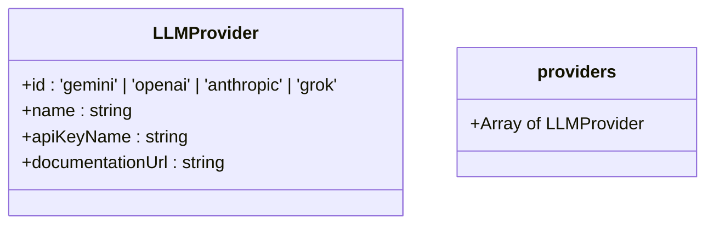
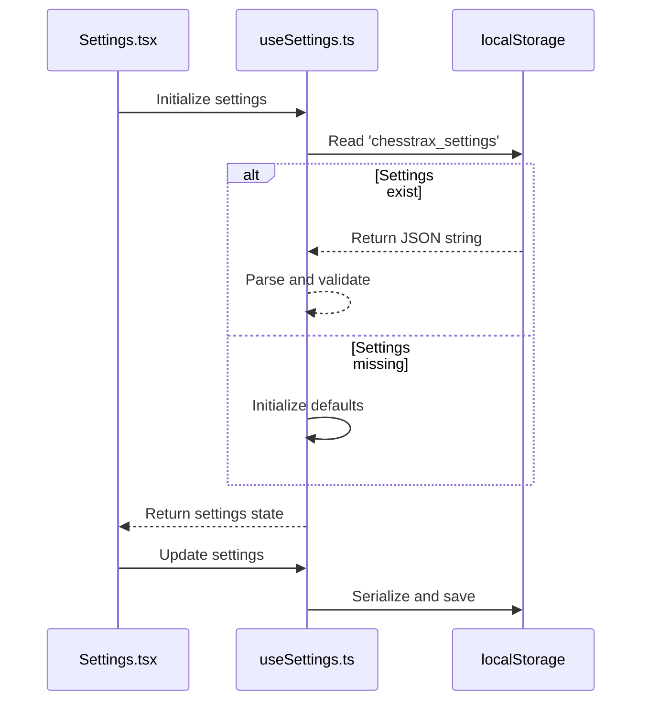
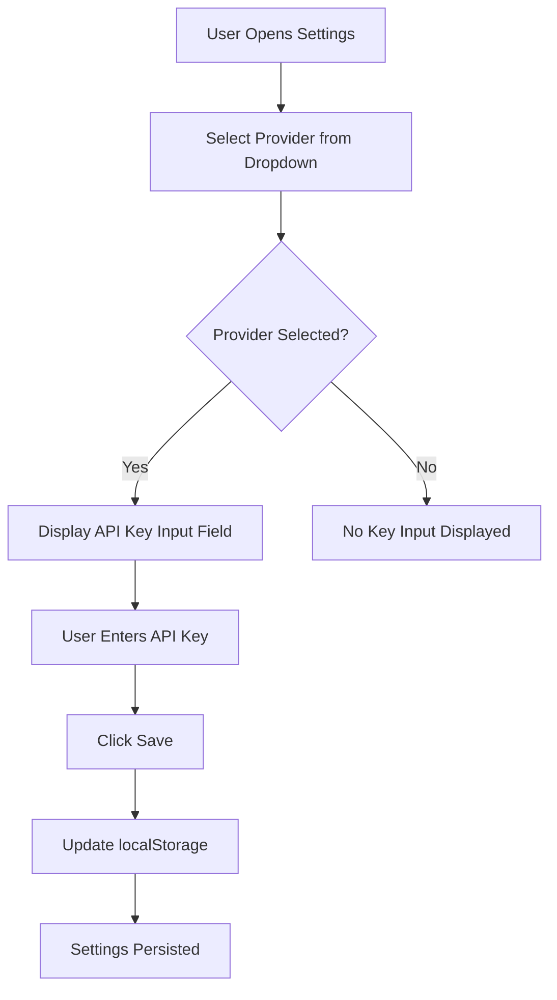
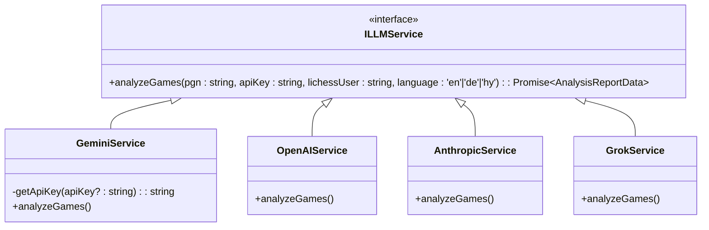
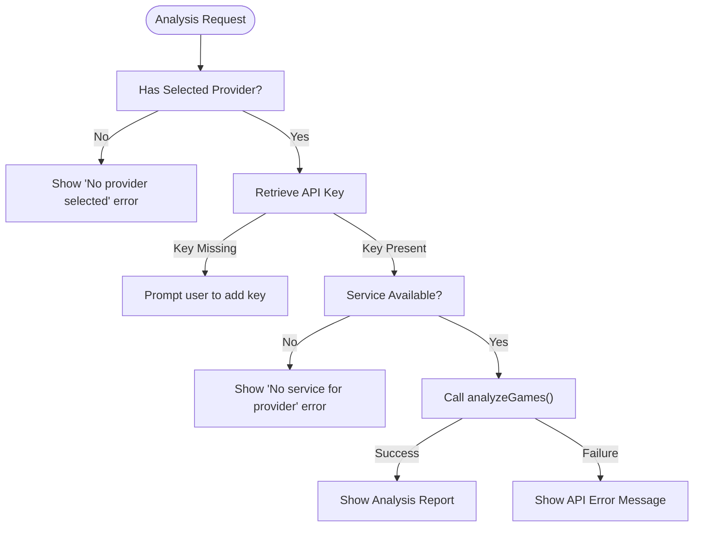

# Provider Configuration

<cite>
**Referenced Files in This Document**   
- [llmProviders.ts](file://llmProviders.ts)
- [useSettings.ts](file://hooks/useSettings.ts)
- [llmService.ts](file://services/llmService.ts)
- [geminiService.ts](file://services/geminiService.ts)
- [openAIService.ts](file://services/openAIService.ts)
- [Settings.tsx](file://components/Settings.tsx)
- [App.tsx](file://App.tsx)
</cite>

## Table of Contents
1. [Introduction](#introduction)
2. [LLM Provider Definition and Metadata](#llm-provider-definition-and-metadata)
3. [Persistent Configuration Management](#persistent-configuration-management)
4. [Provider Selection and AI Analysis Flow](#provider-selection-and-ai-analysis-flow)
5. [Service Layer Integration and Dependency Injection](#service-layer-integration-and-dependency-injection)
6. [Validation and Error Handling](#validation-and-error-handling)
7. [Common Configuration Issues and Resolutions](#common-configuration-issues-and-resolutions)
8. [Extending the System with New Providers](#extending-the-system-with-new-providers)
9. [Conclusion](#conclusion)

## Introduction
The ChessTrax application supports multiple Large Language Model (LLM) providers for AI-powered chess analysis. This document details the configuration architecture that enables users to select and authenticate with different LLM services such as Gemini, OpenAI, Anthropic, and Grok. The system is designed with extensibility, security, and user experience in mind, leveraging localStorage for persistent settings and a service-oriented architecture for clean separation of concerns.

## LLM Provider Definition and Metadata
The `llmProviders.ts` file defines the interface and available LLM providers in the system. Each provider is represented as a structured object containing metadata necessary for UI rendering and user guidance.

**Diagram sources**  
- [llmProviders.ts](file://llmProviders.ts#L3-L28)

The `LLMProvider` interface standardizes provider metadata with four key properties: a unique identifier (`id`), display name (`name`), API key label (`apiKeyName`), and documentation link (`documentationUrl`). The exported `providers` array currently includes OpenAI, Grok, and Anthropic configurations, with Gemini implicitly supported through environment variables and localStorage fallbacks.

**Section sources**  
- [llmProviders.ts](file://llmProviders.ts#L3-L28)

## Persistent Configuration Management
User preferences for LLM provider selection and API keys are managed through the `useSettings` custom React hook, which abstracts localStorage operations and provides a reactive settings state.

**Diagram sources**  
- [useSettings.ts](file://hooks/useSettings.ts#L5-L38)
- [Settings.tsx](file://components/Settings.tsx#L10-L105)

The `SettingsState` interface defines two core properties: `selectedProviderId` (nullable) and `apiKeys` (a record mapping provider IDs to their respective keys). On initialization, the hook attempts to retrieve settings from localStorage, falling back to default values if unavailable. The `saveSettings` function ensures both state update and persistent storage in a single operation, with error handling for storage exceptions.

**Section sources**  
- [useSettings.ts](file://hooks/useSettings.ts#L5-L38)

## Provider Selection and AI Analysis Flow
The provider configuration directly influences the AI analysis workflow, from user interface interaction to service invocation. The Settings component renders a dynamic form based on the selected provider, allowing users to input and save API credentials.

**Diagram sources**  
- [Settings.tsx](file://components/Settings.tsx#L45-L95)

When analysis is initiated, the App component retrieves the current settings and validates the presence of both a selected provider and valid API key before proceeding. The selected provider determines which service implementation is used for analysis.

**Section sources**  
- [Settings.tsx](file://components/Settings.tsx#L10-L105)
- [App.tsx](file://App.tsx#L125-L158)

## Service Layer Integration and Dependency Injection
The LLM service layer employs a dependency injection pattern through a common interface `ILLMService`, enabling runtime selection of provider-specific implementations based on user configuration.

**Diagram sources**  
- [llmService.ts](file://services/llmService.ts#L1-L4)
- [geminiService.ts](file://services/geminiService.ts#L1-L165)
- [openAIService.ts](file://services/openAIService.ts#L1-L27)

Each provider service (e.g., `GeminiService`, `OpenAIService`) implements the `analyzeGames` method according to the `ILLMService` interface. The `GeminiService` demonstrates a sophisticated API key resolution strategy, checking user input, localStorage, and environment variables in sequence. Other providers are currently placeholders, indicating planned future implementation.

**Section sources**  
- [llmService.ts](file://services/llmService.ts#L1-L4)
- [geminiService.ts](file://services/geminiService.ts#L1-L165)
- [openAIService.ts](file://services/openAIService.ts#L1-L27)

## Validation and Error Handling
The system implements comprehensive validation to prevent analysis execution with incomplete or invalid configurations. Before initiating analysis, the application verifies both provider selection and API key availability.

**Diagram sources**  
- [App.tsx](file://App.tsx#L125-L158)
- [geminiService.ts](file://services/geminiService.ts#L133-L162)

Error messages are contextualized based on the provider and key source. For example, when using Gemini without a user-provided key, the system prompts users to use the header key icon, while other providers direct users to the settings panel. The `GeminiService` also implements retry logic with exponential backoff for rate-limited or overloaded models.

**Section sources**  
- [App.tsx](file://App.tsx#L125-L158)
- [geminiService.ts](file://services/geminiService.ts#L133-L162)

## Common Configuration Issues and Resolutions
Users may encounter several configuration-related issues during normal operation. This section documents common problems and their resolution steps.

### Invalid or Missing API Keys
**Symptom**: "API key for [Provider] is missing" error message appears.  
**Resolution**: 
1. Open Settings panel
2. Select desired provider from dropdown
3. Enter valid API key obtained from the provider's documentation page
4. Click Save

For Gemini users, an alternative key entry point exists via the header key icon, which stores keys in `userGeminiApiKey` localStorage entry.

### Provider Switching Conflicts
**Symptom**: Analysis fails after switching providers despite having saved keys.  
**Resolution**: 
- Ensure API keys for the newly selected provider are entered and saved
- Verify that the correct provider is displayed in the analysis interface
- Clear any cached settings if issues persist

### Service Not Implemented Errors
**Symptom**: "OpenAI provider is not yet implemented" error.  
**Resolution**: 
- Currently, only Gemini is fully implemented
- Users should select Google Gemini as their provider
- Monitor project updates for additional provider support

## Extending the System with New Providers
Developers can extend the LLM provider system by following these steps:

1. **Add Provider Metadata**: Extend the `LLMProvider` interface and `providers` array in `llmProviders.ts` with the new provider's details.
2. **Implement Service Class**: Create a new service file (e.g., `newProviderService.ts`) that implements the `ILLMService` interface.
3. **Handle API Key Resolution**: Implement secure key retrieval logic, following the pattern in `GeminiService.getApiKey()`.
4. **Integrate with App**: Ensure the main application component can resolve and instantiate the new service.

The system's interface-based design ensures that new providers can be added without modifying existing code that consumes the service, adhering to the Open/Closed Principle.

**Section sources**  
- [llmProviders.ts](file://llmProviders.ts#L3-L28)
- [llmService.ts](file://services/llmService.ts#L1-L4)
- [geminiService.ts](file://services/geminiService.ts#L1-L165)

## Conclusion
The ChessTrax LLM provider configuration system provides a flexible, extensible framework for integrating multiple AI services. By separating provider metadata, persistent storage, and service implementation, the architecture enables easy addition of new providers while maintaining a clean user experience. The use of localStorage for settings persistence ensures user preferences are maintained across sessions, and comprehensive validation prevents common configuration errors. As additional providers are implemented beyond the current Gemini support, users will benefit from a consistent interface and reliable AI analysis capabilities.