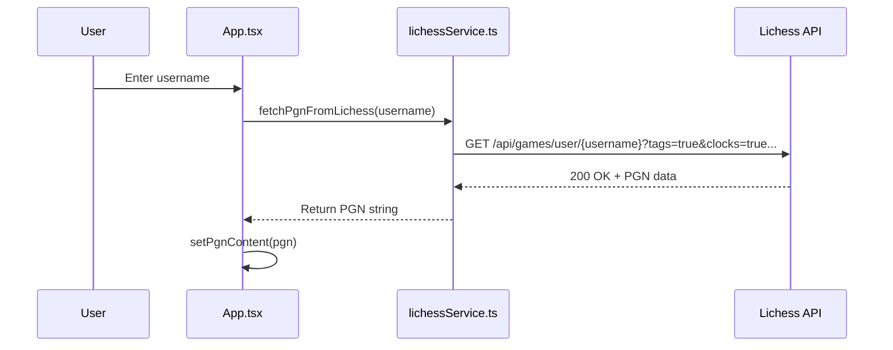
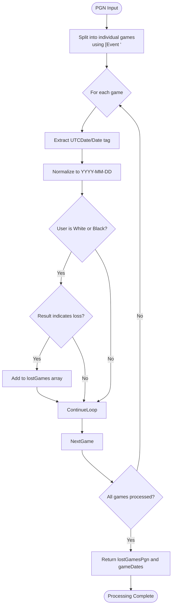
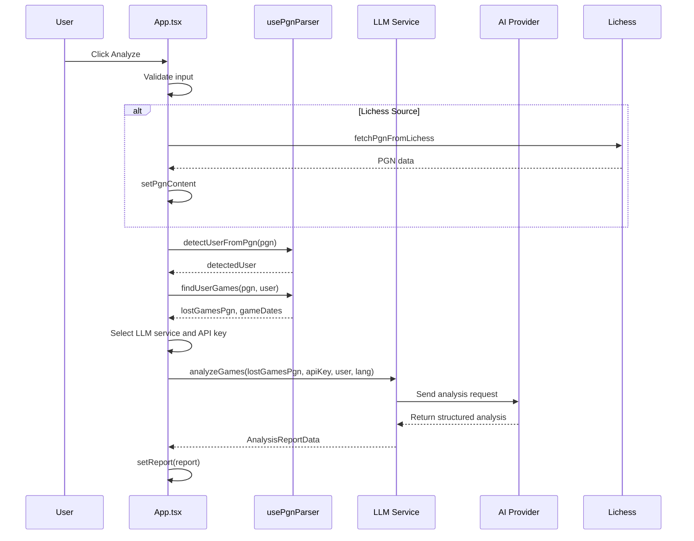

# Game Analysis

<cite>
**Referenced Files in This Document**   
- [FileUpload.tsx](file://components/FileUpload.tsx)
- [lichessService.ts](file://services/lichessService.ts)
- [usePgnParser.ts](file://hooks/usePgnParser.ts)
- [App.tsx](file://App.tsx)
</cite>

## Table of Contents
1. [Introduction](#introduction)
2. [Data Input Methods](#data-input-methods)
3. [PGN Parsing and Game Processing](#pgn-parsing-and-game-processing)
4. [Domain Model and Data Transformation](#domain-model-and-data-transformation)
5. [Integration with AI Analysis System](#integration-with-ai-analysis-system)
6. [Error Handling and Common Issues](#error-handling-and-common-issues)
7. [Conclusion](#conclusion)

## Introduction
ChessTrax provides a comprehensive game analysis feature that enables users to gain insights from their chess games by analyzing losses through AI-powered evaluation. The system supports two primary input methods: uploading PGN (Portable Game Notation) files or fetching games directly from Lichess using a username. This document details the implementation of these features, focusing on the data flow from input to AI analysis, including parsing logic, domain modeling, and integration with external services.

## Data Input Methods

### File Upload Interface
The `FileUpload` component provides a user-friendly interface for uploading PGN files. It renders a clickable area that triggers a hidden file input dialog when clicked. The component displays the selected filename and includes a remove button to clear the selection. Only files with the `.pgn` extension are accepted, ensuring proper format compliance.

When a file is selected, the `handleFileSelect` function reads its content using the `FileReader` API and stores the raw PGN text in the application state via `setPgnContent`. This action also clears any previously entered Lichess username, ensuring data source consistency.

**Section sources**
- [FileUpload.tsx](file://components/FileUpload.tsx#L1-L83)
- [App.tsx](file://App.tsx#L87-L100)

### Lichess API Integration
The `lichessService.ts` module handles communication with the Lichess API to fetch game data. The `fetchPgnFromLichess` function constructs a request URL using the provided username and predefined parameters that specify the desired data format and game types (blitz, rapid, classical, correspondence, standard). The request header specifies `application/x-nd-pgn` to receive games in PGN format.

The service fetches up to 2000 games, including metadata such as tags, clocks, evaluations, and opening information. If the request fails—due to network issues or a non-existent user—an error is thrown with the corresponding HTTP status code, which is then handled by the calling component.

**Diagram sources**
- [lichessService.ts](file://services/lichessService.ts#L1-L28)
- [App.tsx](file://App.tsx#L183-L195)

**Section sources**
- [lichessService.ts](file://services/lichessService.ts#L1-L28)
- [App.tsx](file://App.tsx#L183-L223)

## PGN Parsing and Game Processing

### PGN Format Basics
PGN (Portable Game Notation) is a standard plain text format for recording chess games. Each game begins with bracketed tags such as `[Event ""]`, `[White ""]`, `[Black ""]`, and `[Result ""]`, followed by the move list in algebraic notation. ChessTrax processes PGN content by splitting the input string at each `[Event "` marker to separate individual games.

### User Detection Logic
The `detectUserFromPgn` function analyzes all games in the PGN string to determine the most frequently occurring player. It scans both White and Black player tags, counting occurrences while ignoring placeholder values like `?`. The user with the highest frequency is selected as the subject of analysis, enabling automatic identification without manual input.

### Loss Filtering Mechanism
The `findUserGames` function processes each game to identify losses for the detected user. It checks whether the user played as White or Black and evaluates the Result tag accordingly:
- If the user was White and the result was `0-1`, the game is considered a loss
- If the user was Black and the result was `1-0`, the game is considered a loss

All games are scanned for date information using the `UTCDate` or `Date` tag, which is normalized to `YYYY-MM-DD` format for consistent processing and display.

**Diagram sources**
- [usePgnParser.ts](file://hooks/usePgnParser.ts#L0-L104)

**Section sources**
- [usePgnParser.ts](file://hooks/usePgnParser.ts#L0-L104)

## Domain Model and Data Transformation

### Parsed Game Data Structure
The parsing process transforms raw PGN text into a structured domain model represented by the `PgnParseResult` interface:
- `lostGamesPgn`: Array of PGN strings representing games where the user lost
- `gameDates`: Array of normalized date strings from all games
- `detectedUser`: Username identified as the primary player

This model enables downstream components to access filtered game data and metadata without reprocessing the original PGN content.

### Data Flow Pipeline
The transformation pipeline follows a reactive pattern using the `usePgnParser` hook, which leverages React's `useMemo` to cache results and avoid redundant parsing when the input remains unchanged. The pipeline executes in the following sequence:
1. Raw PGN content is provided (either from file upload or Lichess API)
2. `detectUserFromPgn` identifies the primary user
3. `findUserGames` filters games for losses and extracts dates
4. Results are returned as a stable object reference for UI rendering

The `getGameDateRange` utility function further processes the date array to display a human-readable date range in the interface, enhancing user experience by showing the temporal scope of analyzed games.

**Section sources**
- [usePgnParser.ts](file://hooks/usePgnParser.ts#L42-L104)
- [App.tsx](file://App.tsx#L58-L65)

## Integration with AI Analysis System

### Analysis Trigger Workflow
When the user clicks "Analyze", the `handleAnalyzeClick` function orchestrates the analysis workflow based on the selected data source:
- For Lichess input: Fetches PGN data, stores it, and proceeds to analysis
- For file upload: Uses existing PGN content and detected user

The system then invokes `performAnalysis`, which selects an appropriate LLM service (Gemini, Grok, etc.) based on available API keys and settings. The lost games PGN array is passed to the AI service along with the username and language preference.

### Service Provider Selection
The AI service selection follows a priority order:
1. User-provided Gemini API key (stored in localStorage)
2. Configured API key from settings for the selected provider
3. Fallback to environment variable for Gemini

This layered approach ensures flexibility while maintaining security through proper key management.

**Diagram sources**
- [App.tsx](file://App.tsx#L183-L223)
- [usePgnParser.ts](file://hooks/usePgnParser.ts#L64-L103)

**Section sources**
- [App.tsx](file://App.tsx#L102-L158)
- [usePgnParser.ts](file://hooks/usePgnParser.ts#L64-L103)

## Error Handling and Common Issues

### Input Validation
The system implements comprehensive validation to handle common user errors:
- Empty Lichess username: Displays "Please enter a username"
- Non-existent Lichess user: Shows "User not found" with 404 detection
- Missing PGN file: Prompts "Please upload a PGN file"
- Undetectable user: Indicates "Could not detect player from PGN"

### Format and API Issues
Common technical issues and their solutions include:
- **Invalid PGN format**: The parser skips malformed games but requires at least one valid game with proper tags. Users should ensure exports include header tags.
- **API rate limits**: The Lichess API does not enforce strict rate limits for public endpoints, but excessive requests may be throttled. The application handles HTTP errors gracefully with user-friendly messages.
- **Empty result sets**: If no lost games are found, the system notifies the user rather than proceeding with analysis, preventing unnecessary AI processing costs.

Error messages are localized using the i18n system, supporting English, German, and Armenian languages to accommodate international users.

**Section sources**
- [App.tsx](file://App.tsx#L183-L223)
- [usePgnParser.ts](file://hooks/usePgnParser.ts#L0-L40)

## Conclusion
ChessTrax's game analysis functionality provides a robust pipeline from raw chess game data to AI-powered insights. By supporting both file upload and direct Lichess integration, it accommodates various user preferences and technical backgrounds. The parsing system intelligently detects players and filters losses, while the modular service architecture allows for flexible AI provider integration. Comprehensive error handling ensures a smooth user experience even when input issues arise, making the tool accessible to both beginners learning chess analysis and experienced players seeking deeper insights.