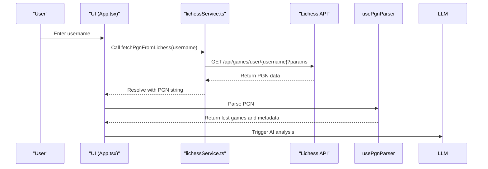
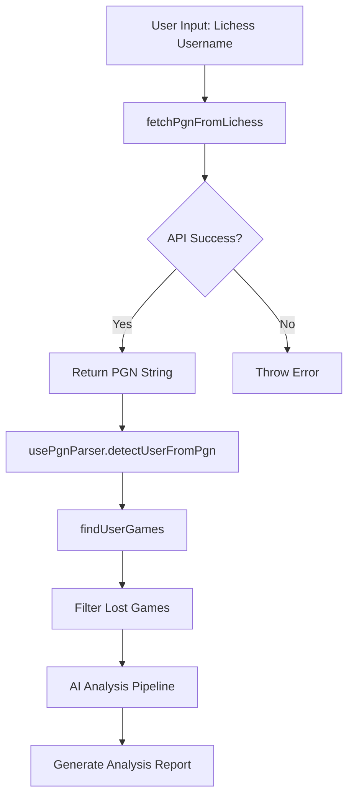
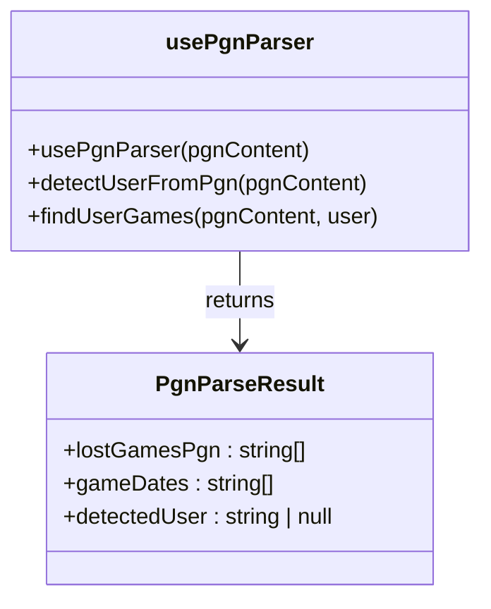
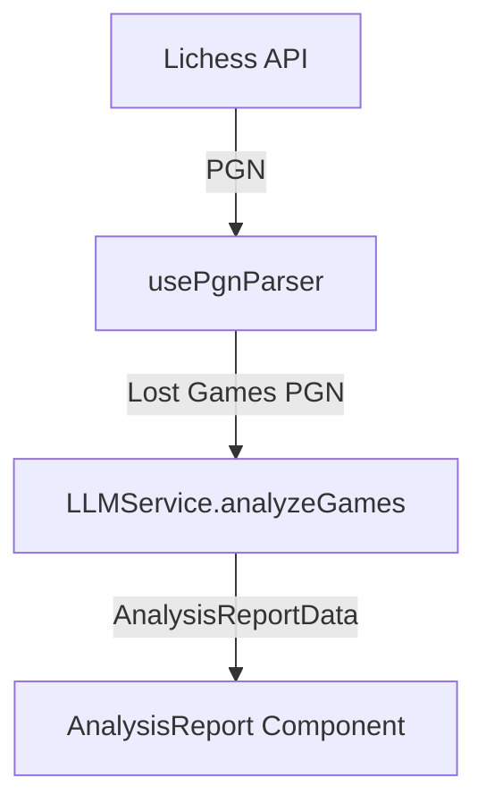

# Lichess Integration

<cite>
**Referenced Files in This Document**   
- [lichessService.ts](file://services/lichessService.ts)
- [usePgnParser.ts](file://hooks/usePgnParser.ts)
- [App.tsx](file://App.tsx)
</cite>

## Table of Contents
1. [Introduction](#introduction)
2. [Lichess API Integration Overview](#lichess-api-integration-overview)
3. [Core Data Flow](#core-data-flow)
4. [API Request Structure and Parameters](#api-request-structure-and-parameters)
5. [Response Processing and PGN Handling](#response-processing-and-pgn-handling)
6. [Error Handling and Resilience](#error-handling-and-resilience)
7. [Integration with PGN Parser and AI Pipeline](#integration-with-pgn-parser-and-ai-pipeline)
8. [Common Issues and Troubleshooting](#common-issues-and-troubleshooting)
9. [Advanced Considerations](#advanced-considerations)

## Introduction
The Lichess Integration sub-feature enables users to analyze their chess games by fetching historical game data directly from their Lichess account. By entering a username, the application retrieves recent games in Portable Game Notation (PGN) format, processes them to identify losses, and feeds the data into an AI-powered analysis pipeline. This document details the implementation, data flow, error handling, and integration points that make this feature possible.

## Lichess API Integration Overview
The integration leverages the public Lichess API to fetch game data for a given user. The core functionality is implemented in `fetchPgnFromLichess`, which constructs a properly formatted HTTP request to retrieve PGN data. The system is designed to be user-friendly, robust, and efficient, handling various edge cases such as invalid usernames, rate limiting, and network issues.

**Diagram sources**
- [lichessService.ts](file://services/lichessService.ts#L1-L27)
- [usePgnParser.ts](file://hooks/usePgnParser.ts#L0-L103)
- [App.tsx](file://App.tsx#L180-L220)

**Section sources**
- [lichessService.ts](file://services/lichessService.ts#L1-L27)
- [App.tsx](file://App.tsx#L180-L220)

## Core Data Flow
The data flow begins with user input and progresses through several stages: API fetch, PGN parsing, loss filtering, and AI analysis. This pipeline ensures that only relevant game data is processed and analyzed.

**Diagram sources**
- [lichessService.ts](file://services/lichessService.ts#L1-L27)
- [usePgnParser.ts](file://hooks/usePgnParser.ts#L0-L103)
- [App.tsx](file://App.tsx#L180-L220)

**Section sources**
- [lichessService.ts](file://services/lichessService.ts#L1-L27)
- [usePgnParser.ts](file://hooks/usePgnParser.ts#L0-L103)

## API Request Structure and Parameters
The application constructs a precise HTTP request to the Lichess API using the following structure:

- **Base URL**: `https://lichess.org/api/games/user/`
- **Endpoint**: `/api/games/user/{username}`
- **HTTP Method**: GET
- **Accept Header**: `application/x-nd-pgn`

The request includes several query parameters to control the data returned:

| Parameter | Value | Purpose |
|---------|-------|--------|
| tags | true | Include PGN tags (metadata) |
| clocks | true | Include clock times |
| evals | true | Include engine evaluations |
| opening | true | Include opening classification |
| literate | true | Include natural language comments |
| max | 2000 | Limit to 2000 most recent games |
| perfType | blitz,rapid,classical,correspondence,standard | Filter by game types |

These parameters ensure comprehensive game data is retrieved while maintaining reasonable performance and bandwidth usage.

**Section sources**
- [lichessService.ts](file://services/lichessService.ts#L2-L10)

## Response Processing and PGN Handling
After receiving the PGN response from Lichess, the application processes it through the `usePgnParser` hook. This processing involves three key steps:

1. **User Detection**: The `detectUserFromPgn` function analyzes all games to determine the most frequently occurring player, assuming this is the target user.
2. **Game Filtering**: The `findUserGames` function identifies games where the detected user was playing.
3. **Loss Extraction**: Games are filtered to include only those where the user lost (result is 0-1 when playing White, or 1-0 when playing Black).

The parsed data includes both the PGN of lost games and date information for all games, enabling temporal analysis and reporting.

**Diagram sources**
- [usePgnParser.ts](file://hooks/usePgnParser.ts#L0-L103)

**Section sources**
- [usePgnParser.ts](file://hooks/usePgnParser.ts#L0-L103)

## Error Handling and Resilience
The integration includes comprehensive error handling for various failure scenarios:

- **Invalid Username (404)**: The API returns a 404 status when a user does not exist. The application catches this and displays a user-friendly error message.
- **Rate Limiting (429)**: Although not explicitly handled in the current code, Lichess enforces rate limits. A production implementation should include retry logic with exponential backoff.
- **Network Failures**: Any network-related issues (timeout, connection loss) are caught and reported to the user.
- **Empty Responses**: The parser gracefully handles empty or malformed PGN content.

Error handling occurs primarily in the `handleAnalyzeClick` function in `App.tsx`, which wraps the API call in a try-catch block and provides appropriate user feedback.

**Section sources**
- [lichessService.ts](file://services/lichessService.ts#L20-L27)
- [App.tsx](file://App.tsx#L195-L210)

## Integration with PGN Parser and AI Pipeline
The Lichess integration is tightly coupled with the PGN parser and AI analysis pipeline. After fetching games, the data flows through the following sequence:

1. The PGN string is passed to `usePgnParser`
2. The parser detects the user and extracts lost games
3. The lost games PGN is sent to the selected LLM service (via `analyzeGames`)
4. The AI generates a structured analysis report

This integration enables personalized chess improvement recommendations based on actual gameplay patterns and recurring mistakes.

**Diagram sources**
- [lichessService.ts](file://services/lichessService.ts#L1-L27)
- [usePgnParser.ts](file://hooks/usePgnParser.ts#L0-L103)
- [llmService.ts](file://services/llmService.ts#L0-L4)

**Section sources**
- [usePgnParser.ts](file://hooks/usePgnParser.ts#L0-L103)
- [llmService.ts](file://services/llmService.ts#L0-L4)

## Common Issues and Troubleshooting
Users may encounter several common issues when using the Lichess integration:

- **Private Account Data**: Lichess respects user privacy settings. If a user has private games, those games will not be included in the API response.
- **Incomplete Game Data**: Some older games may lack complete metadata (clocks, evaluations) depending on when they were played.
- **API Downtime**: Temporary unavailability of the Lichess API will prevent game fetching. Users should retry later.
- **Username Case Sensitivity**: While Lichess usernames are case-insensitive, exact spelling is required.
- **Slow Response for Active Players**: Users with thousands of games may experience longer fetch times due to the large PGN response.

**Section sources**
- [lichessService.ts](file://services/lichessService.ts#L1-L27)
- [App.tsx](file://App.tsx#L180-L220)

## Advanced Considerations
For improved performance and user experience, consider implementing the following enhancements:

- **Client-Side Caching**: Store fetched PGN data locally to avoid repeated API calls for the same user.
- **Incremental Fetching**: Implement pagination to fetch games in batches, providing faster initial response.
- **Background Processing**: Process PGN parsing in a web worker to prevent UI blocking.
- **Rate Limit Awareness**: Monitor response headers for rate limit status and adjust fetch frequency accordingly.
- **Data Filtering Options**: Allow users to filter by date range, rating, or specific time controls.

These optimizations would enhance the responsiveness and scalability of the integration, particularly for users with extensive game histories.

**Section sources**
- [lichessService.ts](file://services/lichessService.ts#L1-L27)
- [usePgnParser.ts](file://hooks/usePgnParser.ts#L0-L103)