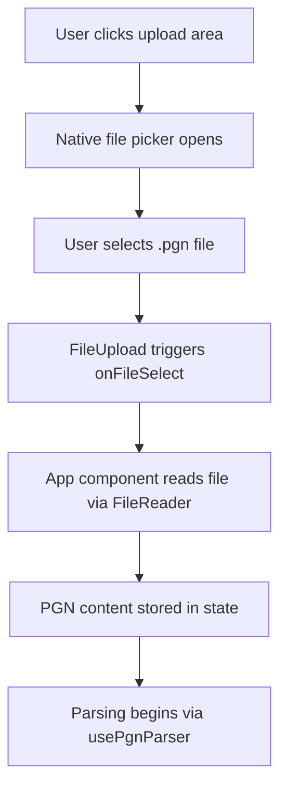
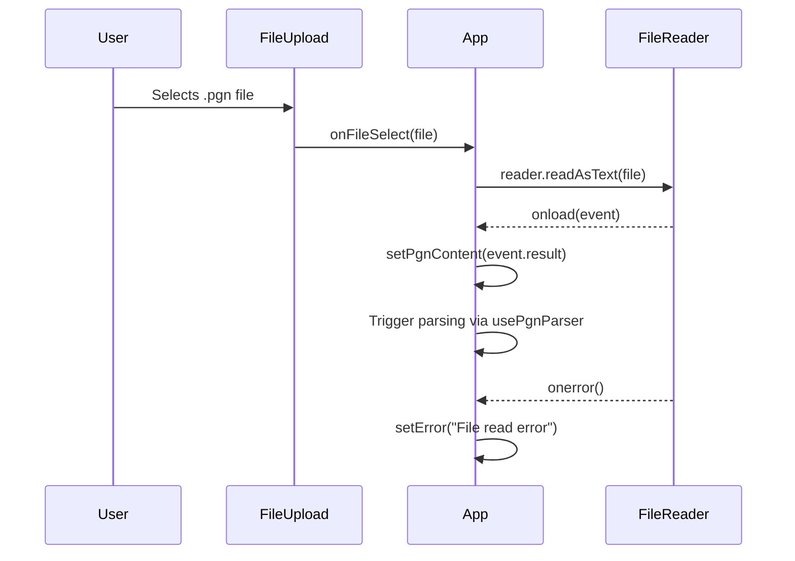
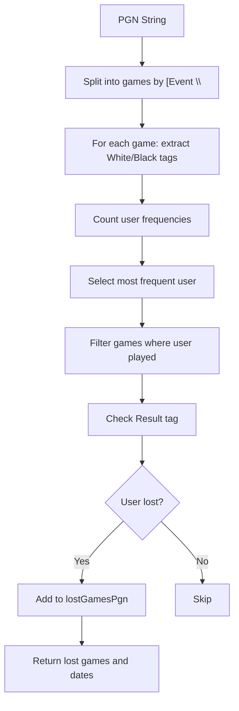
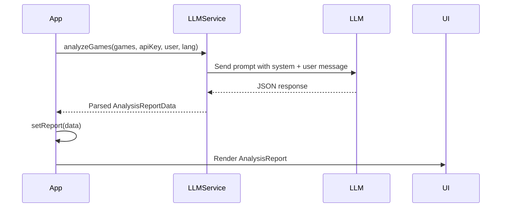
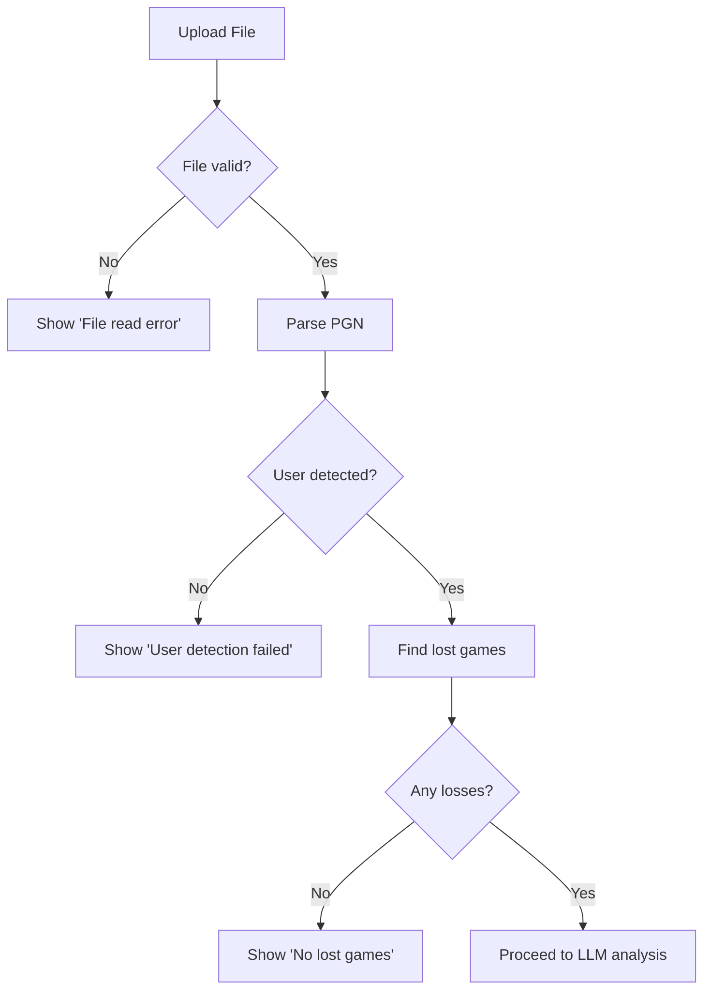

# PGN File Upload

<cite>
**Referenced Files in This Document**   
- [FileUpload.tsx](file://components/FileUpload.tsx)
- [usePgnParser.ts](file://hooks/usePgnParser.ts)
- [App.tsx](file://App.tsx)
- [types.ts](file://types.ts)
</cite>

## Table of Contents
1. [Introduction](#introduction)
2. [File Upload UI and Interaction Flow](#file-upload-ui-and-interaction-flow)
3. [File Input Handling and FileReader API](#file-input-handling-and-filereader-api)
4. [PGN Parsing Logic and User Detection](#pgn-parsing-logic-and-user-detection)
5. [Internal Data Model and Game Analysis](#internal-data-model-and-game-analysis)
6. [Integration with LLM Analysis Engine](#integration-with-llm-analysis-engine)
7. [Error Handling and Common Issues](#error-handling-and-common-issues)
8. [Conclusion](#conclusion)

## Introduction
The PGN File Upload feature enables users to analyze their chess games by uploading Portable Game Notation (PGN) files. This document details the implementation of the upload mechanism, parsing logic, and integration with downstream analysis components. The system automatically detects the user, extracts game metadata, identifies lost games, and prepares data for AI-powered insights via an LLM engine. The feature supports both file uploads and Lichess API integration, with a focus on usability, robustness, and performance.

## File Upload UI and Interaction Flow

The `FileUpload` component provides a clean, interactive interface for uploading PGN files. It supports click-to-upload functionality and displays the selected filename with a remove button for easy reset. The UI is built using React and styled with utility classes for consistency across themes.

When a file is selected, the component triggers the `onFileSelect` callback, which is handled in the main `App` component. If no file is selected, the upload area displays a prompt encouraging the user to click and upload.



**Diagram sources**
- [FileUpload.tsx](file://components/FileUpload.tsx#L45-L83)
- [App.tsx](file://App.tsx#L79-L90)

**Section sources**
- [FileUpload.tsx](file://components/FileUpload.tsx#L1-L83)

## File Input Handling and FileReader API

The file reading process uses the browser's `FileReader` API to asynchronously read the uploaded PGN file as text. This ensures the UI remains responsive during file processing, even for large files.

In `App.tsx`, the `handleFileSelect` function initializes a `FileReader` instance. On successful load, the resulting string is stored in the `pgnContent` state, triggering re-rendering and parsing. If an error occurs (e.g., corrupted file), an error message is displayed.



**Diagram sources**
- [App.tsx](file://App.tsx#L79-L90)

**Section sources**
- [App.tsx](file://App.tsx#L75-L100)

## PGN Parsing Logic and User Detection

The `usePgnParser` hook is central to processing PGN content. It uses two pure functions: `detectUserFromPgn` and `findUserGames`. The parsing logic splits the PGN string into individual games using a regex that matches `[Event "` as a delimiter.

User detection is based on frequency analysis of `White` and `Black` tags. The system counts occurrences of each player name and selects the most frequent non-`?` user as the active player. This approach ensures robustness even when usernames are inconsistently formatted.

Lost games are identified by checking the `Result` tag:
- If the user was White and the result is `0-1`, the game is lost.
- If the user was Black and the result is `1-0`, the game is lost.

Dates are extracted and normalized to `YYYY-MM-DD` format for consistent sorting and display.



**Diagram sources**
- [usePgnParser.ts](file://hooks/usePgnParser.ts#L0-L103)

**Section sources**
- [usePgnParser.ts](file://hooks/usePgnParser.ts#L0-L103)

## Internal Data Model and Game Analysis

The internal data model is defined in `types.ts` and used throughout the application. While the PGN parser returns a `PgnParseResult` interface containing `lostGamesPgn`, `gameDates`, and `detectedUser`, the final analysis output conforms to `AnalysisReportData`, which includes structured insights on openings, tactics, strategy, and endgames.

Although `GameNode` is referenced in the documentation objective, it is not present in the current codebase. The actual parsing does not build a tree structure but operates on flat string representations of games.

The system limits analysis to the 50 most recent lost games to ensure performance and relevance:
```ts
const gamesToAnalyze = lostGamesPgn.slice(-50).join('\n\n');
```

This prevents overwhelming the LLM with excessive input while focusing on recent performance trends.

**Section sources**
- [types.ts](file://types.ts#L1-L28)
- [usePgnParser.ts](file://hooks/usePgnParser.ts#L1-L103)
- [App.tsx](file://App.tsx#L152-L154)

## Integration with LLM Analysis Engine

After parsing, the system integrates with external LLM services (Gemini, OpenAI, Grok, Anthropic) to generate personalized training reports. The detected user and their lost games are passed to the `performAnalysis` function, which selects an appropriate service based on user settings and API key availability.

The LLM receives a structured prompt requesting pattern-based analysis rather than move-by-move commentary. The response is expected in JSON format matching the `AnalysisReportData` schema, enabling consistent rendering in the UI.



**Diagram sources**
- [App.tsx](file://App.tsx#L145-L168)

**Section sources**
- [App.tsx](file://App.tsx#L125-L168)
- [types.ts](file://types.ts#L1-L28)

## Error Handling and Common Issues

The system handles several common user issues:

- **Malformed PGN**: Invalid syntax may cause parsing to fail silently (games not detected). The system relies on consistent `[Event "` delimiters.
- **Encoding Problems**: FileReader defaults to UTF-8, which covers most PGN files. Non-UTF-8 encoded files may produce garbled text.
- **Large Files**: Files with thousands of games are processed in memory, which may impact performance on low-end devices.
- **No Lost Games**: If the user has no losses, analysis cannot proceed. The system displays a clear error message.

Error messages are localized and displayed in a user-friendly banner. For example:
- `error.fileRead`: Shown when FileReader fails
- `error.noLostGames`: When no losses are found
- `error.userDetectFailed`: When no valid username is detected



**Diagram sources**
- [App.tsx](file://App.tsx#L150-L155)
- [App.tsx](file://App.tsx#L205-L210)

**Section sources**
- [App.tsx](file://App.tsx#L85-L95)
- [App.tsx](file://App.tsx#L200-L215)

## Conclusion
The PGN File Upload feature provides a robust pipeline from file input to AI-powered chess analysis. It leverages modern web APIs, efficient string parsing, and reactive state management to deliver a seamless user experience. By focusing on lost games and automating user detection, the system reduces friction and delivers targeted insights. Future improvements could include support for PGN variations, move validation, and incremental parsing for very large files.