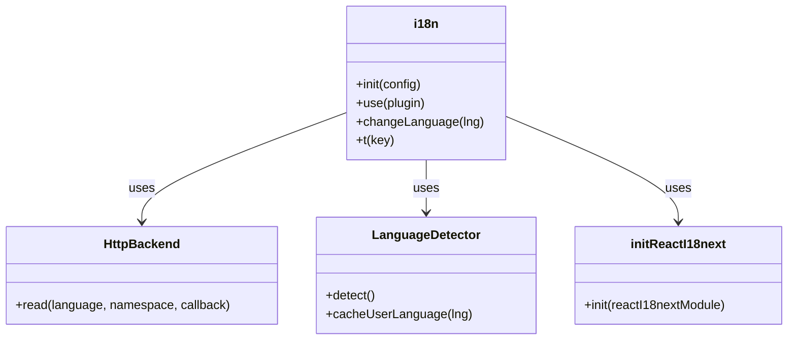
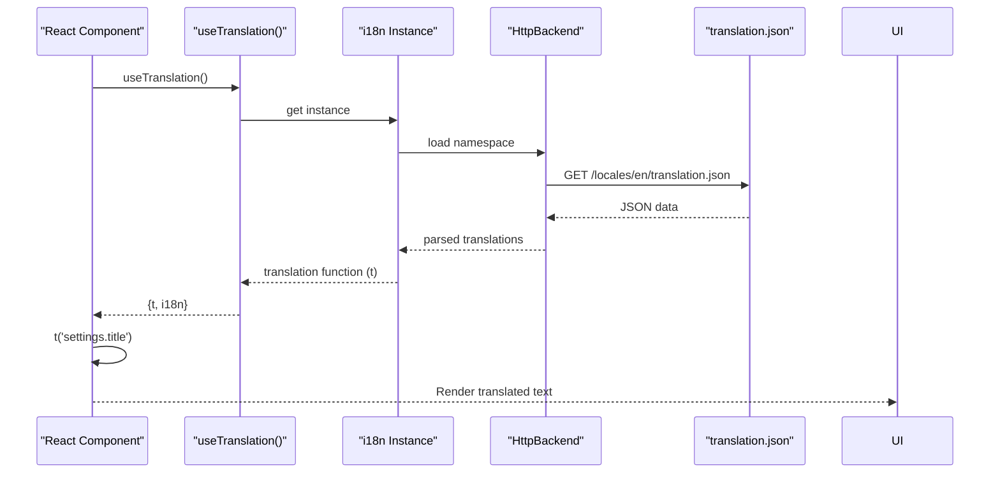

# Internationalization

<cite>
**Referenced Files in This Document**   
- [i18n.ts](file://public/i18n.ts)
- [Settings.tsx](file://components/Settings.tsx)
- [HelpDialog.tsx](file://components/HelpDialog.tsx)
- [translation.json](file://public/locales/en/translation.json)
- [translation.json](file://public/locales/de/translation.json)
- [translation.json](file://public/locales/hy/translation.json)
</cite>

## Table of Contents
1. [Internationalization System Overview](#internationalization-system-overview)
2. [i18next Configuration](#i18next-configuration)
3. [Translation File Structure](#translation-file-structure)
4. [Dynamic Translation in UI Components](#dynamic-translation-in-ui-components)
5. [Language Switching Implementation](#language-switching-implementation)
6. [Adding New Languages](#adding-new-languages)
7. [Common Issues and Solutions](#common-issues-and-solutions)
8. [Performance Considerations](#performance-considerations)

## Internationalization System Overview

The ChessTrax application implements a comprehensive internationalization (i18n) system using the i18next library to support multiple languages including English (en), German (de), and Armenian (hy). The system is designed to provide a seamless multilingual experience for users by dynamically loading translations and applying them throughout the user interface. The implementation follows a modular approach with translation files organized in a dedicated locales directory and a centralized configuration in the i18n.ts file.

**Section sources**
- [i18n.ts](file://public/i18n.ts)
- [index.tsx](file://index.tsx)

## i18next Configuration

The internationalization system is configured in the public/i18n.ts file, which initializes the i18next instance with essential settings for the ChessTrax application. The configuration includes the HttpBackend plugin for loading translation files via HTTP requests, the LanguageDetector plugin for automatically detecting the user's preferred language from their browser settings, and the initReactI18next plugin to integrate with React components.

Key configuration options include:
- **debug**: Enabled to provide helpful information in the console during development
- **fallbackLng**: Set to 'en' (English) as the default language when the user's preferred language is not supported
- **supportedLngs**: Specifies the array of supported languages ['en', 'de', 'hy']
- **load**: Configured as 'languageOnly' to load only the language part of the locale (e.g., 'en' from 'en-US')
- **interpolation**: escapeValue set to false since React handles XSS protection by default
- **backend.loadPath**: Defines the template path '/locales/{{lng}}/translation.json' for loading language-specific JSON files

The configuration ensures that translation files are loaded on-demand when needed, improving initial load performance while maintaining flexibility for future language additions.



**Diagram sources**
- [i18n.ts](file://public/i18n.ts#L1-L25)

**Section sources**
- [i18n.ts](file://public/i18n.ts#L1-L25)

## Translation File Structure

Translation files are organized in the public/locales directory with a hierarchical structure that separates translations by language. Each supported language has its own subdirectory (en, de, hy) containing a translation.json file with all the translatable strings for the application. This structure follows the convention expected by the i18next HttpBackend, which uses the loadPath configuration to resolve the correct file based on the current language.

The translation.json files contain key-value pairs where keys represent translation identifiers used in the code, and values contain the actual translated text. The structure uses a dot notation hierarchy to organize translations by feature or component (e.g., "settings.title", "help.gettingStarted.title"). This approach provides a clear organization and makes it easier to locate specific translations.

The system supports interpolation with placeholders (e.g., {{error}}, {{user}}) that can be dynamically replaced with runtime values. It also supports HTML content within translations using dangerouslySetInnerHTML in React components, allowing for formatted text with line breaks and emphasis in help content.

```mermaid
graph TD
A[locales/] --> B[en/]
A --> C[de/]
A --> D[hy/]
B --> E[translation.json]
C --> F[translation.json]
D --> G[translation.json]
H[i18n.ts] --> I[loadPath: /locales/{{lng}}/translation.json]
I --> A
```

**Diagram sources**
- [i18n.ts](file://public/i18n.ts#L20-L22)
- [locales](file://public/locales/)

**Section sources**
- [translation.json](file://public/locales/en/translation.json)
- [translation.json](file://public/locales/de/translation.json)
- [translation.json](file://public/locales/hy/translation.json)

## Dynamic Translation in UI Components

The internationalization system is integrated into React components using the useTranslation hook from react-i18next. Components such as Settings.tsx and HelpDialog.tsx demonstrate the practical implementation of dynamic translations in the user interface.

In the Settings component, the useTranslation hook is used to access the translation function (t), which is then applied to various UI elements:
- Component titles and labels use translation keys like 'settings.title' and 'settings.aiProvider'
- Placeholder text in input fields uses keys with interpolation like 'settings.apiKeyPlaceholder' with the providerName parameter
- Button text and status messages use keys like 'settings.save' and 'settings.saved'

The HelpDialog component showcases a more complex implementation with a structured help system organized into sections. Each help section is defined with translation keys for both title and content, allowing for comprehensive multilingual support. The component uses dangerouslySetInnerHTML with the t function to render HTML content from translations, enabling formatted help text with line breaks and emphasis.

This approach ensures that all user-facing text can be localized without requiring changes to the component structure or logic, promoting maintainability and consistency across the application.



**Diagram sources**
- [Settings.tsx](file://components/Settings.tsx#L1-L106)
- [HelpDialog.tsx](file://components/HelpDialog.tsx#L1-L134)

**Section sources**
- [Settings.tsx](file://components/Settings.tsx#L1-L106)
- [HelpDialog.tsx](file://components/HelpDialog.tsx#L1-L134)

## Language Switching Implementation

The ChessTrax application automatically detects and applies the user's preferred language through the i18next-browser-languagedetector plugin. When a user visits the application, the detector checks the browser's language settings and attempts to match it with the supported languages (en, de, hy). If a match is found, that language is automatically selected; otherwise, the fallback language (English) is used.

The system does not currently provide a manual language switcher UI element, relying instead on browser language preferences. However, the underlying i18next infrastructure supports programmatic language changes through the i18n.changeLanguage() method, which could be easily exposed through a settings interface if needed in the future.

When a language change occurs, i18next triggers a re-render of all components using the useTranslation hook, ensuring that all text content is updated to the new language without requiring a page refresh. This reactive approach provides a seamless user experience when switching between supported languages.

**Section sources**
- [i18n.ts](file://public/i18n.ts#L1-L25)

## Adding New Languages

To add a new language to the ChessTrax application, follow these steps:

1. **Update supported languages**: Add the new language code to the supportedLngs array in public/i18n.ts
2. **Create translation directory**: Create a new subdirectory in public/locales using the language code (e.g., 'fr' for French)
3. **Copy translation template**: Create a translation.json file in the new directory by copying the structure from an existing language file
4. **Translate content**: Replace all English values with translations in the target language

For example, to add French support:
1. Update i18n.ts: supportedLngs: ['en', 'de', 'hy', 'fr']
2. Create directory: public/locales/fr/
3. Create file: public/locales/fr/translation.json with French translations

The HttpBackend will automatically load the new language file when requested, requiring no additional configuration changes. All components using the useTranslation hook will immediately support the new language once the translation file is in place.

**Section sources**
- [i18n.ts](file://public/i18n.ts#L1-L25)
- [locales](file://public/locales/)

## Common Issues and Solutions

### Missing Translation Keys
When a translation key is missing from a language file, i18next returns the key itself as the fallback. This makes missing translations immediately visible in the UI (e.g., displaying "settings.title" instead of the translated text). To resolve:
1. Check the translation.json file for the missing key
2. Add the key with appropriate translation
3. Verify the key matches exactly (including case and punctuation)

### Formatting Errors
HTML content in translations may not render correctly if:
- Line breaks using \n are not replaced with <br/> tags
- HTML entities are not properly escaped
- Malformed HTML tags are present

The HelpDialog component addresses line breaks by replacing \n with <br/> in the dangerouslySetInnerHTML assignment.

### Language Detection Issues
If the wrong language is detected:
1. Verify the browser's language settings
2. Check that the language code is included in supportedLngs
3. Ensure the corresponding locale directory exists

### Caching Problems
Translation files may be cached by the browser. To force reload:
1. Clear browser cache
2. Use incognito mode for testing
3. Add cache-busting parameters if needed

**Section sources**
- [HelpDialog.tsx](file://components/HelpDialog.tsx#L1-L134)
- [i18n.ts](file://public/i18n.ts#L1-L25)

## Performance Considerations

The internationalization implementation in ChessTrax balances functionality with performance through several design choices:

1. **Lazy Loading**: Translation files are loaded on-demand via HTTP requests only when a language is needed, reducing initial bundle size and improving startup performance.

2. **Caching**: The HttpBackend and browser cache translation files, preventing repeated downloads during the same session.

3. **Minimal Dependencies**: The implementation uses only essential i18next plugins (HttpBackend, LanguageDetector, initReactI18next), avoiding unnecessary overhead.

4. **Efficient Updates**: Components re-render only when necessary through React's reconciliation process, with translations updated efficiently via the context API.

5. **File Size Optimization**: JSON files are compact and contain only string data, minimizing download size. The current translation files are approximately 4-5KB each.

For applications with many languages or large translation sets, additional optimizations could include code splitting language files or implementing a more sophisticated caching strategy, but the current approach is optimal for the ChessTrax use case.

**Section sources**
- [i18n.ts](file://public/i18n.ts#L1-L25)
- [translation.json](file://public/locales/en/translation.json)
- [translation.json](file://public/locales/de/translation.json)
- [translation.json](file://public/locales/hy/translation.json)