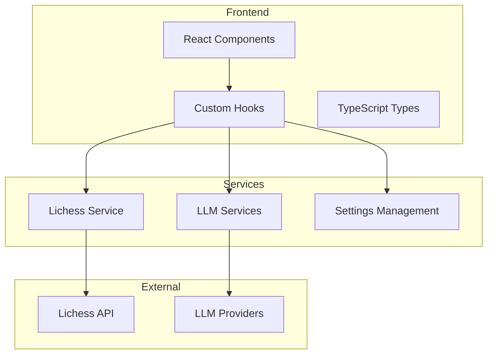

# Project Overview

<cite>
**Referenced Files in This Document**   
- [README.md](file://README.md)
- [App.tsx](file://App.tsx)
- [types.ts](file://types.ts)
- [llmService.ts](file://services/llmService.ts)
- [geminiService.ts](file://services/geminiService.ts)
- [usePgnParser.ts](file://hooks/usePgnParser.ts)
- [lichessService.ts](file://services/lichessService.ts)
- [useSettings.ts](file://hooks/useSettings.ts)
- [llmProviders.ts](file://llmProviders.ts)
- [AnalysisReport.tsx](file://components/AnalysisReport.tsx)
</cite>

## Table of Contents
1. [Introduction](#introduction)
2. [Core Value Proposition and Target Audience](#core-value-proposition-and-target-audience)
3. [High-Level Workflow](#high-level-workflow)
4. [Conceptual Overview for Beginners](#conceptual-overview-for-beginners)
5. [Technical Context for Developers](#technical-context-for-developers)
6. [Architecture Summary](#architecture-summary)
7. [Key Features](#key-features)

## Introduction

ChessTrax is an AI-powered chess analysis tool designed to help players improve by identifying recurring patterns in their lost games. The application processes chess game data from Lichess or uploaded PGN files and leverages large language models (LLMs) to generate personalized training recommendations. By transforming game history into actionable insights, ChessTrax serves as a virtual coach that pinpoints specific areas for improvement in a player's game.

**Section sources**
- [README.md](file://README.md#L1-L10)

## Core Value Proposition and Target Audience

The core value proposition of ChessTrax lies in its ability to transform a player's own game history into a personalized training plan. Unlike generic chess tutorials, ChessTrax analyzes actual gameplay to identify specific weaknesses in openings, tactics, strategy, and endgames. This targeted approach allows players to focus their study time on the areas that will yield the greatest improvement.

The primary target audience consists of chess players seeking to improve their skills, particularly those who have reached a plateau in their development. The tool is especially valuable for intermediate players who understand basic principles but struggle to identify systematic weaknesses in their play. ChessTrax answers critical questions about recurring tactical oversights, problematic opening choices, strategic misconceptions, and endgame deficiencies.

**Section sources**
- [README.md](file://README.md#L1-L25)

## High-Level Workflow

The ChessTrax workflow follows a clear sequence from input to AI-generated report:

1. **Input**: Users either enter a Lichess username to automatically retrieve their games or upload a PGN file containing their chess games.
2. **Processing**: The application parses the PGN data to identify the user and extract their lost games using PGN parsing techniques.
3. **Analysis**: The system sends the relevant game data to a configured LLM provider for analysis.
4. **Output**: The AI generates a structured analysis report with personalized training recommendations.
5. **Delivery**: Users receive a comprehensive report that can be exported as a PDF or copied to clipboard for further use.

This workflow transforms raw game data into actionable insights through AI-powered pattern recognition and analysis.

**Section sources**
- [README.md](file://README.md#L27-L35)
- [App.tsx](file://App.tsx#L150-L300)

## Conceptual Overview for Beginners

For chess players new to analytical tools, ChessTrax functions as a personal coach that learns from your games. When you lose chess games, certain patterns of mistakes often repeat—perhaps you consistently struggle with knight forks, have difficulty in specific opening variations, or make strategic errors in the middlegame. ChessTrax identifies these recurring patterns by analyzing your lost games at scale.

Instead of reviewing each game individually, the AI synthesizes insights across many games to identify your most critical weaknesses. The resulting analysis report highlights specific areas for improvement and suggests targeted training exercises. This approach helps players move beyond simply recognizing individual mistakes to understanding systemic weaknesses in their playing style, enabling more focused and effective practice.

**Section sources**
- [README.md](file://README.md#L1-L25)

## Technical Context for Developers

From a technical perspective, ChessTrax integrates several sophisticated components to deliver its AI-powered analysis. The application uses PGN parsing to extract game data and identify user-specific patterns, including detecting the user from game metadata and filtering for lost games. This parsed data is then processed and formatted for submission to an LLM provider.

The system supports multiple LLM providers through a service abstraction layer, with Google Gemini serving as the default analysis engine. The LLM provider receives a carefully crafted prompt that includes the user's lost games and requests a structured JSON response according to a predefined schema. This schema ensures consistent output formatting for the analysis report, including sections on opening analysis, tactical motifs, strategic weaknesses, and endgame practice recommendations.

The integration handles API key management securely, storing user-provided keys only in the browser's localStorage. Error handling includes retry logic for API failures and appropriate user feedback for various error conditions.

**Section sources**
- [App.tsx](file://App.tsx#L100-L300)
- [geminiService.ts](file://services/geminiService.ts#L1-L165)
- [llmService.ts](file://services/llmService.ts#L1-L5)
- [usePgnParser.ts](file://hooks/usePgnParser.ts#L1-L105)

## Architecture Summary

ChessTrax follows a modern web application architecture built on React and TypeScript. The frontend is implemented as a single-page application with a component-based structure, featuring a clean, responsive user interface. The architecture separates concerns through distinct layers:

- **React Frontend**: The user interface is built with React components, managing state and user interactions.
- **TypeScript Foundation**: The entire codebase uses TypeScript for type safety and improved developer experience.
- **Service Layer**: Dedicated services handle external integrations, including Lichess API calls and LLM provider communications.
- **Hook System**: Custom React hooks manage state, PGN parsing, and user settings.
- **Configuration Management**: The application supports configurable AI providers and persistent user settings.

This architecture enables a responsive user experience while maintaining clean separation between presentation, business logic, and external service integrations.

**Diagram sources**
- [App.tsx](file://App.tsx#L1-L380)
- [services](file://services/)
- [hooks](file://hooks/)

**Section sources**
- [App.tsx](file://App.tsx#L1-L380)
- [types.ts](file://types.ts#L1-L29)

## Key Features

ChessTrax offers several key features that enhance its utility for chess players:

- **Multi-language Support**: The application interface supports multiple languages (English, German, and Armenian), making it accessible to a broader audience.
- **Configurable AI Providers**: Users can select from multiple LLM providers, including Google Gemini (default), OpenAI, Anthropic Claude, and xAI Grok, allowing for experimentation with different AI models.
- **User Settings Persistence**: The application stores user preferences and API keys securely in the browser's localStorage, ensuring settings persist between sessions.
- **Flexible Input Options**: Players can analyze their games by either connecting their Lichess account or uploading PGN files, providing multiple pathways to access the analysis.
- **Comprehensive Analysis Report**: The generated report covers all critical aspects of chess play, including openings, tactics, strategy, and endgames, with specific recommendations for improvement.
- **Export Functionality**: Users can export their analysis as a PDF or copy it to the clipboard for use in other applications, facilitating integration with their existing study workflow.

These features combine to create a powerful, user-friendly tool that leverages AI to deliver personalized chess coaching.

**Section sources**
- [README.md](file://README.md#L50-L80)
- [useSettings.ts](file://hooks/useSettings.ts#L1-L39)
- [llmProviders.ts](file://llmProviders.ts#L1-L29)
- [AnalysisReport.tsx](file://components/AnalysisReport.tsx#L1-L197)