# Error Handling

<cite>
**Referenced Files in This Document**   
- [App.tsx](file://App.tsx)
- [api/log-usage.ts](file://api/log-usage.ts)
- [components/HelpDialog.tsx](file://components/HelpDialog.tsx)
- [hooks/usePgnParser.ts](file://hooks/usePgnParser.ts)
- [services/lichessService.ts](file://services/lichessService.ts)
- [services/geminiService.ts](file://services/geminiService.ts)
- [public/locales/en/translation.json](file://public/locales/en/translation.json)
</cite>

## Table of Contents
1. [Introduction](#introduction)
2. [Error Handling Architecture](#error-handling-architecture)
3. [Core Error Scenarios](#core-error-scenarios)
4. [Telemetry and Usage Logging](#telemetry-and-usage-logging)
5. [User-Facing Error Display](#user-facing-error-display)
6. [Troubleshooting Guidance](#troubleshooting-guidance)
7. [Security Considerations](#security-considerations)

## Introduction
The ChessTrax application implements a comprehensive error handling system designed to manage failures across critical operations including PGN parsing, LLM analysis requests, and external API calls. The system combines client-side error detection with server-side telemetry to provide both user-facing feedback and developer diagnostic capabilities. Errors are systematically caught, categorized, and presented through appropriate UI components while maintaining user privacy and security. This document details the implementation of error handling throughout the application, focusing on how different error types are managed and communicated.

## Error Handling Architecture
ChessTrax employs a layered error handling approach that captures exceptions at multiple levels of the application stack. The architecture combines React state management for UI-level errors with try-catch blocks around asynchronous operations and service calls. Central to this system is the `error` state variable in App.tsx, which serves as the single source of truth for user-visible error messages. This state is updated through various pathways depending on the error source and type.

Critical operations are wrapped in try-catch blocks that transform raw exceptions into user-friendly messages using the i18n translation system. The error handling is particularly robust around asynchronous operations such as fetching games from Lichess, analyzing games with LLM providers, and processing PGN files. Each service call includes specific error handling logic tailored to the potential failure modes of that service.

**Diagram sources**
- [App.tsx](file://App.tsx#L125-L158)
- [services/lichessService.ts](file://services/lichessService.ts#L15-L28)

**Section sources**
- [App.tsx](file://App.tsx#L125-L158)
- [services/lichessService.ts](file://services/lichessService.ts#L15-L28)

## Core Error Scenarios
The application handles several distinct error scenarios that occur during normal operation. These are categorized based on their source and impact on the user experience.

### Invalid PGN Uploads
When users upload PGN files, multiple validation checks are performed to ensure data integrity. The system first attempts to read the file using FileReader, catching any file read errors with a generic "Failed to read the PGN file" message. Once the content is loaded, the PGN parser attempts to detect the user's username by analyzing White and Black tags across all games. If no valid username can be detected, the error "Could not automatically detect a username from the PGN file" is displayed, guiding users to verify their file is a valid export from their account.

The PGN parsing process also validates game structure and extracts relevant data for analysis. If the PGN format is malformed or incomplete, the parser may fail to extract games properly, leading to subsequent errors during analysis. The system specifically checks for the presence of lost games for the detected user, displaying "Successfully fetched games, but could not find any losses to analyze" when no losses are found in the provided data.

**Section sources**
- [hooks/usePgnParser.ts](file://hooks/usePgnParser.ts#L1-L104)
- [App.tsx](file://App.tsx#L254-L281)

### Expired or Missing API Keys
Authentication with LLM providers is a critical path that requires proper API key management. The application implements a hierarchical key resolution system that first checks for user-provided keys in localStorage, then falls back to settings-configured keys, and finally uses environment variables as a last resort. When no valid API key is available, the system displays a provider-specific error message.

For Gemini, the most common provider, the error message is tailored based on how the key is missing: "API key for Google Gemini is missing. Please add your own key using the key icon in the header." when no user key exists, or "API key for Google Gemini is missing. Please add it in the settings." when the settings key is missing. This contextual guidance directs users to the appropriate configuration interface.

**Diagram sources**
- [App.tsx](file://App.tsx#L125-L158)
- [services/geminiService.ts](file://services/geminiService.ts#L45-L65)

**Section sources**
- [App.tsx](file://App.tsx#L125-L158)
- [services/geminiService.ts](file://services/geminiService.ts#L45-L65)

### Rate Limiting and LLM Provider Errors
The Gemini service implementation includes specific handling for rate limiting and service overload conditions. When calling the LLM API, the code wraps the request in a retry mechanism that specifically detects 503 "overloaded" errors from the service. Upon encountering such an error, the system implements exponential backoff with jitter, waiting progressively longer between retries (starting at approximately 2 seconds) up to three attempts.

If all retries fail, the error "Failed to get analysis from AI: [detailed message]" is propagated to the user. This approach balances resilience against temporary service issues with timely feedback when the service is genuinely unavailable. Other LLM providers would implement similar patterns, though the specific error codes and retry logic may vary by service.

**Section sources**
- [services/geminiService.ts](file://services/geminiService.ts#L120-L165)

### Failed Lichess Lookups
External API calls to Lichess are wrapped in try-catch blocks that differentiate between various failure modes. A 404 response from the Lichess API triggers the specific "User '{{user}}' not found on Lichess. Please check the username." message, helping users correct typos or verify their profile visibility. Other network or server errors result in the more general "Failed to fetch games from Lichess. Please try again later." message, with technical details included for debugging purposes.

The Lichess service constructs URLs with specific parameters to fetch up to 2000 recent games in PGN format, including tags, clocks, evaluations, and opening information. Errors in this process typically stem from network connectivity issues, Lichess API rate limiting, or invalid usernames rather than application bugs.

**Section sources**
- [services/lichessService.ts](file://services/lichessService.ts#L15-L28)
- [App.tsx](file://App.tsx#L254-L281)

## Telemetry and Usage Logging
The log-usage.ts serverless function provides telemetry capabilities for tracking application usage and errors. This Vercel-hosted endpoint accepts POST requests with username and provider information, logging analysis requests to BetterStack for monitoring and analytics. The function implements comprehensive error handling to ensure logging does not disrupt the user experience.

When the BetterStack ingest service is not properly configured (missing source token or ingest URL), the function falls back to console logging while returning a 500 error to the client. Network errors during the fetch to BetterStack are caught and logged locally, with the original request still acknowledged to the client. This resilience ensures that logging failures do not cascade into application errors.

The client-side implementation in App.tsx calls this endpoint during analysis initiation but uses a catch block on the fetch promise to prevent logging failures from affecting the main analysis flow. This fire-and-forget approach ensures usage tracking does not introduce latency or reliability issues for the primary application functionality.

**Diagram sources**
- [api/log-usage.ts](file://api/log-usage.ts#L1-L94)
- [App.tsx](file://App.tsx#L150-L158)

**Section sources**
- [api/log-usage.ts](file://api/log-usage.ts#L1-L94)
- [App.tsx](file://App.tsx#L150-L158)

## User-Facing Error Display
Errors are presented to users through multiple channels designed to balance visibility with non-disruption. The primary mechanism is an inline error banner that appears below the main input fields in the central card interface. This banner uses a red color scheme with an alert icon to draw attention to the error message.

The error display is implemented in App.tsx using conditional rendering of a div element when the error state is not null. The message itself is translated using the i18n system, allowing for localized error messages in English, German, and Armenian. Parameterized messages use template variables (e.g., {{user}}) to include relevant context without exposing raw technical details.

```mermaid
flowchart TD
A[Error State Set] --> B{Error ≠ null?}
B --> |Yes| C[Render Error Banner]
C --> D[Apply Red Styling]
D --> E[Show Alert Icon]
E --> F[Display Translated Message]
F --> G[Include Context Variables]
G --> H[User Sees Error]
B --> |No| I[Hide Error Banner]
I --> J[Normal UI]
```

**Diagram sources**
- [App.tsx](file://App.tsx#L254-L281)
- [public/locales/en/translation.json](file://public/locales/en/translation.json#L1-L121)

For more comprehensive error guidance, the HelpDialog component provides a dedicated troubleshooting section. This expandable panel contains detailed advice for common issues including username not found, no lost games detected, analysis failures, and file upload problems. The content is statically defined in translation files, allowing for rich HTML-formatted text with line breaks and emphasis.

**Section sources**
- [App.tsx](file://App.tsx#L254-L281)
- [components/HelpDialog.tsx](file://components/HelpDialog.tsx#L1-L133)
- [public/locales/en/translation.json](file://public/locales/en/translation.json#L1-L121)

## Troubleshooting Guidance
The application provides troubleshooting guidance through both immediate error messages and comprehensive help documentation. When errors occur, users receive specific instructions for resolution based on the error type.

For Lichess integration issues, users are advised to check username spelling and ensure their Lichess profile is public. The system cannot access games from private profiles, which is a common source of "user not found" errors. Users experiencing persistent issues are encouraged to export games manually from Lichess and upload the PGN file instead.

When analysis fails due to LLM provider issues, users are guided to use their own API keys for more reliable service. The application supports multiple providers (Gemini, OpenAI, Anthropic, Grok) and allows users to switch between them. Using a personal API key often resolves rate limiting issues and provides higher usage quotas.

File upload problems are typically resolved by ensuring the PGN file is valid and under 10MB in size. Users should export games directly from Lichess or other chess platforms using standard PGN format. Corrupted or malformed PGN files may fail to parse correctly, resulting in user detection or game extraction errors.

Developers can access additional diagnostic information through browser developer tools. The application logs detailed error information to the console, including stack traces and response details from external services. These logs should be consulted when troubleshooting persistent issues, though care should be taken not to expose sensitive information.

**Section sources**
- [components/HelpDialog.tsx](file://components/HelpDialog.tsx#L1-L133)
- [public/locales/en/translation.json](file://public/locales/en/translation.json#L1-L121)

## Security Considerations
The error handling system incorporates several security measures to prevent information disclosure. Error messages are carefully crafted to avoid exposing sensitive technical details, API endpoints, or internal system structure. Generic messages are used when possible, with specific details limited to non-sensitive context like usernames or provider names.

API keys are handled with particular care, never being included in error messages or logged to external services. The system ensures that API key validation errors do not distinguish between invalid keys and missing keys, preventing enumeration attacks. User-provided API keys are stored only in localStorage, which is isolated to the user's browser and not transmitted to the application servers.

The log-usage telemetry system is designed to minimize data collection, transmitting only the username and provider ID necessary for usage analytics. No PGN content, analysis results, or API keys are included in these logs. The endpoint implements CORS restrictions to prevent unauthorized domains from submitting usage data.

Error logging to BetterStack includes safeguards against sensitive data exposure. The system checks for the presence of required environment variables before attempting to send data, falling back to console logging if configuration is incomplete. This prevents accidental transmission of usage data to unconfigured or incorrect endpoints.

**Section sources**
- [api/log-usage.ts](file://api/log-usage.ts#L1-L94)
- [services/geminiService.ts](file://services/geminiService.ts#L45-L65)
- [App.tsx](file://App.tsx#L125-L158)