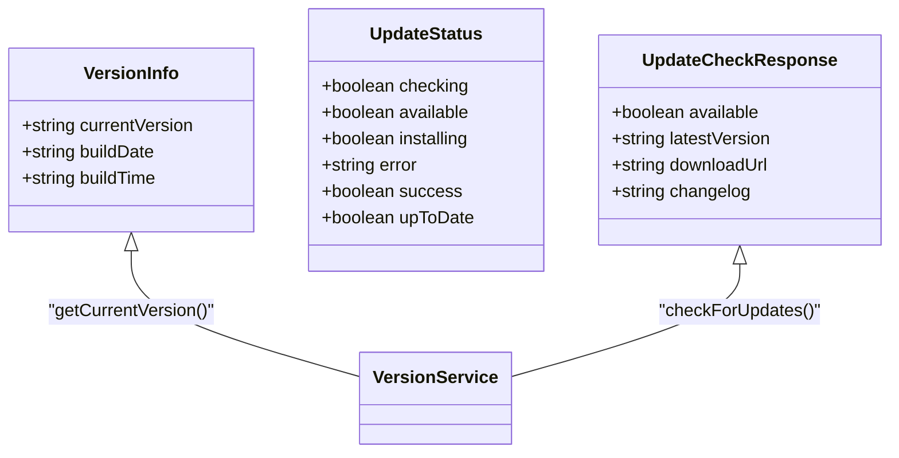
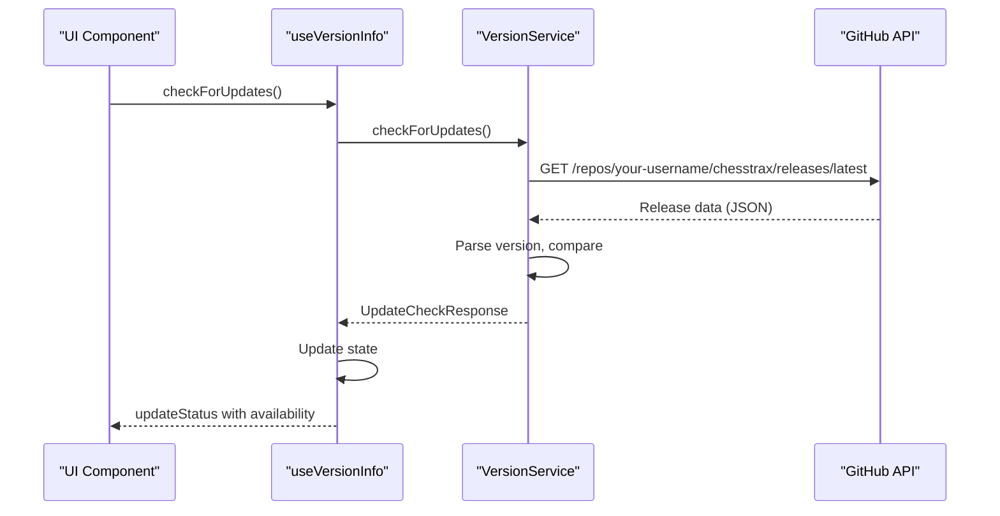
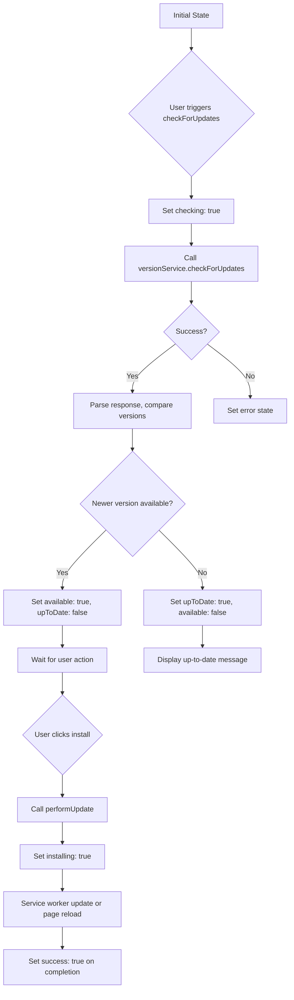

# Version Management

<cite>
**Referenced Files in This Document**   
- [metadata.json](file://metadata.json)
- [versionService.ts](file://services/versionService.ts)
- [useVersionInfo.ts](file://hooks/useVersionInfo.ts)
- [AboutDialog.tsx](file://components/AboutDialog.tsx)
- [App.tsx](file://App.tsx)
</cite>

## Table of Contents
1. [Introduction](#introduction)
2. [Version Information Structure](#version-information-structure)
3. [Core Version Management Components](#core-version-management-components)
4. [Version Checking Workflow](#version-checking-workflow)
5. [Update Availability and State Management](#update-availability-and-state-management)
6. [UI Integration and User Experience](#ui-integration-and-user-experience)
7. [Error Handling and Network Resilience](#error-handling-and-network-resilience)
8. [Performance Considerations](#performance-considerations)
9. [Developer Integration Guide](#developer-integration-guide)

## Introduction
The ChessTrax application implements a robust version management system that enables automatic detection of new releases and seamless update notifications for users. This system operates by comparing the current application version, embedded at build time, with the latest version available on GitHub's release API. The version checking functionality is orchestrated through a React hook (`useVersionInfo.ts`) that manages state, performs version polling, and exposes update availability flags to the UI components. This documentation details the implementation, integration, and operational characteristics of the version management system.

**Section sources**
- [versionService.ts](file://services/versionService.ts#L1-L20)
- [useVersionInfo.ts](file://hooks/useVersionInfo.ts#L1-L10)

## Version Information Structure
The version management system relies on structured version information that includes the current application version, build date, and build time. This information is captured at build time through Vite's environment variable injection mechanism and made available globally to the application.

The `VersionInfo` interface defines the structure of version data:
- `currentVersion`: Semantic version string (e.g., "0.2.0")
- `buildDate`: ISO date string of the build (YYYY-MM-DD format)
- `buildTime`: Time string of the build (HH:MM:SS format)

The current version is retrieved from globally declared constants (`__APP_VERSION__`, `__BUILD_DATE__`, `__BUILD_TIME__`) that are injected during the build process. These values are defined in `vite.config.ts` and provide reliable, immutable version metadata that persists across application sessions.



**Diagram sources**
- [versionService.ts](file://services/versionService.ts#L10-L30)
- [useVersionInfo.ts](file://hooks/useVersionInfo.ts#L8-L15)

**Section sources**
- [versionService.ts](file://services/versionService.ts#L10-L45)
- [vite.config.ts](file://vite.config.ts#L21)

## Core Version Management Components
The version management system consists of two primary components: the `versionService.ts` service class and the `useVersionInfo.ts` React hook. These components work together to provide version checking functionality with proper state management.

The `VersionService` class encapsulates all version-related operations:
- Retrieving current version information from build metadata
- Checking for updates via GitHub's API
- Performing updates through service worker communication
- Comparing version strings using semantic versioning logic

The service uses GitHub's REST API to fetch the latest release information from the repository. The endpoint `https://api.github.com/repos/your-username/chesstrax/releases/latest` returns release data in JSON format, including the tag name, release notes, and download URL.



**Diagram sources**
- [versionService.ts](file://services/versionService.ts#L50-L90)
- [useVersionInfo.ts](file://hooks/useVersionInfo.ts#L25-L50)

**Section sources**
- [versionService.ts](file://services/versionService.ts#L35-L156)
- [useVersionInfo.ts](file://hooks/useVersionInfo.ts#L1-L97)

## Version Checking Workflow
The version checking process follows a well-defined workflow that begins with the user initiating a check (either manually or programmatically) and concludes with the update status being reflected in the UI.

When `checkForUpdates()` is called on the `useVersionInfo` hook:
1. The hook updates its internal state to indicate that a check is in progress
2. It calls the `versionService.checkForUpdates()` method
3. The service makes an HTTP GET request to the GitHub API with a 10-second timeout
4. The response is parsed to extract the latest version tag (with 'v' prefix removed)
5. The latest version is compared with the current version using semantic versioning logic
6. An `UpdateCheckResponse` object is returned with availability status and metadata
7. The hook updates its state with the result, setting appropriate flags

The version comparison algorithm splits version strings into numeric components and compares them from left to right (major, minor, patch). This ensures accurate determination of whether a newer version is available, even with complex versioning schemes.

**Section sources**
- [versionService.ts](file://services/versionService.ts#L60-L120)
- [useVersionInfo.ts](file://hooks/useVersionInfo.ts#L25-L50)

## Update Availability and State Management
The `useVersionInfo` hook implements comprehensive state management for tracking the entire update lifecycle. It maintains an `updateStatus` object that captures various states of the update process:

- `checking`: Indicates an active version check in progress
- `available`: True when a newer version is detected
- `installing`: Indicates an update installation is in progress
- `error`: Contains error messages from failed operations
- `success`: Indicates a successful update installation
- `upToDate`: Convenience flag indicating the current version is latest

This state management approach provides a complete picture of the update status to consuming components. The hook exposes methods to control the update flow:
- `checkForUpdates()`: Initiates a version check
- `performUpdate()`: Applies an available update
- `clearUpdateStatus()`: Resets the status to default values

The state is managed using React's `useState` and `useCallback` hooks to ensure proper reactivity and prevent unnecessary re-renders.



**Diagram sources**
- [useVersionInfo.ts](file://hooks/useVersionInfo.ts#L25-L97)
- [versionService.ts](file://services/versionService.ts#L89-L100)

**Section sources**
- [useVersionInfo.ts](file://hooks/useVersionInfo.ts#L15-L97)

## UI Integration and User Experience
The version management system is integrated into the ChessTrax UI primarily through the About dialog component. This dialog provides users with comprehensive information about the application version and update status.

The `AboutDialog` component consumes the `useVersionInfo` hook to access version information and update functionality. It displays:
- Current version number, build date, and time
- Real-time update status (checking, available, up-to-date, error)
- Action buttons for checking for updates and installing available updates
- Visual indicators for different update states (success, error, progress)

When an update is available, the UI presents a clear call-to-action with an install button. During the update process, loading indicators provide feedback on the installation progress. After a successful update, the application reloads to activate the new version.

The integration follows React best practices by keeping state management separate from presentation logic. The `useVersionInfo` hook provides a clean API that allows the UI to remain focused on rendering and user interaction.

**Section sources**
- [AboutDialog.tsx](file://components/AboutDialog.tsx#L10-L50)
- [useVersionInfo.ts](file://hooks/useVersionInfo.ts#L1-L10)

## Error Handling and Network Resilience
The version management system implements robust error handling to address common network and API issues. The `versionService.checkForUpdates()` method includes comprehensive error handling that distinguishes between different types of failures:

- **Network connectivity issues**: Detected through Axios error codes like `ENOTFOUND`, `ECONNREFUSED`, or `ETIMEDOUT`
- **API endpoint issues**: Handled for 404 (not found) and 403 (rate limited) responses
- **Server availability**: Managed for 5xx status codes from the GitHub API
- **General failures**: Caught as fallback cases with user-friendly messages

When an error occurs, the system translates technical error codes into user-friendly messages that guide users toward resolution. For example, a network timeout results in a suggestion to check internet connectivity, while a 403 response indicates rate limiting with a recommendation to try again later.

The error handling strategy prioritizes user experience by:
- Providing actionable feedback rather than technical details
- Maintaining application stability even when version checks fail
- Allowing users to retry failed operations
- Gracefully degrading functionality when the update service is unavailable

**Section sources**
- [versionService.ts](file://services/versionService.ts#L70-L90)

## Performance Considerations
The version management system has been designed with performance and user experience in mind. Several considerations ensure minimal impact on application performance:

- **Polling strategy**: The system does not implement automatic polling by default, avoiding unnecessary network requests on startup or at intervals. Version checks are triggered manually by user action or programmatically when needed.
- **Request optimization**: The GitHub API request includes appropriate headers and a reasonable timeout (10 seconds) to balance responsiveness with network reliability.
- **Caching considerations**: While the current implementation does not include explicit caching, the GitHub API response benefits from HTTP caching mechanisms. For applications requiring more aggressive caching, localStorage or sessionStorage could be implemented to store recent check results.
- **Startup impact**: Since version checks are not performed automatically on startup, there is no impact on initial load time. This design choice prioritizes immediate application usability over proactive update notifications.
- **Bundle size**: The implementation relies on Axios for HTTP requests, which is already included in the application dependencies, avoiding additional bundle size overhead.

For developers considering automatic polling, a recommended interval of 24 hours would balance freshness with performance. This could be implemented using `localStorage` to track the last check time and only perform requests when sufficient time has elapsed.

**Section sources**
- [versionService.ts](file://services/versionService.ts#L65-L70)
- [useVersionInfo.ts](file://hooks/useVersionInfo.ts#L25-L50)

## Developer Integration Guide
Developers can integrate similar version-checking functionality into their applications by following the ChessTrax pattern:

1. **Set up build-time version injection**:
   Configure your build tool (Vite, Webpack, etc.) to inject version metadata. In Vite, this is done through `define` in `vite.config.ts`:
   ```typescript
   define: {
     '__APP_VERSION__': JSON.stringify(version)
   }
   ```

2. **Create a version service**:
   Implement a service class that handles version retrieval and update checking:
   - Retrieve current version from build metadata
   - Implement API calls to your update endpoint
   - Include version comparison logic
   - Handle errors appropriately

3. **Develop a React hook**:
   Create a custom hook that wraps the service and manages state:
   ```typescript
   const useVersionInfo = () => {
     const [versionInfo, setVersionInfo] = useState<VersionInfo>();
     const [updateStatus, setUpdateStatus] = useState<UpdateStatus>();
     
     const checkForUpdates = useCallback(async () => {
       // Implementation
     }, []);
     
     return { versionInfo, updateStatus, checkForUpdates };
   };
   ```

4. **Integrate with UI components**:
   Consume the hook in relevant components and display update status:
   ```typescript
   const { versionInfo, updateStatus, checkForUpdates } = useVersionInfo();
   ```

5. **Handle updates appropriately**:
   For web applications, implement service worker updates or page reloads. For other platforms, adapt the update mechanism to the deployment model.

Common issues and resolutions:
- **CORS errors**: Ensure your update endpoint supports CORS headers or use a proxy
- **Malformed version responses**: Implement defensive parsing with fallbacks
- **Network timeouts**: Set appropriate timeout values and provide retry mechanisms
- **Rate limiting**: Implement exponential backoff or limit check frequency

The ChessTrax implementation serves as a robust reference for building reliable version management systems in web applications.

**Section sources**
- [versionService.ts](file://services/versionService.ts#L1-L156)
- [useVersionInfo.ts](file://hooks/useVersionInfo.ts#L1-L97)
- [vite.config.ts](file://vite.config.ts#L21)