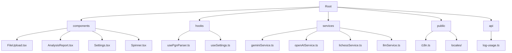
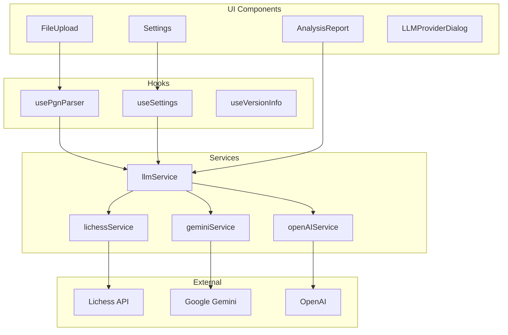
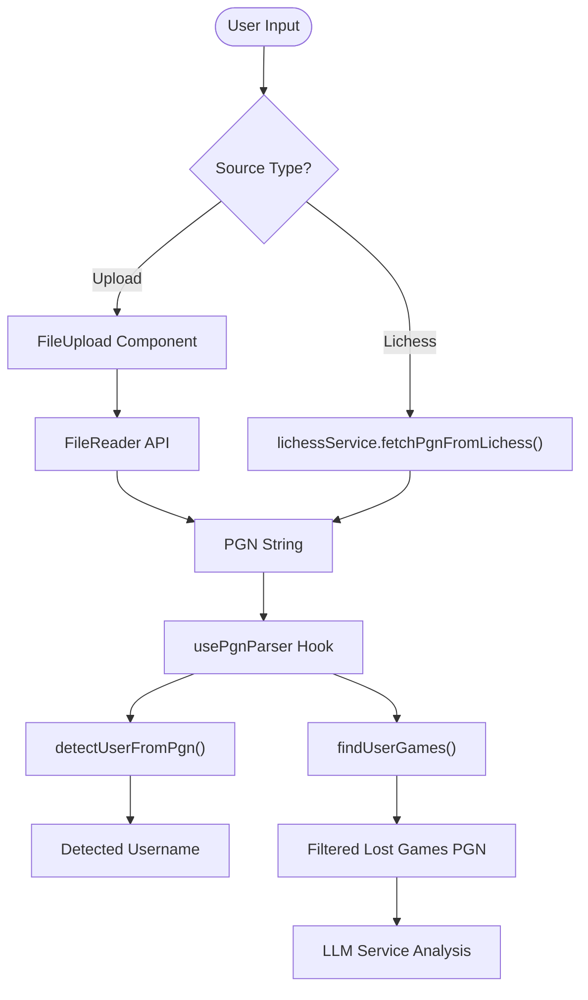
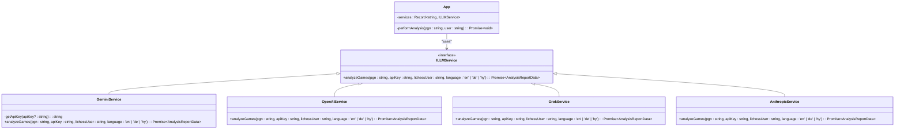
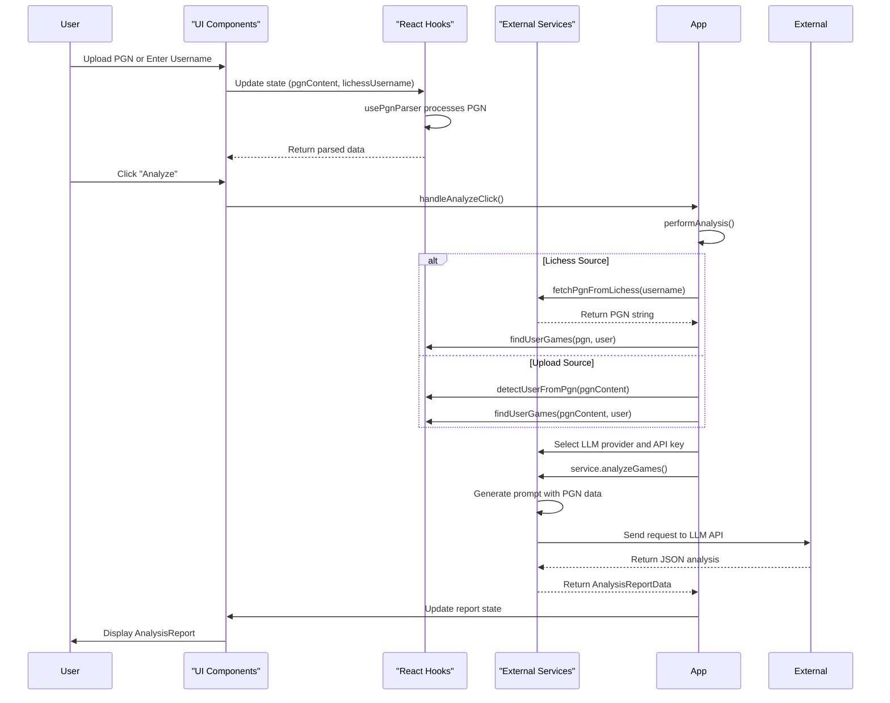

# Technical Architecture

<cite>
**Referenced Files in This Document**   
- [App.tsx](file://App.tsx)
- [types.ts](file://types.ts)
- [usePgnParser.ts](file://hooks/usePgnParser.ts)
- [useSettings.ts](file://hooks/useSettings.ts)
- [llmService.ts](file://services/llmService.ts)
- [geminiService.ts](file://services/geminiService.ts)
- [lichessService.ts](file://services/lichessService.ts)
- [AnalysisReport.tsx](file://components/AnalysisReport.tsx)
- [FileUpload.tsx](file://components/FileUpload.tsx)
- [vite.config.ts](file://vite.config.ts)
- [package.json](file://package.json)
- [tsconfig.json](file://tsconfig.json)
</cite>

## Table of Contents
1. [Introduction](#introduction)
2. [Project Structure](#project-structure)
3. [Core Components](#core-components)
4. [Architecture Overview](#architecture-overview)
5. [Detailed Component Analysis](#detailed-component-analysis)
6. [Dependency Analysis](#dependency-analysis)
7. [Performance Considerations](#performance-considerations)
8. [Troubleshooting Guide](#troubleshooting-guide)
9. [Conclusion](#conclusion)

## Introduction
ChessTrax is a React-based frontend application designed to provide AI-powered chess analysis for players using their Lichess game history or uploaded PGN files. The application leverages large language models (LLMs) to generate personalized training reports based on patterns in a player's lost games. Built with Vite, the application follows a component-based architecture with strong emphasis on modularity, type safety, and extensibility. This document details the technical architecture, design patterns, data flows, and integration points that enable ChessTrax to deliver actionable insights to chess players.

## Project Structure



**Diagram sources**
- [components/FileUpload.tsx](file://components/FileUpload.tsx#L1-L84)
- [components/AnalysisReport.tsx](file://components/AnalysisReport.tsx#L1-L198)
- [hooks/usePgnParser.ts](file://hooks/usePgnParser.ts#L1-L105)
- [services/geminiService.ts](file://services/geminiService.ts#L1-L166)
- [public/i18n.ts](file://public/i18n.ts)

**Section sources**
- [App.tsx](file://App.tsx#L1-L381)
- [components](file://components)
- [hooks](file://hooks)
- [services](file://services)

## Core Components

The ChessTrax application is structured around several core components that handle user interaction, data processing, and AI integration. The main entry point is `App.tsx`, which orchestrates the flow between UI components, hooks for state management, and services for external integrations. Key components include `FileUpload` for PGN input, `AnalysisReport` for displaying AI-generated insights, and various dialog components for settings and help. The application uses React hooks extensively for managing state and side effects, with custom hooks like `usePgnParser` and `useSettings` providing encapsulated logic for specific concerns.

**Section sources**
- [App.tsx](file://App.tsx#L25-L100)
- [components/FileUpload.tsx](file://components/FileUpload.tsx#L1-L84)
- [components/AnalysisReport.tsx](file://components/AnalysisReport.tsx#L1-L198)
- [hooks/usePgnParser.ts](file://hooks/usePgnParser.ts#L1-L105)

## Architecture Overview



**Diagram sources**
- [App.tsx](file://App.tsx#L1-L381)
- [hooks/usePgnParser.ts](file://hooks/usePgnParser.ts#L1-L105)
- [hooks/useSettings.ts](file://hooks/useSettings.ts#L1-L39)
- [services/llmService.ts](file://services/llmService.ts#L1-L5)
- [services/geminiService.ts](file://services/geminiService.ts#L1-L166)
- [services/lichessService.ts](file://services/lichessService.ts#L1-L29)

## Detailed Component Analysis

### PGN Processing Pipeline



**Diagram sources**
- [components/FileUpload.tsx](file://components/FileUpload.tsx#L1-L84)
- [services/lichessService.ts](file://services/lichessService.ts#L1-L29)
- [hooks/usePgnParser.ts](file://hooks/usePgnParser.ts#L1-L105)

**Section sources**
- [components/FileUpload.tsx](file://components/FileUpload.tsx#L1-L84)
- [services/lichessService.ts](file://services/lichessService.ts#L1-L29)
- [hooks/usePgnParser.ts](file://hooks/usePgnParser.ts#L1-L105)

### AI Analysis Service Architecture



**Diagram sources**
- [services/llmService.ts](file://services/llmService.ts#L1-L5)
- [services/geminiService.ts](file://services/geminiService.ts#L1-L166)
- [App.tsx](file://App.tsx#L1-L381)

**Section sources**
- [services/llmService.ts](file://services/llmService.ts#L1-L5)
- [services/geminiService.ts](file://services/geminiService.ts#L1-L166)
- [App.tsx](file://App.tsx#L1-L381)

### Data Flow and State Management



**Diagram sources**
- [App.tsx](file://App.tsx#L1-L381)
- [hooks/usePgnParser.ts](file://hooks/usePgnParser.ts#L1-L105)
- [services/geminiService.ts](file://services/geminiService.ts#L1-L166)
- [services/lichessService.ts](file://services/lichessService.ts#L1-L29)

**Section sources**
- [App.tsx](file://App.tsx#L1-L381)
- [hooks/usePgnParser.ts](file://hooks/usePgnParser.ts#L1-L105)

## Dependency Analysis

```mermaid
graph TD
A[ChessTrax] --> B[@google/genai]
A --> C[axios]
A --> D[html2canvas]
A --> E[i18next]
A --> F[jspdf]
A --> G[lucide-react]
A --> H[openai]
A --> I[react]
A --> J[react-dom]
A --> K[react-hot-toast]
A --> L[react-i18next]
B --> M[Google Gemini API]
H --> N[OpenAI API]
C --> O[Lichess API]
A --> P[Vite]
A --> Q[TypeScript]
```

**Diagram sources**
- [package.json](file://package.json#L1-L31)
- [vite.config.ts](file://vite.config.ts)
- [tsconfig.json](file://tsconfig.json#L1-L29)

**Section sources**
- [package.json](file://package.json#L1-L31)
- [vite.config.ts](file://vite.config.ts)
- [tsconfig.json](file://tsconfig.json#L1-L29)

## Performance Considerations

The ChessTrax application implements several performance optimizations to ensure responsive user experience. The PGN parsing is handled efficiently using regular expressions and memoization via React's `useMemo` hook in `usePgnParser`. For AI analysis, the application limits the number of games sent to the LLM by processing only the last 50 lost games, which helps control API costs and response times. Error handling includes retry logic with exponential backoff for the Gemini service to handle API overloads gracefully. The application also implements client-side caching of settings using localStorage, reducing the need for repeated configuration. The Vite build system ensures optimized production bundles with code splitting and tree shaking.

**Section sources**
- [hooks/usePgnParser.ts](file://hooks/usePgnParser.ts#L1-L105)
- [services/geminiService.ts](file://services/geminiService.ts#L1-L166)
- [vite.config.ts](file://vite.config.ts)

## Troubleshooting Guide

Common issues in ChessTrax typically relate to API key configuration, PGN parsing, or network connectivity. The application provides user-friendly error messages for missing API keys, user not found on Lichess, or analysis failures. For API key issues, users can configure keys through the settings panel or use the dedicated API key manager. PGN parsing issues may occur with malformed PGN files, which can be validated using external tools. Network issues with Lichess or LLM providers are handled with appropriate error messages and retry mechanisms. The application logs usage data to help diagnose issues, and developers can inspect console logs for detailed error information. Users experiencing language-specific issues should ensure their browser language settings are correctly detected by the i18next system.

**Section sources**
- [App.tsx](file://App.tsx#L1-L381)
- [services/geminiService.ts](file://services/geminiService.ts#L1-L166)
- [services/lichessService.ts](file://services/lichessService.ts#L1-L29)

## Conclusion

ChessTrax demonstrates a well-structured React application architecture that effectively combines modern frontend practices with AI-powered analysis. The component-based design, coupled with strategic use of design patterns like Strategy and Dependency Injection, creates a maintainable and extensible codebase. The application successfully integrates multiple external services while providing a seamless user experience. The use of TypeScript ensures type safety throughout the codebase, and the Vite build system enables efficient development and production workflows. Future enhancements could include support for additional LLM providers, improved error handling, and enhanced visualization of chess patterns in the analysis reports.