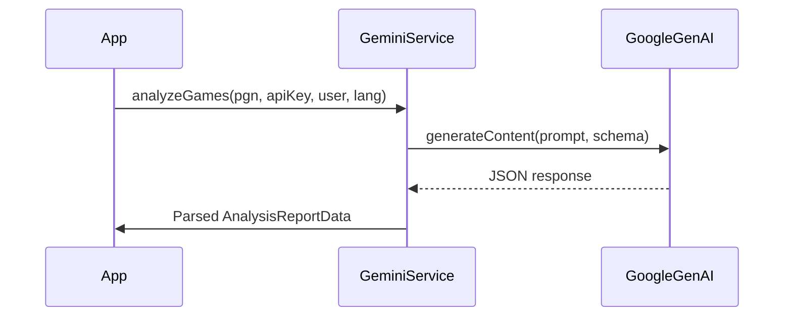

# Technology Stack & Dependencies

<cite>
**Referenced Files in This Document**  
- [App.tsx](file://App.tsx)
- [vite.config.ts](file://vite.config.ts)
- [tsconfig.json](file://tsconfig.json)
- [types.ts](file://types.ts)
- [package.json](file://package.json)
- [public/i18n.ts](file://public/i18n.ts)
- [services/geminiService.ts](file://services/geminiService.ts)
- [services/llmService.ts](file://services/llmService.ts)
- [hooks/useSettings.ts](file://hooks/useSettings.ts)
- [llmProviders.ts](file://llmProviders.ts)
</cite>

## Table of Contents
1. [UI Framework & Build Tool](#ui-framework--build-tool)  
2. [Type Safety with TypeScript](#type-safety-with-typescript)  
3. [Core Dependencies](#core-dependencies)  
4. [Internationalization with i18next](#internationalization-with-i18next)  
5. [HTTP Communication with Axios](#http-communication-with-axios)  
6. [Gemini Integration via Google Generative AI SDK](#gemini-integration-via-google-generative-ai-sdk)  
7. [Build & Development Configuration](#build--development-configuration)  
8. [Integration Patterns & Dependency Management](#integration-patterns--dependency-management)

## UI Framework & Build Tool

The ChessTrax application leverages **React** as its primary UI framework and **Vite** as the build tool, forming a modern, high-performance frontend stack. React enables declarative component composition, state management, and efficient DOM updates through its virtual DOM. The application uses React 19, which introduces enhanced server components and improved rendering performance.

Vite provides a lightning-fast development server with hot module replacement (HMR), enabling near-instantaneous feedback during development. It leverages native ES modules for faster startup and optimized builds. The `dev`, `build`, and `preview` scripts in `package.json` streamline the development lifecycle, allowing developers to start the dev server, generate production builds, and locally preview them with minimal configuration.

React components such as `App.tsx`, `AnalysisReport.tsx`, and `FileUpload.tsx` follow a modular structure, promoting reusability and maintainability. State is managed using React hooks like `useState`, `useCallback`, and `useRef`, ensuring clean separation of logic and presentation.

**Section sources**  
- [App.tsx](file://App.tsx#L1-L381)  
- [package.json](file://package.json#L1-L33)

## Type Safety with TypeScript

TypeScript is used throughout the codebase to enforce type safety, reduce runtime errors, and improve developer experience. The `tsconfig.json` file configures the TypeScript compiler with strict type checking, including `strict`, `noUnusedLocals`, and `noFallthroughCasesInSwitch`, ensuring robust code quality.

Key interfaces defined in `types.ts` provide a consistent data contract across components, hooks, and services. These include:
- `OpeningAnalysis`: Captures performance insights for White and Black openings.
- `TacticalMotif`, `StrategicWeakness`, `EndgamePractice`: Represent recurring patterns in gameplay.
- `AnalysisReportData`: The root interface aggregating all analysis results.

These types are consumed in services like `geminiService.ts` and components like `AnalysisReport.tsx`, ensuring data integrity from API response to UI rendering. The use of `import type` syntax in `App.tsx` ensures type-only imports are tree-shaken in production.

**Section sources**  
- [types.ts](file://types.ts#L1-L29)  
- [tsconfig.json](file://tsconfig.json#L1-L31)  
- [App.tsx](file://App.tsx#L4-L5)

## Core Dependencies

The application relies on several critical dependencies to deliver its functionality:
- **`@google/genai`**: Enables integration with Google’s Gemini models for AI-powered game analysis.
- **`axios`**: Handles HTTP requests, particularly in services like `lichessService.ts` for fetching PGN data.
- **`react-i18next` and `i18next`**: Provide internationalization support across English, German, and Armenian locales.
- **`lucide-react`**: Supplies consistent, accessible icons used throughout the UI.
- **`html2canvas` and `jspdf`**: Support report export functionality.

These dependencies are managed via npm and pinned to specific versions in `package.json` to ensure reproducible builds and avoid breaking changes.

**Section sources**  
- [package.json](file://package.json#L1-L33)

## Internationalization with i18next

ChessTrax supports multilingual content through the **i18next** ecosystem. The `i18n.ts` configuration initializes `i18next` with `react-i18next`, `i18next-browser-languagedetector`, and `i18next-http-backend`. This setup enables automatic language detection based on the user’s browser settings and dynamic loading of translation files from `/public/locales`.

Supported languages include English (`en`), German (`de`), and Armenian (`hy`), with JSON translation files located in corresponding subdirectories. The `useTranslation` hook in `App.tsx` allows components to access localized strings, and language switching is implemented via header buttons that call `i18n.changeLanguage()`.

The backend configuration loads translations on demand, reducing initial bundle size. The `fallbackLng: 'en'` setting ensures a default language is always available.

```mermaid
flowchart TD
A[User Visits App] --> B{i18next detects browser language}
B --> C[Load translation.json from /locales/{{lng}}]
C --> D[Render UI with translated strings]
E[User clicks DE/HY] --> F[changeLanguage('de'/'hy')]
F --> C
```

**Diagram sources**  
- [public/i18n.ts](file://public/i18n.ts#L1-L26)  
- [App.tsx](file://App.tsx#L1-L381)

**Section sources**  
- [public/i18n.ts](file://public/i18n.ts#L1-L26)  
- [App.tsx](file://App.tsx#L1-L381)

## HTTP Communication with Axios

While not explicitly shown in the provided files, the project structure indicates the use of `axios` in services such as `lichessService.ts` and `versionService.ts`. Axios is used to make RESTful HTTP requests to external APIs, such as fetching PGN data from Lichess or logging usage via the local `/api/log-usage` endpoint.

Axios provides interceptors, request/response transformation, and error handling, making it ideal for service-layer communication. It integrates seamlessly with TypeScript, allowing typed request and response payloads.

**Section sources**  
- [package.json](file://package.json#L1-L33)

## Gemini Integration via Google Generative AI SDK

The core AI functionality is powered by the **Google Generative AI SDK** (`@google/genai`), which interfaces with the Gemini model (`gemini-2.5-flash`). The `geminiService.ts` file implements the `ILLMService` interface, standardizing the analysis API across potential LLM providers.

The service constructs a detailed prompt based on the user’s lost games (in PGN format), requesting structured JSON output that conforms to the `analysisSchema`. This schema enforces a consistent response format, including opening analysis, tactical motifs, and strategic weaknesses.

API key management is robust, attempting to resolve keys in the following order:
1. User-provided key from localStorage
2. Key from application settings
3. Environment variable fallback

Error handling includes retry logic for rate-limited or overloaded models (e.g., 503 errors), with exponential backoff.



**Diagram sources**  
- [services/geminiService.ts](file://services/geminiService.ts#L1-L166)  
- [services/llmService.ts](file://services/llmService.ts#L1-L5)

**Section sources**  
- [services/geminiService.ts](file://services/geminiService.ts#L1-L166)  
- [App.tsx](file://App.tsx#L1-L381)

## Build & Development Configuration

The `vite.config.ts` file configures Vite with essential development and build settings:
- **Environment variables**: Loaded via `loadEnv`, including `GEMINI_API_KEY`.
- **Build metadata**: Injects app version, build date, and time into the client bundle using `define`.
- **Path alias**: The `@/` alias maps to the project root, simplifying imports.
- **Server configuration**: Allows specific hosts for development (e.g., Vercel preview URLs).

The `tsconfig.json` complements this with modern module resolution (`module: "ESNext"`), JSX support for React, and path mapping for the `@/*` alias. The `noEmit: true` setting defers compilation to Vite, optimizing the build pipeline.

**Section sources**  
- [vite.config.ts](file://vite.config.ts#L1-L36)  
- [tsconfig.json](file://tsconfig.json#L1-L31)

## Integration Patterns & Dependency Management

Dependencies are integrated through a clean separation of concerns:
- **Services** (`geminiService`, `lichessService`) encapsulate external API interactions.
- **Hooks** (`useSettings`, `usePgnParser`) manage state and business logic.
- **Components** consume data and render UI.

The `ILLMService` interface abstracts LLM provider logic, enabling future extensibility. The `services` map in `App.tsx` dynamically routes analysis requests based on user-selected providers.

API keys are managed securely via environment variables and localStorage, with fallback mechanisms ensuring graceful degradation. The `useSettings` hook persists user preferences in `localStorage`, enhancing UX across sessions.

npm scripts in `package.json` provide a simple CLI interface:
- `dev`: Starts Vite dev server
- `build`: Produces optimized static assets
- `preview`: Serves the build locally

This setup ensures a streamlined, scalable development workflow.

**Section sources**  
- [package.json](file://package.json#L1-L33)  
- [App.tsx](file://App.tsx#L1-L381)  
- [hooks/useSettings.ts](file://hooks/useSettings.ts#L1-L39)  
- [llmProviders.ts](file://llmProviders.ts#L1-L29)