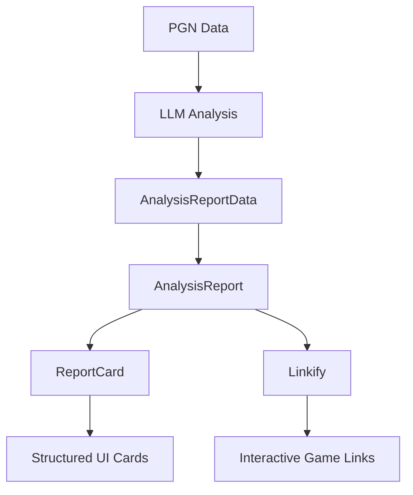
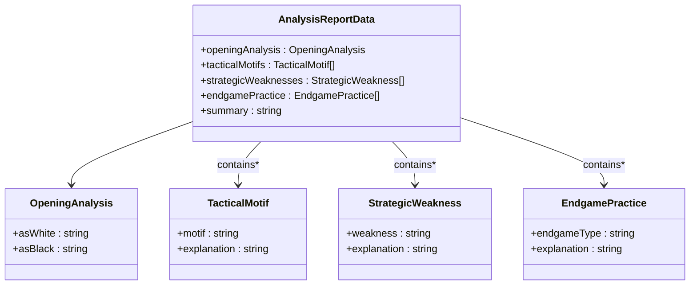
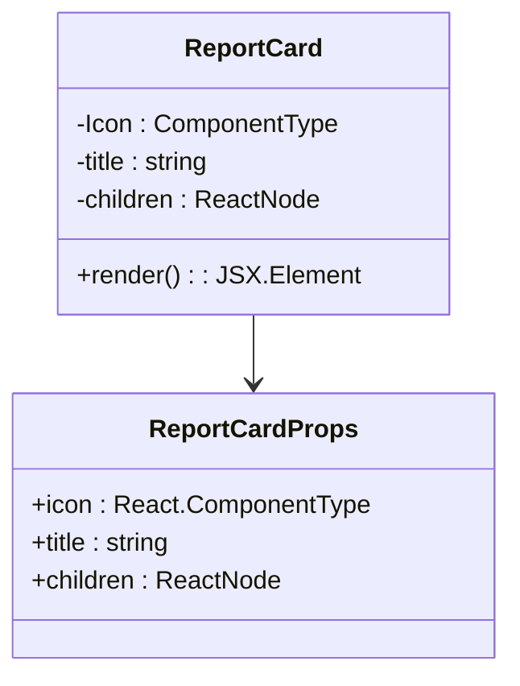
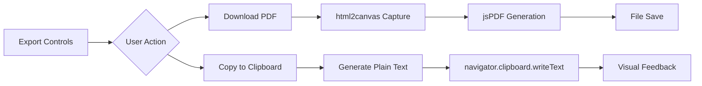

# Analysis Report

<cite>
**Referenced Files in This Document**   
- [AnalysisReport.tsx](file://components/AnalysisReport.tsx)
- [ReportCard.tsx](file://components/ReportCard.tsx)
- [Linkify.tsx](file://components/Linkify.tsx)
- [types.ts](file://types.ts)
</cite>

## Table of Contents
1. [Introduction](#introduction)
2. [Core Components Overview](#core-components-overview)
3. [Data Structure and Type Definitions](#data-structure-and-type-definitions)
4. [Report Rendering Pipeline](#report-rendering-pipeline)
5. [Linkify Implementation for Safe Hyperlink Rendering](#linkify-implementation-for-safe-hyperlink-rendering)
6. [ReportCard Component Architecture](#reportcard-component-architecture)
7. [Styling, Responsiveness, and Accessibility](#styling-responsiveness-and-accessibility)
8. [Export Functionality](#export-functionality)
9. [Error Handling and Edge Cases](#error-handling-and-edge-cases)
10. [Extensibility and Future Enhancements](#extensibility-and-future-enhancements)

## Introduction

The Analysis Report feature in ChessTrax provides users with AI-generated insights derived from parsed PGN game data. It transforms complex chess performance data into structured, user-readable reports using a modular component architecture. The system leverages large language models (LLMs) to analyze gameplay patterns and generate personalized improvement recommendations across key domains: openings, tactics, strategy, and endgames. This document details the implementation of the `AnalysisReport.tsx` component and its integration with supporting components to deliver a cohesive, interactive, and exportable analysis experience.

## Core Components Overview

The Analysis Report system is built around three primary components: `AnalysisReport.tsx`, `ReportCard.tsx`, and `Linkify.tsx`. These components work in concert to process structured analysis data, render it in a visually consistent format, and enhance user interaction through safe hyperlink rendering.



**Diagram sources**
- [AnalysisReport.tsx](file://components/AnalysisReport.tsx#L0-L197)
- [types.ts](file://types.ts#L21-L27)

**Section sources**
- [AnalysisReport.tsx](file://components/AnalysisReport.tsx#L0-L197)
- [ReportCard.tsx](file://components/ReportCard.tsx#L0-L27)
- [Linkify.tsx](file://components/Linkify.tsx#L0-L63)

## Data Structure and Type Definitions

The analysis data is structured through a well-defined TypeScript interface that ensures type safety and consistency across the application. The `AnalysisReportData` interface encapsulates all AI-generated insights in a hierarchical format.



**Diagram sources**
- [types.ts](file://types.ts#L1-L27)

**Section sources**
- [types.ts](file://types.ts#L1-L27)

## Report Rendering Pipeline

The `AnalysisReport` component receives `AnalysisReportData` as a prop and orchestrates the rendering of various analysis sections. It uses a grid layout to organize content into logical groupings, with each section rendered via the `ReportCard` component.

The component processes the data by:
1. Displaying metadata (user, date, model, game period) in the header
2. Rendering the primary focus summary using `Linkify` for enhanced content
3. Mapping through tactical motifs, strategic weaknesses, and endgame practice items
4. Organizing content into a responsive two-column layout on medium screens and above

```mermaid
sequenceDiagram
participant Props as AnalysisReportProps
participant Component as AnalysisReport
participant Card as ReportCard
participant Link as Linkify
Props->>Component : data, lichessUser, modelName, etc.
Component->>Component : Render header metadata
Component->>Card : Render primary focus (summary)
Card->>Link : Process summary text
Component->>Card : Render opening analysis
Card->>Link : Process asWhite/asBlack text
Component->>Card : Map tacticalMotifs
loop Each motif
Card->>Link : Process explanation
end
Component->>Card : Map strategicWeaknesses
loop Each weakness
Card->>Link : Process explanation
end
Component->>Card : Map endgamePractice
loop Each endgame
Card->>Link : Process explanation
end
```

**Diagram sources**
- [AnalysisReport.tsx](file://components/AnalysisReport.tsx#L0-L197)

**Section sources**
- [AnalysisReport.tsx](file://components/AnalysisReport.tsx#L0-L197)

## Linkify Implementation for Safe Hyperlink Rendering

The `Linkify` component implements a secure method for rendering hyperlinks within AI-generated content, specifically for Lichess game references. It uses a two-step regex matching process to ensure links are only created in appropriate contexts.

The implementation follows these rules:
- Only text blocks starting with "GameId" are processed for linking
- Within these blocks, 8-character alphanumeric IDs are identified as valid Lichess game IDs
- All matched IDs are converted to clickable links pointing to `https://lichess.org/{id}`
- Links open in new tabs with proper security attributes (`noopener noreferrer`)
- Non-matching text is rendered as plain text to prevent injection attacks

```mermaid
flowchart TD
A[Input Text] --> B{Text Empty?}
B --> |Yes| C[Return null]
B --> |No| D[Split by GAME_ID_BLOCK_REGEX]
D --> E[Process Each Block]
E --> F{Block Starts with "GameId"?}
F --> |No| G[Render as Plain Text]
F --> |Yes| H[Split by LICHESS_ID_REGEX]
H --> I[Process Sub-Parts]
I --> J{Sub-Part is 8-char ID?}
J --> |Yes| K[Render as Link]
J --> |No| L[Render as Plain Text]
```

**Diagram sources**
- [Linkify.tsx](file://components/Linkify.tsx#L0-L63)

**Section sources**
- [Linkify.tsx](file://components/Linkify.tsx#L0-L63)

## ReportCard Component Architecture

The `ReportCard` component serves as a reusable container for analysis sections, providing visual consistency and structural integrity across the report. It accepts an icon, title, and children to create a standardized presentation format.

Key features include:
- Icon integration using Lucide React components
- Consistent spacing and padding (6 units)
- Rounded corners (2xl) with border and shadow effects
- Semantic heading structure (h3 for title)
- Prose-based text styling for readability
- Full height expansion to maintain grid alignment



**Diagram sources**
- [ReportCard.tsx](file://components/ReportCard.tsx#L0-L27)

**Section sources**
- [ReportCard.tsx](file://components/ReportCard.tsx#L0-L27)

## Styling, Responsiveness, and Accessibility

The Analysis Report implements comprehensive styling and accessibility features to ensure usability across devices and assistive technologies.

### Responsive Behavior
- Mobile: Single column layout with vertical spacing
- Medium screens and above: Two-column grid layout
- Export area uses responsive padding (p-6 on mobile, p-8 on md)
- Flex-based export controls adapt to screen width

### Accessibility Features
- Semantic HTML structure with proper heading hierarchy
- High contrast text colors for readability
- Focusable interactive elements (buttons, links)
- Screen reader support through semantic markup
- Keyboard navigable interface
- ARIA attributes on interactive elements
- Color contrast compliant with WCAG standards

### Styling System
- Uses a consistent color palette (gray-primary, accent, text-primary, etc.)
- Implements Tailwind CSS for utility-first styling
- Maintains visual hierarchy through font weights and sizes
- Uses consistent spacing system (gap-3, mb-4, p-6, etc.)
- Implements hover states for interactive elements

**Section sources**
- [AnalysisReport.tsx](file://components/AnalysisReport.tsx#L0-L197)
- [ReportCard.tsx](file://components/ReportCard.tsx#L0-L27)

## Export Functionality

The Analysis Report provides two export options for users to save or share their analysis:

1. **PDF Export**: Uses `html2canvas` and `jsPDF` to convert the report into a downloadable PDF
   - Captures the `#exportable-area` element
   - Renders with high quality (scale: 2)
   - Preserves dark theme background
   - Names file with user-specific identifier

2. **Clipboard Export**: Generates a plain text version of the report for easy pasting
   - Formats content with clear section headers
   - Uses translation keys for internationalization
   - Includes metadata and all analysis sections
   - Provides visual feedback upon successful copy



**Diagram sources**
- [AnalysisReport.tsx](file://components/AnalysisReport.tsx#L45-L95)

**Section sources**
- [AnalysisReport.tsx](file://components/AnalysisReport.tsx#L45-L95)

## Error Handling and Edge Cases

The Analysis Report implementation includes robust handling for various edge cases and potential failures:

### Data Edge Cases
- Empty or missing text in `Linkify` returns null safely
- Missing analysis sections are handled by empty arrays in the interface
- Optional fields are not present in the type definition, requiring complete data

### Rendering Edge Cases
- Long content is handled by prose classes with `max-w-none`
- Large numbers of tactical motifs are handled by dynamic list rendering
- Complex formatting in AI responses is preserved through plain text rendering

### Functional Edge Cases
- PDF generation failure is caught and logged without crashing
- Clipboard API unavailability is handled gracefully
- Network issues with external links are managed by browser defaults
- Translation key failures fall back to default strings

### Malformed Response Handling
- The component assumes well-formed `AnalysisReportData`
- Type checking ensures required fields are present
- Runtime validation could be added for production hardening
- Empty strings are rendered as empty paragraphs

**Section sources**
- [AnalysisReport.tsx](file://components/AnalysisReport.tsx#L0-L197)
- [Linkify.tsx](file://components/Linkify.tsx#L0-L63)

## Extensibility and Future Enhancements

The Analysis Report architecture is designed for extensibility, allowing for future enhancements while maintaining consistency.

### Recommended Extension Patterns
- Add new analysis sections by creating additional `ReportCard` instances
- Extend `AnalysisReportData` interface with new properties
- Implement new visualization types within existing cards
- Add filtering or sorting controls for list-based sections

### Potential Enhancements
- Section collapse/expand functionality for better navigation
- Search within report content
- Interactive elements for deeper analysis exploration
- Custom styling options for exported PDFs
- Additional export formats (Markdown, HTML)
- Print-specific styling improvements
- Analytics tracking for report interactions

### Maintenance Guidelines
- Keep consistent icon usage across sections
- Maintain uniform spacing and typography
- Preserve accessibility features in new components
- Use existing color palette and design system
- Ensure all new text is internationalized
- Test responsiveness across device sizes
- Validate error handling for new features

**Section sources**
- [AnalysisReport.tsx](file://components/AnalysisReport.tsx#L0-L197)
- [types.ts](file://types.ts#L21-L27)