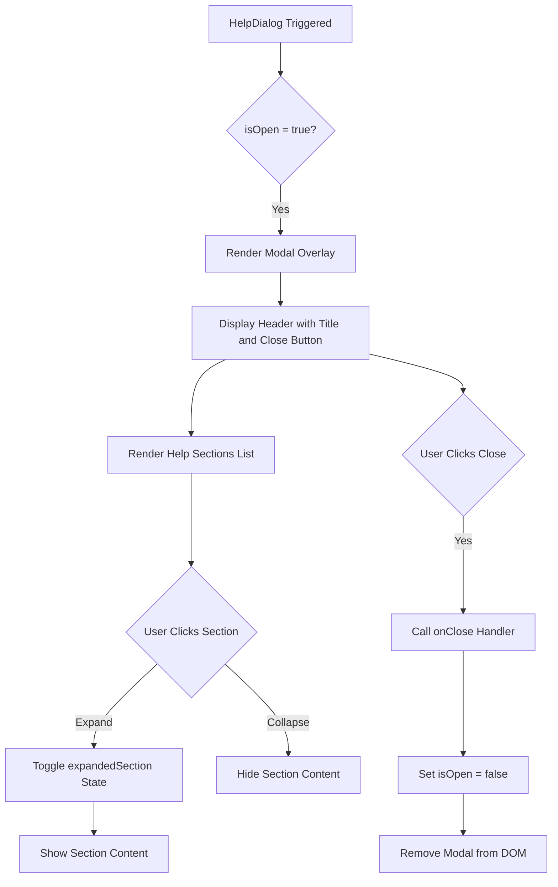
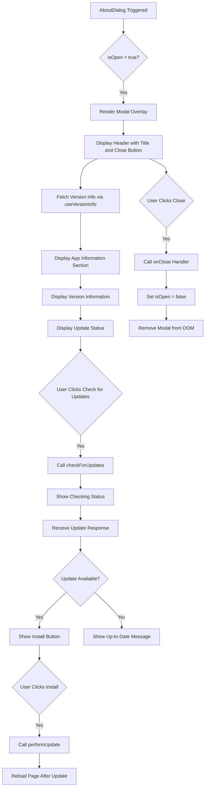

# Help System

<cite>
**Referenced Files in This Document**   
- [HelpDialog.tsx](file://components/HelpDialog.tsx)
- [AboutDialog.tsx](file://components/AboutDialog.tsx)
- [App.tsx](file://App.tsx)
- [translation.json](file://public/locales/en/translation.json)
- [useVersionInfo.ts](file://hooks/useVersionInfo.ts)
- [versionService.ts](file://services/versionService.ts)
</cite>

## Table of Contents
1. [Introduction](#introduction)
2. [Core Components Overview](#core-components-overview)
3. [HelpDialog Component](#helpdialog-component)
4. [AboutDialog Component](#aboutdialog-component)
5. [Integration with App.tsx](#integration-with-apptsx)
6. [Content Organization and Internationalization](#content-organization-and-internationalization)
7. [Accessibility and User Experience](#accessibility-and-user-experience)
8. [Maintaining and Extending Help Content](#maintaining-and-extending-help-content)
9. [Conclusion](#conclusion)

## Introduction
The ChessTrax AI Coach application includes a comprehensive help system designed to guide users through its core functionalities and provide essential application information. This system consists of two primary components: `HelpDialog.tsx` for contextual assistance and `AboutDialog.tsx` for version details and project credits. These modal dialogs are seamlessly integrated into the main interface, offering users immediate access to guidance and technical information. The help system supports multiple languages through i18n and is designed with accessibility in mind, ensuring a smooth user experience across different devices and input methods.

## Core Components Overview
The help system in ChessTrax comprises two distinct but complementary components that serve different user needs. The `HelpDialog` provides detailed guidance on using the application's features, while the `AboutDialog` offers technical information about the application version and update status. Both components are implemented as modal dialogs that can be triggered from the application header, ensuring consistent access throughout the user journey. They share a common design language with the rest of the application, featuring dark-themed interfaces with accent colors and responsive layouts that work well on various screen sizes.

**Section sources**
- [HelpDialog.tsx](file://components/HelpDialog.tsx#L1-L133)
- [AboutDialog.tsx](file://components/AboutDialog.tsx#L1-L215)

## HelpDialog Component

The `HelpDialog` component provides contextual assistance to users by organizing help content into expandable sections. It displays a modal dialog when activated, featuring a clean interface with collapsible panels for different topics such as getting started, Lichess integration, PGN upload, analysis results, troubleshooting, and frequently asked questions.

Each section is represented by an icon and title, with content that can be expanded or collapsed through user interaction. The component uses React state to manage which section is currently expanded, allowing only one section to be open at a time. This accordion-style interface conserves vertical space while providing quick navigation between different help topics.

The dialog is conditionally rendered based on the `isOpen` prop, ensuring it only appears when needed. When open, it creates a backdrop overlay that dims the main application content and captures user focus. The dialog can be closed either by clicking the close button or by clicking outside the dialog area (handled by the parent component).



**Diagram sources**
- [HelpDialog.tsx](file://components/HelpDialog.tsx#L15-L133)

**Section sources**
- [HelpDialog.tsx](file://components/HelpDialog.tsx#L1-L133)

## AboutDialog Component

The `AboutDialog` component displays application metadata and version information to users. It provides details about the current version, build date and time, and includes functionality for checking and installing updates. The component integrates with the `useVersionInfo` hook to manage update status and perform update operations through the service worker mechanism.

The dialog is organized into several sections: app information, version details, update functionality, and external links. The update section displays the current status (checking, available, up to date, etc.) and provides buttons to initiate update checks and installations. Success and error messages are displayed appropriately based on the update process outcome.

The component uses the `useVersionInfo` hook to access version information and update functions, maintaining a clean separation between UI presentation and business logic. Like the HelpDialog, it is conditionally rendered based on the `isOpen` prop and can be dismissed by clicking the close button.



**Diagram sources**
- [AboutDialog.tsx](file://components/AboutDialog.tsx#L1-L215)
- [useVersionInfo.ts](file://hooks/useVersionInfo.ts#L1-L97)

**Section sources**
- [AboutDialog.tsx](file://components/AboutDialog.tsx#L1-L215)

## Integration with App.tsx

The help system components are integrated into the main application through state management in `App.tsx`. The component maintains boolean state variables (`isHelpDialogOpen` and `isAboutDialogOpen`) to control the visibility of both dialogs. These states are toggled by button clicks in the application header, providing consistent access to help and about information throughout the user experience.

Both dialogs are implemented using React's Suspense and lazy loading features, which improves initial application load performance by loading the dialog components only when needed. The dialogs are wrapped in Suspense boundaries with null fallbacks, ensuring they don't block the main application rendering.

The integration follows a clean pattern where the dialog components are rendered at the root level of the application, positioned above other content using z-index. This ensures they remain accessible regardless of the current application state or active views. The close functionality is handled by setting the corresponding state variable to false, which triggers the conditional rendering logic in the dialog components.

```mermaid
classDiagram
class App {
-isHelpDialogOpen : boolean
-isAboutDialogOpen : boolean
+setIsHelpDialogOpen() : void
+setIsAboutDialogOpen() : void
+render() : JSX.Element
}
class HelpDialog {
+isOpen : boolean
+onClose : () => void
+render() : JSX.Element
}
class AboutDialog {
+isOpen : boolean
+onClose : () => void
+render() : JSX.Element
}
App --> HelpDialog : "uses"
App --> AboutDialog : "uses"
App --> "header buttons" : "triggers"
HelpDialog --> "user interaction" : "closes"
AboutDialog --> "user interaction" : "closes"
```

**Diagram sources**
- [App.tsx](file://App.tsx#L1-L397)
- [HelpDialog.tsx](file://components/HelpDialog.tsx#L1-L133)
- [AboutDialog.tsx](file://components/AboutDialog.tsx#L1-L215)

**Section sources**
- [App.tsx](file://App.tsx#L1-L397)

## Content Organization and Internationalization

The help content in ChessTrax is organized into logical sections that guide users through the application's core workflows: analysis, settings, and API key management. Each section in the `HelpDialog` addresses specific user needs, starting with getting started instructions and progressing to more advanced topics like troubleshooting and frequently asked questions.

The content is externalized through the i18n system, with all text strings defined in JSON translation files located in the `public/locales` directory. This structure supports multiple languages (English, German, and Armenian) and allows for easy translation and localization. The `useTranslation` hook from react-i18next is used to access these translations within the components.

For the `HelpDialog`, content is organized as an array of `HelpSection` objects, each containing an ID, icon, and keys for the title and content. This structure makes it easy to add new sections or reorder existing ones without modifying the component's rendering logic. The content strings in the translation files use HTML-like formatting with `<br/>` tags to preserve line breaks, which are rendered using `dangerouslySetInnerHTML` after proper sanitization.

The `AboutDialog` also leverages i18n for its static text content, including section titles, button labels, and status messages. Dynamic content such as version numbers and build dates are inserted as variables in the UI, while the surrounding text is translated.

**Section sources**
- [HelpDialog.tsx](file://components/HelpDialog.tsx#L1-L133)
- [AboutDialog.tsx](file://components/AboutDialog.tsx#L1-L215)
- [translation.json](file://public/locales/en/translation.json#L1-L122)

## Accessibility and User Experience

The help system in ChessTrax prioritizes accessibility and user experience through several design and implementation choices. Both dialog components include proper ARIA attributes to ensure screen reader compatibility. The close buttons have descriptive `aria-label` attributes, and the modal overlays use appropriate roles and properties to convey their purpose to assistive technologies.

Keyboard navigation is fully supported, allowing users to interact with the dialogs using only the keyboard. Users can open and close dialogs, navigate between sections, and expand/collapse content using standard keyboard controls. The focus is managed appropriately when dialogs open and close, with initial focus set to the close button and focus trapped within the dialog while it is open.

The UI design follows accessibility best practices with sufficient color contrast between text and background elements. Interactive elements have clear visual states for hover, focus, and active conditions. The expandable sections in the `HelpDialog` use chevron icons that visually indicate the expand/collapse state, providing clear feedback to users.

Both dialogs are responsive and adapt to different screen sizes, with maximum width constraints and scrollable content areas that prevent overflow on smaller devices. The backdrop overlay prevents interaction with the underlying application while the dialog is open, reducing the risk of accidental actions.

**Section sources**
- [HelpDialog.tsx](file://components/HelpDialog.tsx#L1-L133)
- [AboutDialog.tsx](file://components/AboutDialog.tsx#L1-L215)

## Maintaining and Extending Help Content

To add new help sections or update existing content in the `HelpDialog`, developers should follow a structured approach that maintains consistency across the help system. New sections can be added to the `helpSections` array by defining a new `HelpSection` object with a unique ID, appropriate icon, and translation keys for the title and content.

When adding new content, corresponding translation strings must be added to all language files in the `public/locales` directory to maintain multilingual support. The translation keys should follow the established naming convention (`help.sectionName.property`) to ensure consistency and ease of maintenance.

For the `AboutDialog`, updates typically involve modifying the static content in the translation files or enhancing the update functionality. The version information is automatically populated from build-time variables and the version service, requiring no manual updates for version numbers.

The modular design of both components makes them easy to extend with new features. For example, additional sections could be added to the `AboutDialog` to display changelogs or third-party license information. Similarly, the `HelpDialog` could be enhanced with search functionality or the ability to link directly to specific sections.

**Section sources**
- [HelpDialog.tsx](file://components/HelpDialog.tsx#L1-L133)
- [translation.json](file://public/locales/en/translation.json#L1-L122)

## Conclusion
The help system in ChessTrax provides comprehensive support for users through two well-designed components: `HelpDialog` for contextual assistance and `AboutDialog` for application information. These components are seamlessly integrated into the application's UI, accessible from the header, and designed with accessibility and internationalization in mind. The modular structure and use of externalized strings make the help content easy to maintain and extend, ensuring that users always have access to up-to-date guidance and information about the application.