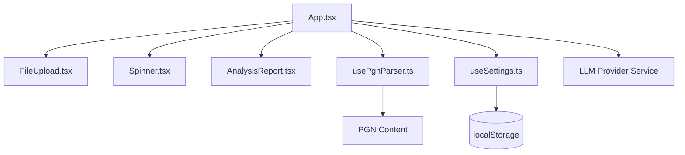
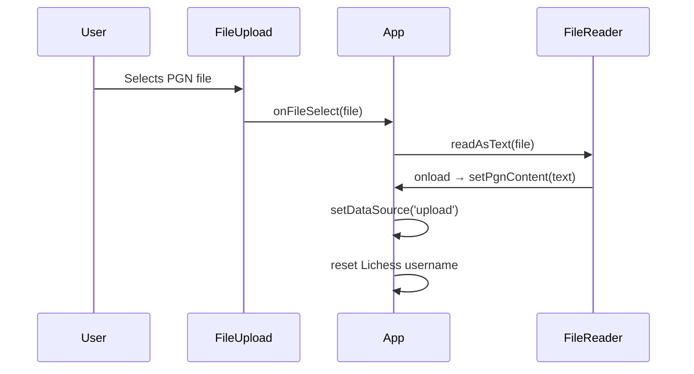
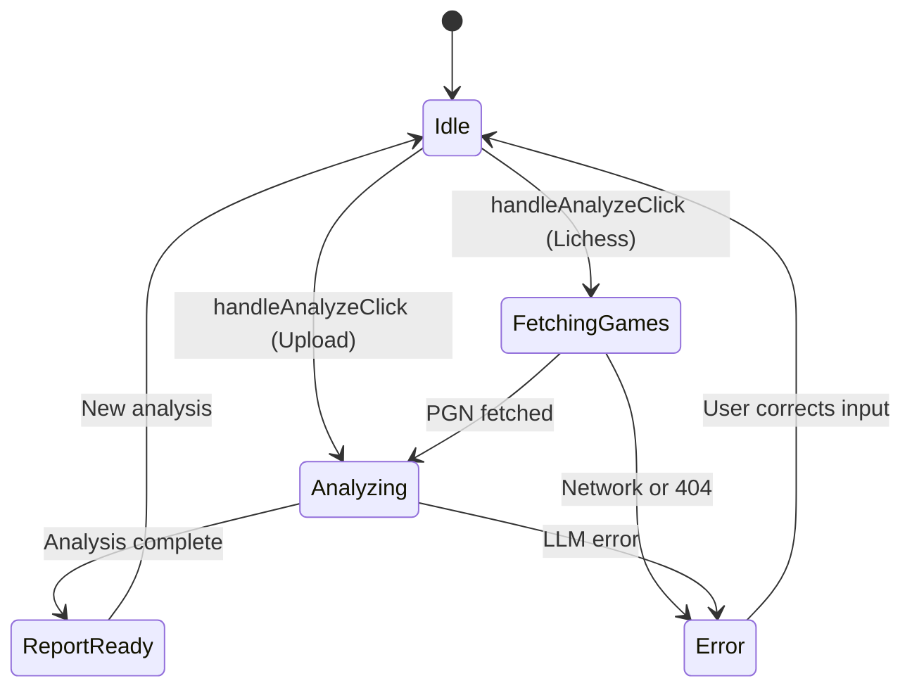
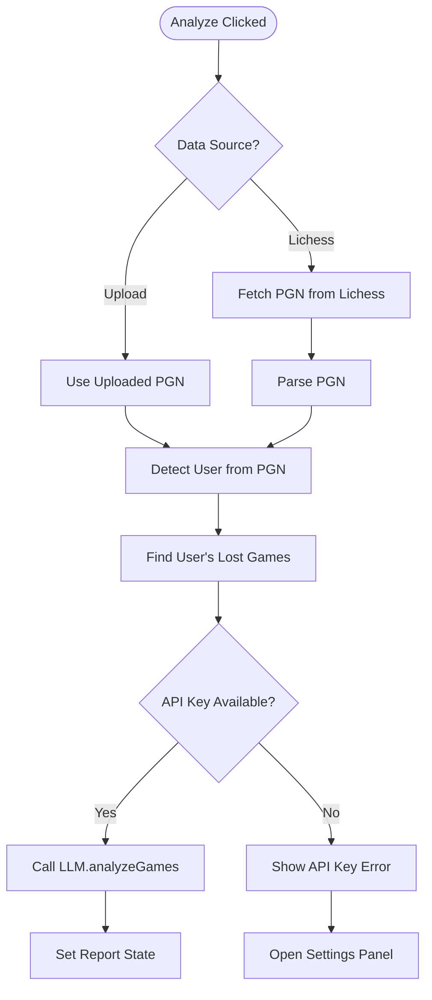

# Main Dashboard

<cite>
**Referenced Files in This Document**   
- [App.tsx](file://App.tsx)
- [FileUpload.tsx](file://components/FileUpload.tsx)
- [Spinner.tsx](file://components/Spinner.tsx)
- [usePgnParser.ts](file://hooks/usePgnParser.ts)
- [useSettings.ts](file://hooks/useSettings.ts)
- [AnalysisReport.tsx](file://components/AnalysisReport.tsx)
- [types.ts](file://types.ts)
</cite>

## Table of Contents
1. [Introduction](#introduction)
2. [Core Components and State Management](#core-components-and-state-management)
3. [User Input Handling and File Upload](#user-input-handling-and-file-upload)
4. [Loading States and Feedback with Spinner](#loading-states-and-feedback-with-spinner)
5. [PGN Parsing and Analysis Workflow](#pgn-parsing-and-analysis-workflow)
6. [UI Composition and Responsive Layout](#ui-composition-and-responsive-layout)
7. [Error Handling and User Feedback](#error-handling-and-user-feedback)
8. [Performance and Re-rendering Optimization](#performance-and-re-rendering-optimization)
9. [Accessibility and Internationalization](#accessibility-and-internationalization)
10. [Conclusion](#conclusion)

## Introduction

The Main Dashboard in ChessTrax serves as the central interface for users to analyze their chess games through AI-powered insights. Orchestrated by `App.tsx`, the dashboard enables users to input their game data either by uploading a PGN file or entering a Lichess username. It manages the entire analysis lifecycle—from data ingestion and parsing to AI processing and report generation—while providing real-time feedback via loading indicators and error messages. This document details the architectural design, component integration, and state flow of the dashboard, offering both onboarding guidance for new developers and deeper insights into its reactive architecture.

**Section sources**
- [App.tsx](file://App.tsx#L1-L50)

## Core Components and State Management

The `App.tsx` component acts as the central orchestrator, managing application state and coordinating interactions between UI components and business logic. It maintains key state variables such as `pgnContent`, `report`, `isLoading` flags (`isFetchingPgn`, `isAnalyzing`), and user input (`lichessUsername`). These states are managed using React’s `useState` hook and are updated in response to user actions and asynchronous operations.

Critical hooks like `useSettings` and `usePgnParser` are integrated directly within `App.tsx` to provide settings persistence and PGN parsing capabilities. The `useSettings` hook retrieves user preferences (e.g., selected LLM provider and API keys) from `localStorage`, ensuring continuity across sessions. Meanwhile, `usePgnParser` processes the PGN content to detect the user and extract relevant games, particularly losses, which are the focus of the analysis.

**Diagram sources**
- [App.tsx](file://App.tsx#L1-L50)
- [usePgnParser.ts](file://hooks/usePgnParser.ts#L1-L10)
- [useSettings.ts](file://hooks/useSettings.ts#L1-L10)

**Section sources**
- [App.tsx](file://App.tsx#L1-L100)
- [useSettings.ts](file://hooks/useSettings.ts#L1-L39)
- [usePgnParser.ts](file://hooks/usePgnParser.ts#L1-L105)

## User Input Handling and File Upload

The `FileUpload.tsx` component provides a drag-and-drop or click-based interface for users to upload PGN files. It is integrated into `App.tsx` via a ref (`fileUploadRef`) to allow programmatic control, such as clearing the file input when switching data sources. The component uses an invisible `<input type="file" />` element and a styled div to create a user-friendly upload zone.

When a file is selected, `handleFileSelect` in `App.tsx` reads the file content using `FileReader` and updates the `pgnContent` state. If the user switches to the Lichess username input, the file upload is automatically cleared to prevent conflicting data sources. This ensures a clean state transition between upload and username-based workflows.

**Diagram sources**
- [FileUpload.tsx](file://components/FileUpload.tsx#L1-L83)
- [App.tsx](file://App.tsx#L150-L180)

**Section sources**
- [FileUpload.tsx](file://components/FileUpload.tsx#L1-L83)
- [App.tsx](file://App.tsx#L150-L200)

## Loading States and Feedback with Spinner

The `Spinner.tsx` component is a lightweight SVG-based spinner used to indicate asynchronous operations such as fetching games from Lichess or analyzing games via the LLM service. It is conditionally rendered during `isFetchingPgn` or `isAnalyzing` states within the `mainContent` function of `App.tsx`.

The spinner is embedded in both the main analysis card and the "Analyze" button, providing consistent visual feedback. The loading text dynamically changes based on the current operation (`fetchingGames`, `analyzing`), enhancing user awareness of the system state. This ensures users understand that the application is actively processing their request, reducing perceived latency.

**Diagram sources**
- [Spinner.tsx](file://components/Spinner.tsx#L1-L30)
- [App.tsx](file://App.tsx#L300-L320)

**Section sources**
- [Spinner.tsx](file://components/Spinner.tsx#L1-L30)
- [App.tsx](file://App.tsx#L250-L300)

## PGN Parsing and Analysis Workflow

The analysis workflow begins when the user clicks "Analyze". The `handleAnalyzeClick` function determines the data source and triggers the appropriate flow. For Lichess usernames, it calls `fetchPgnFromLichess` to retrieve the user’s game history. For uploaded files, it uses the `detectUserFromPgn` utility to infer the player’s name from the PGN headers.

The `findUserGames` function then filters the PGN content to extract only the games where the user lost, which are passed to the LLM for analysis. The system prioritizes API key resolution by first checking for a user-provided Gemini key, then falling back to stored settings or environment variables. Once the analysis is complete, the report is stored in state and displayed via `AnalysisReport.tsx`.

**Diagram sources**
- [usePgnParser.ts](file://hooks/usePgnParser.ts#L50-L100)
- [App.tsx](file://App.tsx#L200-L250)

**Section sources**
- [usePgnParser.ts](file://hooks/usePgnParser.ts#L1-L105)
- [App.tsx](file://App.tsx#L200-L280)

## UI Composition and Responsive Layout

The dashboard employs a mobile-first responsive design using Tailwind CSS. The main content area is centered with `max-w-lg` and padded appropriately for small screens, while larger screens use `max-w-5xl` for the header and footer. Flexbox and grid layouts ensure consistent alignment across devices.

The `mainContent` function conditionally renders one of three states: loading spinner, analysis report, or input form. Icons from `lucide-react` enhance visual clarity, and interactive elements use hover states and transitions for a polished feel. The layout adapts to screen size, with stacked buttons on mobile and side-by-side report cards on desktop via `md:grid-cols-2`.

**Section sources**
- [App.tsx](file://App.tsx#L300-L380)
- [AnalysisReport.tsx](file://components/AnalysisReport.tsx#L1-L198)

## Error Handling and User Feedback

Errors are managed through a centralized `error` state in `App.tsx`, displayed prominently in a red alert box. Common error conditions include missing usernames, unreadable files, failed Lichess lookups (404), and missing API keys. When an API key is missing, the app automatically opens the appropriate settings panel (`isApiKeyPanelOpen` or `isSettingsPanelOpen`) to guide the user toward resolution.

The error messages are localized using `react-i18next`, ensuring accessibility across supported languages (English, German, Armenian). This user-centric approach minimizes friction by providing actionable feedback and direct navigation to fix issues.

**Section sources**
- [App.tsx](file://App.tsx#L250-L280)
- [AnalysisReport.tsx](file://components/AnalysisReport.tsx#L1-L198)

## Performance and Re-rendering Optimization

To optimize performance, `App.tsx` leverages `useCallback` to memoize critical functions like `performAnalysis` and `handleAnalyzeClick`, preventing unnecessary re-creations on each render. The `usePgnParser` hook uses `useMemo` to cache parsing results, ensuring that expensive PGN operations only run when `pgnContent` changes.

The initial load is kept lightweight by code-splitting dialogs and panels into conditional renders (e.g., `isSettingsPanelOpen`), which prevents mounting unused components. This reduces memory usage and improves responsiveness, especially on lower-end devices.

**Section sources**
- [App.tsx](file://App.tsx#L200-L250)
- [usePgnParser.ts](file://hooks/usePgnParser.ts#L80-L105)

## Accessibility and Internationalization

The dashboard supports multiple languages via `react-i18next`, with language selection buttons in the header. All UI text is wrapped in translation functions (`t()`), and ARIA attributes are used in interactive elements (e.g., close buttons with `aria-label`). Icons are accompanied by text or tooltips to ensure clarity for screen readers.

Keyboard navigation is supported through standard HTML controls (buttons, inputs), and focus management is maintained during dialog openings. The color contrast meets WCAG standards, and the UI avoids reliance on color alone to convey information (e.g., error icons with text).

**Section sources**
- [App.tsx](file://App.tsx#L350-L370)
- [components/HelpDialog.tsx](file://components/HelpDialog.tsx#L1-L18)

## Conclusion

The Main Dashboard in ChessTrax exemplifies a well-structured React application with clear separation of concerns, effective state management, and a focus on user experience. By orchestrating components like `FileUpload`, `Spinner`, and `AnalysisReport` through `App.tsx`, and leveraging custom hooks for parsing and settings, the dashboard delivers a seamless, responsive, and accessible interface for chess analysis. Its design balances simplicity for new users with extensibility for developers, making it a robust foundation for future enhancements.