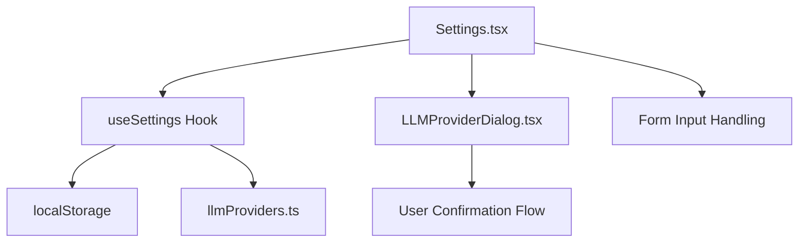
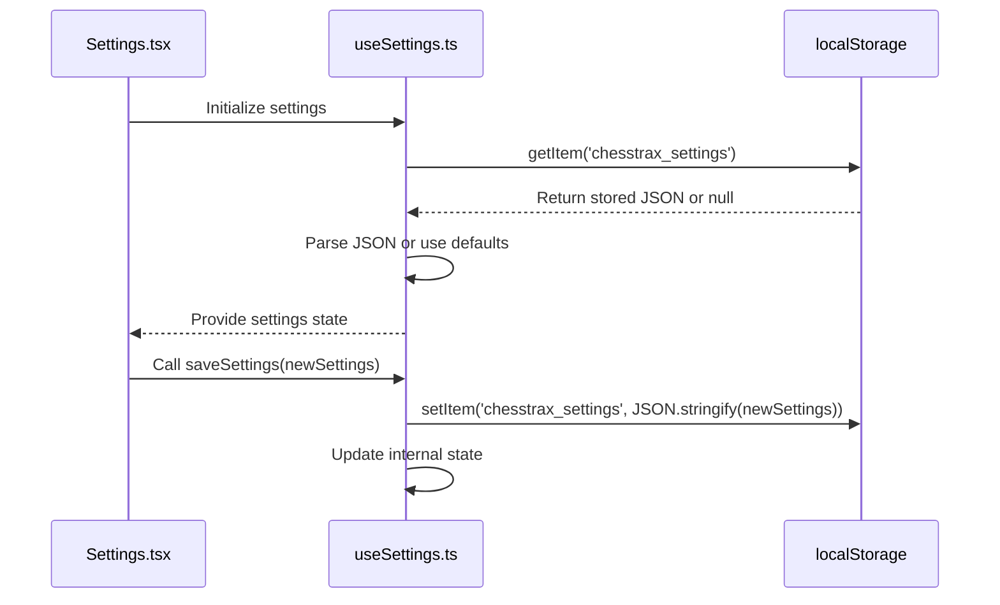
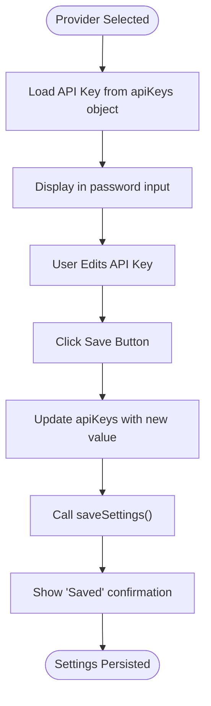

# Settings Panel

<cite>
**Referenced Files in This Document**   
- [Settings.tsx](file://components/Settings.tsx)
- [LLMProviderDialog.tsx](file://components/LLMProviderDialog.tsx)
- [useSettings.ts](file://hooks/useSettings.ts)
- [llmProviders.ts](file://llmProviders.ts)
- [App.tsx](file://App.tsx)
</cite>

## Table of Contents
1. [Introduction](#introduction)
2. [Core Components Overview](#core-components-overview)
3. [State Management with useSettings](#state-management-with-usesettings)
4. [Settings UI Implementation](#settings-ui-implementation)
5. [Provider Configuration and API Key Handling](#provider-configuration-and-api-key-handling)
6. [Security Considerations](#security-considerations)
7. [Responsive Design and Accessibility](#responsive-design-and-accessibility)
8. [Error Handling and User Feedback](#error-handling-and-user-feedback)
9. [Extensibility and Best Practices](#extensibility-and-best-practices)

## Introduction
The Settings Panel in the ChessTrax application provides users with a centralized interface to configure core application behavior, primarily focusing on language model (LLM) provider selection and API key management. Built using React with TypeScript, the panel enables users to select from multiple AI providers, input their respective API credentials securely, and persist these settings across sessions. The implementation emphasizes usability, security, and extensibility, ensuring a seamless experience while protecting sensitive authentication data.

**Section sources**
- [Settings.tsx](file://components/Settings.tsx#L1-L105)
- [useSettings.ts](file://hooks/useSettings.ts#L1-L38)

## Core Components Overview
The Settings Panel is composed of two primary components: `Settings.tsx` and `LLMProviderDialog.tsx`, which work in conjunction with the `useSettings` custom hook for state persistence. The `Settings` component renders the main configuration interface, allowing users to choose an LLM provider and enter API keys. The `LLMProviderDialog` serves as a confirmation modal that appears when users interact with provider settings, reinforcing privacy and security awareness before proceeding.

**Diagram sources**
- [Settings.tsx](file://components/Settings.tsx#L1-L105)
- [LLMProviderDialog.tsx](file://components/LLMProviderDialog.tsx#L1-L60)
- [useSettings.ts](file://hooks/useSettings.ts#L1-L38)

**Section sources**
- [Settings.tsx](file://components/Settings.tsx#L1-L105)
- [LLMProviderDialog.tsx](file://components/LLMProviderDialog.tsx#L1-L60)

## State Management with useSettings
The `useSettings` hook abstracts state management and persistence logic, providing a clean API for components to read and update user preferences. It initializes settings from `localStorage`, falling back to default values if none exist. The hook exposes the current settings object, a `saveSettings` function, and the list of available LLM providers. Settings are persisted as a JSON string under the key `chesstrax_settings`, including the selected provider ID and a record of API keys indexed by provider ID.

**Diagram sources**
- [useSettings.ts](file://hooks/useSettings.ts#L1-L38)

**Section sources**
- [useSettings.ts](file://hooks/useSettings.ts#L1-L38)

## Settings UI Implementation
The `Settings` component implements a form-based interface for configuring LLM providers. It uses React state to manage local form values, syncing them with the global settings via the `useSettings` hook. The UI includes a dropdown for selecting the active provider and a password-protected input field for entering the corresponding API key. The component dynamically updates the label and placeholder text based on the selected provider, enhancing user clarity.

The form includes accessibility features such as proper labeling with `htmlFor` attributes, semantic HTML elements, and ARIA-compliant structure. Responsive design ensures the panel renders correctly on various screen sizes, with constrained width and appropriate spacing.

**Section sources**
- [Settings.tsx](file://components/Settings.tsx#L1-L105)

## Provider Configuration and API Key Handling
Provider configuration is driven by the `llmProviders.ts` module, which defines a type-safe list of supported LLM services. Each provider includes an ID, display name, API key label, and documentation URL. When a user selects a provider, the interface dynamically renders the appropriate API key input field with context-specific instructions and a link to the provider's documentation.

API keys are handled with security in mind: input fields use `type="password"` to obscure values, and keys are stored only in the user's `localStorage`. The `handleSave` function merges the current API key into the existing keys object, ensuring other provider credentials are preserved during updates.

**Diagram sources**
- [Settings.tsx](file://components/Settings.tsx#L1-L105)
- [llmProviders.ts](file://llmProviders.ts#L1-L29)

**Section sources**
- [Settings.tsx](file://components/Settings.tsx#L1-L105)
- [llmProviders.ts](file://llmProviders.ts#L1-L29)

## Security Considerations
The application handles API keys entirely on the client side, with credentials stored in `localStorage`. While this approach simplifies implementation, it carries inherent risks, including potential exposure through XSS attacks. To mitigate risks, the UI obscures API key values and avoids logging sensitive data. Future enhancements could include encrypted storage or backend proxying to prevent direct client-side exposure.

The `LLMProviderDialog` reinforces security by prompting users to acknowledge privacy implications before using third-party AI services. This dialog serves as both a legal safeguard and a user education tool, ensuring informed consent.

**Section sources**
- [Settings.tsx](file://components/Settings.tsx#L1-L105)
- [LLMProviderDialog.tsx](file://components/LLMProviderDialog.tsx#L1-L60)

## Responsive Design and Accessibility
The Settings Panel is designed with responsiveness and accessibility as core principles. The modal container uses a fixed position with flexible sizing, ensuring visibility across devices. Form controls are properly labeled, support keyboard navigation, and include visual feedback for focus states. Color contrast meets WCAG standards, and interactive elements provide hover and active state transitions for improved usability.

The panel is integrated into the main application via conditional rendering in `App.tsx`, appearing as a modal overlay when the `isSettingsPanelOpen` state is true. This pattern ensures the settings interface does not disrupt the primary user workflow.

**Section sources**
- [Settings.tsx](file://components/Settings.tsx#L1-L105)
- [App.tsx](file://App.tsx#L323-L359)

## Error Handling and User Feedback
The component provides immediate visual feedback for user actions. Upon saving settings, a temporary success message appears with a checkmark icon, automatically fading after two seconds. This feedback loop confirms successful persistence without requiring user dismissal.

Error handling is implemented at the storage level within `useSettings`, with try-catch blocks wrapping `localStorage` operations. While errors are logged to the console, the application gracefully falls back to default settings, ensuring functionality is not disrupted by storage failures.

**Section sources**
- [Settings.tsx](file://components/Settings.tsx#L1-L105)
- [useSettings.ts](file://hooks/useSettings.ts#L1-L38)

## Extensibility and Best Practices
The architecture supports easy extension with new LLM providers. Developers can add entries to the `providers` array in `llmProviders.ts` without modifying the core settings logic. The type system ensures consistency, and the dynamic rendering adapts automatically to new provider configurations.

Best practices for extending the settings include:
- Maintaining consistent naming conventions for provider IDs
- Providing accurate documentation URLs
- Testing localStorage limits and error handling
- Considering migration strategies for settings schema changes
- Implementing input validation for API keys in future versions

This modular design promotes maintainability and reduces the risk of regressions when adding new features.

**Section sources**
- [llmProviders.ts](file://llmProviders.ts#L1-L29)
- [Settings.tsx](file://components/Settings.tsx#L1-L105)
- [useSettings.ts](file://hooks/useSettings.ts#L1-L38)