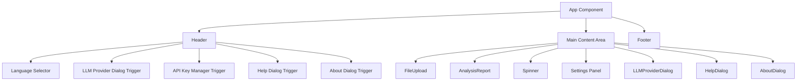
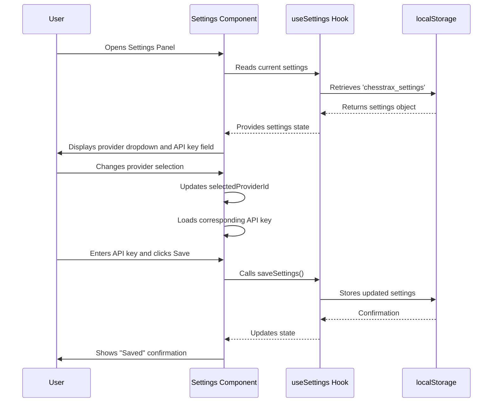
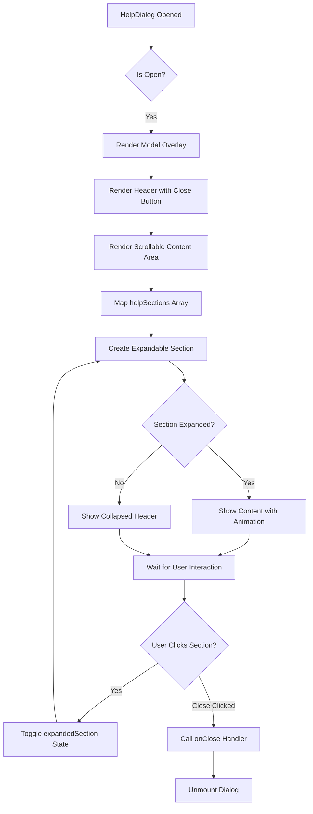
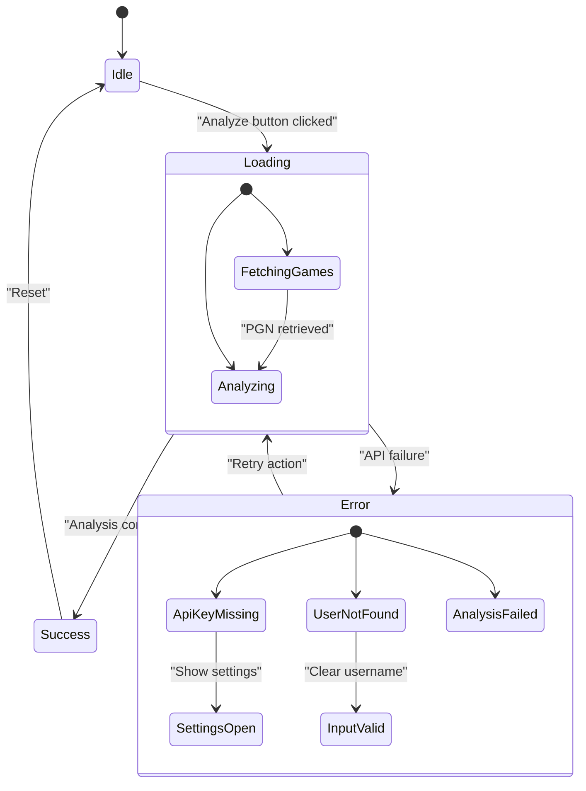
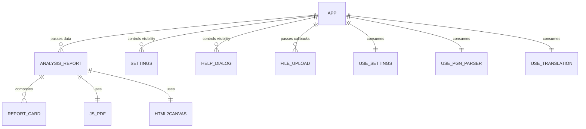

# User Interface

<cite>
**Referenced Files in This Document**   
- [App.tsx](file://App.tsx)
- [AnalysisReport.tsx](file://components/AnalysisReport.tsx)
- [ReportCard.tsx](file://components/ReportCard.tsx)
- [Settings.tsx](file://components/Settings.tsx)
- [HelpDialog.tsx](file://components/HelpDialog.tsx)
- [Spinner.tsx](file://components/Spinner.tsx)
- [FileUpload.tsx](file://components/FileUpload.tsx)
- [useSettings.ts](file://hooks/useSettings.ts)
- [types.ts](file://types.ts)
</cite>

## Table of Contents
1. [Introduction](#introduction)
2. [Main Dashboard Layout](#main-dashboard-layout)
3. [Analysis Report Display](#analysis-report-display)
4. [Settings Panel](#settings-panel)
5. [Help System](#help-system)
6. [Loading and Error States](#loading-and-error-states)
7. [Component Composition and State Management](#component-composition-and-state-management)
8. [Responsive Design and Accessibility](#responsive-design-and-accessibility)

## Introduction
ChessTrax provides a comprehensive user interface for chess players to analyze their gameplay through AI-powered insights. The application features a clean, intuitive dashboard that orchestrates user interactions, analysis reporting, settings management, and contextual help. Built with React and TypeScript, the UI emphasizes accessibility, responsiveness, and seamless state management across components. This document details the implementation of key UI components, their integration patterns, and best practices for usage and extension.

## Main Dashboard Layout
The main dashboard is orchestrated by `App.tsx`, which serves as the central container for all UI components and state management. It implements a responsive layout with a header containing language selectors and utility buttons, a main content area for analysis input and results, and a footer with attribution information.

The header includes language switching (EN/DE/HY), LLM provider selection, API key management, help, and about dialogs. The main content area dynamically renders either the initial input form, loading indicators, or the full analysis report based on application state.



**Diagram sources**
- [App.tsx](file://App.tsx#L1-L380)

**Section sources**
- [App.tsx](file://App.tsx#L1-L380)

## Analysis Report Display
The analysis report is rendered by `AnalysisReport.tsx`, which presents AI-generated insights in a structured, visually organized format. The component receives analysis data, user information, model details, and date ranges as props and composes them into a comprehensive report.

The report is divided into four main sections using `ReportCard` components:
- **Primary Focus**: Highlights the main improvement area with a star icon
- **Opening Analysis**: Breaks down performance as White and Black with book icon
- **Tactical Blind Spots**: Identifies recurring tactical patterns with target icon
- **Strategic Weaknesses**: Details positional shortcomings with brain icon
- **Endgame Training**: Recommends specific endgame practice with shield icon

Each `ReportCard` displays its content in a consistent card layout with an icon, title, and formatted text. The component also provides export functionality through PDF generation and clipboard copying.

```mermaid
classDiagram
class AnalysisReport {
+data : AnalysisReportData
+lichessUser : string
+modelName : string
+gameDateRange : string
+analysisDate : Date
+handleDownloadPdf() : void
+handleCopyToClipboard() : void
}
class ReportCard {
+icon : React.ComponentType
+title : string
+children : React.ReactNode
}
AnalysisReport --> ReportCard : "uses multiple"
AnalysisReport --> "jsPDF" : "generates PDF"
AnalysisReport --> "html2canvas" : "renders DOM to canvas"
AnalysisReport --> "navigator.clipboard" : "copies text"
```

**Diagram sources**
- [AnalysisReport.tsx](file://components/AnalysisReport.tsx#L1-L197)
- [ReportCard.tsx](file://components/ReportCard.tsx#L1-L27)

**Section sources**
- [AnalysisReport.tsx](file://components/AnalysisReport.tsx#L1-L197)
- [ReportCard.tsx](file://components/ReportCard.tsx#L1-L27)
- [types.ts](file://types.ts#L1-L28)

## Settings Panel
The settings panel, implemented in `Settings.tsx`, allows users to configure their preferred LLM provider and manage API keys. It integrates with the `useSettings` hook to persist user preferences in localStorage.

The component provides a dropdown to select from available LLM providers (Gemini, OpenAI, Grok, Anthropic) and a password-protected input field for entering API keys. When a provider is selected, the corresponding API key input is displayed with provider-specific placeholder text and documentation links.

The settings are validated and saved to localStorage, with visual feedback (green checkmark) indicating successful saves. The component automatically loads the current settings on mount and updates the current API key field when the provider selection changes.



**Diagram sources**
- [Settings.tsx](file://components/Settings.tsx#L1-L105)
- [useSettings.ts](file://hooks/useSettings.ts#L1-L38)

**Section sources**
- [Settings.tsx](file://components/Settings.tsx#L1-L105)
- [useSettings.ts](file://hooks/useSettings.ts#L1-L38)

## Help System
The help system is implemented through `HelpDialog.tsx`, which provides contextual guidance organized into expandable sections. The dialog is modal and accessible from the header's help icon.

The help content is structured into six categories:
- Getting Started
- Lichess Integration
- PGN Upload
- Analysis Results
- Troubleshooting
- FAQ

Each section can be expanded or collapsed independently, allowing users to focus on specific topics. The component uses controlled state to manage which section is currently expanded and provides smooth transitions between states.

The help content is localized using the i18n system, with HTML formatting preserved through dangerouslySetInnerHTML (properly sanitized by the translation system). The dialog includes proper accessibility attributes, including ARIA labels and keyboard navigation support.



**Diagram sources**
- [HelpDialog.tsx](file://components/HelpDialog.tsx#L1-L133)

**Section sources**
- [HelpDialog.tsx](file://components/HelpDialog.tsx#L1-L133)

## Loading and Error States
The application handles loading and error states through dedicated UI components and patterns. The `Spinner.tsx` component provides a consistent loading indicator used throughout the application, while error messages are displayed in standardized alert boxes.

Loading states are managed through boolean flags (`isFetchingPgn`, `isAnalyzing`) that trigger the display of the spinner along with appropriate status text. The main content area conditionally renders either the loading state, analysis report, or input form based on these flags.

Error messages are displayed in red alert boxes with warning icons and are cleared automatically when new operations begin. Specific error types include:
- File reading errors
- User not found on Lichess
- Missing API keys
- Analysis failures
- No lost games found



**Diagram sources**
- [App.tsx](file://App.tsx#L1-L380)
- [Spinner.tsx](file://components/Spinner.tsx#L1-L29)

**Section sources**
- [App.tsx](file://App.tsx#L1-L380)
- [Spinner.tsx](file://components/Spinner.tsx#L1-L29)

## Component Composition and State Management
ChessTrax employs a well-structured component composition and state management pattern using React hooks and props. The `App.tsx` component serves as the single source of truth for application state, which is then passed down to child components through props.

Key state variables include:
- `pgnContent`: Stores the uploaded or fetched PGN data
- `report`: Contains the analysis results
- `isLoading`: Tracks loading states
- `error`: Manages error messages
- `dataSource`: Determines input method (upload vs Lichess)
- `lichessUsername`: Stores the username for Lichess integration

Child components receive data through props and communicate back to the parent via callback functions. For example, `FileUpload` calls `onFileSelect` when a file is chosen, and `Settings` uses `saveSettings` to persist configuration changes.

The application uses several custom hooks:
- `useSettings`: Manages persistent settings in localStorage
- `usePgnParser`: Processes PGN content and extracts game data
- `useTranslation`: Handles internationalization



**Diagram sources**
- [App.tsx](file://App.tsx#L1-L380)
- [AnalysisReport.tsx](file://components/AnalysisReport.tsx#L1-L197)
- [Settings.tsx](file://components/Settings.tsx#L1-L105)
- [FileUpload.tsx](file://components/FileUpload.tsx#L1-L83)

**Section sources**
- [App.tsx](file://App.tsx#L1-L380)
- [hooks/useSettings.ts](file://hooks/useSettings.ts#L1-L38)
- [hooks/usePgnParser.ts](file://hooks/usePgnParser.ts)
- [components/FileUpload.tsx](file://components/FileUpload.tsx#L1-L83)

## Responsive Design and Accessibility
The ChessTrax interface implements responsive design principles to ensure usability across device sizes. The layout uses flexbox and grid systems to adapt to different screen widths, with mobile-first considerations.

Key responsive features include:
- Flexible card layouts that switch from single to multi-column on larger screens
- Mobile-friendly button sizes and touch targets
- Responsive typography that scales appropriately
- Collapsible sections in the help dialog
- Full-width inputs and buttons on small screens

Accessibility is prioritized through:
- Proper semantic HTML structure
- ARIA attributes for interactive elements
- Keyboard navigation support
- Sufficient color contrast
- Screen reader-friendly labels
- Focus management in modal dialogs
- Alternative text for icons

The application follows WCAG 2.1 guidelines for color contrast, focus visibility, and interactive element sizing. All interactive components provide visual feedback on hover and focus states, and error messages are announced to screen readers through appropriate ARIA live regions.

**Section sources**
- [App.tsx](file://App.tsx#L1-L380)
- [AnalysisReport.tsx](file://components/AnalysisReport.tsx#L1-L197)
- [Settings.tsx](file://components/Settings.tsx#L1-L105)
- [HelpDialog.tsx](file://components/HelpDialog.tsx#L1-L133)